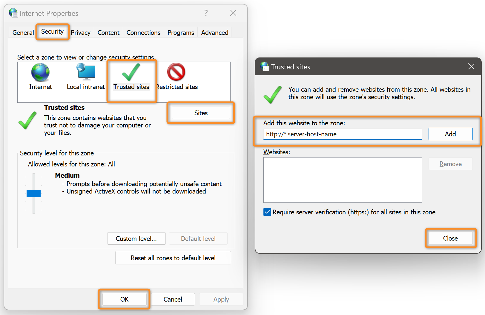
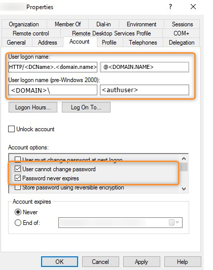
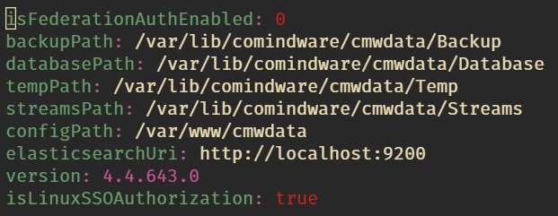

# SSO-аутентификация. Настройка ПО, контроллера домена и ПК пользователя {: #sso_authenticatation_configure}

!!! warning "Внимание!"

    Представленные здесь инструкции зависят от конфигурации сторонних систем и окружения, в котором развёрнут экземпляр ПО **{{ productName }}**.

    Описать все возможные случаи и сочетания конфигураций сторонних систем не представляется возможным, поэтому данные инструкции могут не подойти для вашего случая.

    Для корректной настройки конфигурации контроллера домена, экземпляра ПО и компьютеров конечных пользователей следует обратиться за консультацией в службу поддержки **{{ companyName }}** по адресу:

    <https://www.comindware.ru/company/contact-us/#tab_support>

## Введение

Здесь представлены инструкции по настройке контроллера домена, экземпляра ПО **{{ productName }}** (далее «экземпляр ПО») и компьютера конечного пользователя для аутентификации пользователей посредством технологии единого входа (SSO). Инструкции приведены для контроллера домена под управлением ОС Windows Server 2016, экземпляра ПО под управлением ОС Linux и компьютера конечного пользователя под управлением ОС Windows 10.

!!! question "Определения"

    - **Контроллер домена** — машина с развёрнутыми доменными службами Active Directory.
    - **Домен Active Directory** — группа объектов в сети.
    - **Single Sign-on (SSO)** — технология единого входа, позволяющая пользователям выполнять аутентификацию с использованием одного набора учётных данных в нескольких независимых системах.

## Примеры значений параметров

Здесь примеры значений параметров заключены в угловые скобки `< >`. При настройке конфигурации заменяйте их на фактические значения, как показано в следующей таблице:

| Пример параметра                            | Пример фактического значения      |
| ------------------------------------------- | --------------------------------- |
| `<DCName>`                                  | `DC`                              |
| `<DCName>.<domain.name>`                    | `DC.example.com`                  |
| `HTTP/<DCName>.<domain.name>@<DOMAIN.NAME>` | `HTTP/DC.example.com@EXAMPLE.COM` |
| `<linuxHost>`                               | `server-host-name`                |
| `<domain.controller.ip.address>`            | `192.168.0.254`                   |

!!! note "Примечание"

    Протокол аутентификации Kerberos учитывает регистр символов — там, где в инструкциях даны примеры параметров в верхнем регистре, следует подставлять фактические значения также в верхнем регистре.

## Конфигурация машины linuxHost с экземпляром ПО {{ productName }}

| Параметр             | Значение                  |
| -------------------- | ------------------------- |
| Операционная система | Linux                     |
| Имя хоста            | `<linuxHost>`             |
| IP-адрес хоста       | `<linux.host.ip.address>` |

## Конфигурация машины DCName с контроллером домена

| Параметр                    | Значение                         |
| --------------------------- | -------------------------------- |
| Операционная система        | Windows Server 2016              |
| Имя хоста                   | `<DCName>`                       |
| FQDN контроллера домена     | `<DCName>.<domain.name>`         |
| Доменное имя                | `<domain.name>`                  |
| IP-адрес контроллера домена | `<domain.controller.ip.address>` |

### Настройка надёжных узлов на контроллере домена

При необходимости на контроллере домена добавьте хост `<linuxHost>` с экземпляром ПО в список надёжных узлов в рамках интранета, как указано ниже.

1. В Панели управления выберите пункт «**Сеть и интернет**».
2. Откройте пункт «**Свойства: интернет**» (**Internet Properties**).
3. Выберите вкладку «**Безопасность**» (**Security**).
4. Выберите зону «**Надёжные узлы**» (**Trusted sites**).
5. Нажмите кнопку «**Узлы**» (**Sites**).
6. В отобразившемся окне добавьте в список надёжных узлов `<linuxHost>`.

__

### Сервисный пользователь домена {: .pageBreakBefore }

В домене должен существовать пользователь `<authuser>`, выступающий в роли сервисного аккаунта для модуля аутентификации _NGINX_, работающего на машине `<linuxHost>` с экземпляром ПО.

Если пользователя `<authuser>` в AD нет, необходимо создать его, указав параметры, приведённые в следующей таблице:

| Параметр                                            | Значение                                    |
| --------------------------------------------------- | ------------------------------------------- |
| `name`                                              | `<authuser>`                                |
| `userPrincipalName` (User logon name)               | `HTTP/<DCName>.<domain.name>@<DOMAIN.NAME>` |
| `sAMAccountName` (User logon name pre-Windows 2000) | `<DOMAIN>\<authuser>`                       |

При создании пользователя `<authuser>` на вкладке «**Учётная запись**» (**Account**) необходимо установить флажки «**Пользователь не может менять пароль**» (**User cannot change password**) и «**Срок действия пароля не истекает**» (**Password never expires**), как показано на иллюстрации.

__

### Пользователи для проверки аутентификации

Для проверки работоспособности процедуры аутентификации здесь используются пользователи `user1` и `user2`, см. следующую таблицу:

| Параметр            | Значение              | Значение              |
| ------------------- | --------------------- | --------------------- |
| `name`              | `user1`               | `user2`               |
| `sAmAccountName`    | `<domain>/user1`      | `<domain>/user2`      |
| `userPrincipalName` | `user1@<DOMAIN.NAME>` | `user2@<DOMAIN.NAME>` |

## Создание keytab-файла аутентификации

1. На контроллере домена `<DCName>` выведите список Service Principal Names (SPN), привязанных к пользователю `<authuser>`:

    ``` sh
    setspn -L <authuser>
    ```

2. Добавьте SPN `HTTP/<DCName>.<domain.name>` к пользователю `<authuser>`:

    ``` sh
    setspn -S HTTP/<DCName>.<domain.name> <authuser>
    ```

3. Создайте keytab-файл аутентификации `<authuser>.keytab`:

    **Альт Сервер, Astra Linux, Debian**

    ``` sh
    ktpass /out <authuser>.keytab /mapuser <authuser> /princ HTTP/<DCName>.<domain.name>@<DOMAIN.NAME> /pass <P@$$W0RD> /crypto RC4-HMAC-NT /ptype KRB5_NT_PRINCIPAL
    ```

    !!! note "Примечание"

        Вместо пароля `<P@$$W0RD>`, подставьте пароль [сервисного пользователя](#сервисный-пользователь-домена) `<authuser>`.

4. Утилита `ktpass` создаст файл `<authuser>.keytab` в рабочей директории _PowerShell_ на момент вызова команды `ktpass`.
5. [Настройте машину `<linuxHost>`](#настройка-машины-linuxhost-с-экземпляром-по) с экземпляром ПО.
6. Перенесите keytab-файл `<authuser>.keytab` на машину `<linuxHost>` с экземпляром ПО.

## Обновление keytab-файла аутентификации для аутентификации новых пользователей {: #sso_authentication_configure_keytab_update}

!!! warning "Внимание!"

    Для обеспечения возможности аутентификации новых пользователей, добавленных при синхронизации с сервером каталогов необходимо заново создать keytab-файл на машине `<linuxHost>` с экземпляром ПО.

    Эту операцию необходимо выполнять каждый раз после добавления новых пользователей с сервера каталогов на уже настроенной машине `<linuxHost>`.

    Если не создать новый keytab-файл, пользователи, добавленные с сервера каталогов после создания имеющегося keytab-файла, не смогут войти в систему.

1. [Настройте машину `<linuxHost>`](#настройка-машины-linuxhost-с-экземпляром-по) с экземпляром ПО.
2. На контроллере домена `<DCName>` выведите список Service Principal Names (SPN), привязанных к пользователю `<authuser>`:

    ``` sh
    setspn -L <authuser>
    ```

3. Добавьте SPN `HTTP/<DCName>.<domain.name>` к пользователю `<authuser>`:

    ``` sh
    setspn -S HTTP/<DCName>.<domain.name> <authuser>
    ```

4. Создайте keytab-файл аутентификации `<authuser>.keytab`:

    **Для Rocky Linux**

    ```sh
    ktpass /out <authuser>.keytab /mapuser <authuser> /princ HTTP/<DCName>.<domain.name>@<DOMAIN.NAME> /pass <P@$$W0RD> /crypto AES256-SHA1 /ptype KRB5_NT_PRINCIPAL
    ```

    **Для Astra Linux и Ubuntu**

    ```sh
    ktpass /out <authuser>.keytab /mapuser <authuser> /princ HTTP/<DCName>.<domain.name>@<DOMAIN.NAME> /pass <P@$$W0RD> /crypto RC4-HMAC-NT /ptype KRB5_NT_PRINCIPAL
    ```

    !!! note "Примечание"

        Вместо пароля `<P@$$W0RD>`, подставьте пароль [сервисного пользователя](#сервисный-пользователь-домена) `<authuser>`.

5. Утилита `ktpass` создаст файл `<authuser>.keytab` в рабочей директории _PowerShell_ на момент вызова команды `ktpass`.
6. Перейдите на уже [настроенную машину `<linuxHost>`](#настройка-машины-linuxhost-с-экземпляром-по) с экземпляром ПО.
7. Поместите keytab-файл `<authuser>.keytab` в директорию `/etc/nginx/sasl` и сделайте его доступным для чтения:

    ``` sh
    cp /<path_to_keytab>/<authuser>.keytab /etc/nginx/sasl
    chmod 664 /etc/nginx/sasl/<authuser>.keytab
    ```

    Здесь `<path_to_keytab>` — папка, в которой находится keytab-файл `<authuser>.keytab`, взятый с контроллера домена.

8. Выпустите тикет для приложения `HTTP/<DCName>.<domain.name>`:

    ``` sh
    kinit -k -t /etc/nginx/sasl/<authuser>.keytab HTTP/<DCName>.<domain.name>
    ```

9. Выдайте права на файл `krb5cc_<id>` (в примере — `krb5cc_991` или `krb5cc_33`, где `991` и `33` — `id` пользователя  `nginx` и `www-data` соответственно):

    **Rocky Linux**

    ``` sh
    chown -R nginx:nginx /etc/nginx/sasl/krb5cc_991

    ```

    **Astra Linux и Ubuntu**

    ``` sh
    chown -R www-data:www-data /etc/nginx/sasl/krb5cc_33
    ```

## Настройка машины linuxHost с экземпляром ПО {: .pageBreakBefore }

### Требования к машине

- FQDN `<DCName>.<domain.name>` должно разрешаться.
- Время между машинами `<DCName>` и `<linuxHost>` должно быть синхронизировано.
- Должен быть установлен пакет `libsasl2`.
- Должен быть установлен и сконфигурирован `Kerberos`.
- Должен быть установлен и настроен прокси-сервер _NGINX_ с модулем аутентификации _SPNEGO_ и зависимостями исполняемой среды для него.

### Настройка параметров сети для разрешения DC FQDN

#### Изменение файла hosts

1. Откройте файл `/etc/hosts` для редактирования:

    ``` sh
    vim /etc/hosts
    ```

2. Добавьте в файл `hosts` правила для разрешения машины `<linuxHost>` с экземпляром ПО:

    ``` sh
    127.0.0.1                       localhost localhost.localdomain
    127.0.1.1                       <linuxHost>.<domain.name> <linuxHost>
    <domain.controller.ip.address>  <DCName>.<domain.name> <DCName>
    ```

#### Изменение файла resolv.conf

Если после настройки файла `hosts`, имя контроллера не разрешается, следует отредактировать файл `resolv.conf`.

1. Разрешите редактирование файла `resolv.conf`:

    ``` sh
    chattr -i /etc/resolv.conf
    ```

2. Откройте файл разрешения DNS имен `resolv.conf` для редактирования:

    ``` sh
    vim /etc/resolv.conf
    ```

    {{ pdfEndOfBlockHack }}
    {: .pageBreakAfter }

3. Укажите машину `<DCName>` в качестве сервера имён `nameserver`:
{: .pageBreakBefore }

    ``` sh
    domain     <domain.name>
    search     <domain.name>
    nameserver <domain.controller.ip.address>
    ```

4. Запретите редактирование файла `resolv.conf`:

    ``` sh
    chattr +i /etc/resolv.conf
    ```

### Проверка корректности настроек сети

1. Убедитесь, что FQDN `<DCName>.<domain.name>` разрешается:

    ``` sh
    # DNS Lookup of DC
    nslookup <DCName>
    nslookup <DCName>.<domain.name>

    host <DCName>.<domain.name>

    # Reverse DNS lookup of `nameserver`
    host <domain.controller.ip.address>
    ```

### Синхронизация времени между машинами DCName и linuxHost

Синхронизацию времени следует настраивать в следующих случаях:

- машины `<DCName>` и `<linuxHost>` находятся в разных часовых поясах;
- машина `<linuxHost>` не подключена к сервису синхронизации времени.

1. Установите пакет `ntp`:

    ``` sh
    apt-get install ntp
    ```

2. Откройте файл конфигурации `ntp.conf` для редактирования:

    ``` sh
    vim /etc/ntp.conf
    ```

    {{ pdfEndOfBlockHack }}
    {: .pageBreakAfter}

3. Добавьте в файл конфигурации `ntp.conf` поле `server <DOMAIN.NAME> iburst burst prefer`:

    ``` sh
    driftfile /etc/ntp/drift
    server <DOMAIN.NAME> iburst burst prefer
    server 127.127.1.0 iburst
    fudge  127.127.1.0 stratum 10

    restrict default noquery nomodify
    restrict 127.0.0.1
    ```

4. Примените настройки:

    ``` sh
    systemctl start ntp
    ```

5. Удостоверьтесь, что служба `ntp` работает:

    ``` sh
    systemctl status ntp
    ```

### Настройка конфигурации Kerberos

#### Установка вспомогательных пакетов

1. Установите модуль `libsasl2`:

    ``` sh
    apt install libsasl2-modules-gssapi-mit
    ```

2. Убедитесь, что модуль установлен:

    ``` sh
    apt list libsasl*
    ```

3. Убедитесь, что установлены пакеты `krb5-user`, `krb5-config` и зависимости для них:

    ``` sh
    which krb5-user
    which krb5-config
    ```

4. Установите пакеты `samba-dc` и `kerberos-kdc`:

    ``` sh
    apt-get install task-samba-dc krb5-kdc
    ```

5. Убедитесь, что модули установлены:

    ``` sh
    apt list task-samba-dc krb5-kdc
    ```

#### Настройка аутентификации Kerberos {: .pageBreakBefore }

1. Откройте файл конфигурации Kerberos для редактирования:

    ``` sh
    vim /etc/krb5.conf
    ```

2. Отредактируйте файл `krb5.conf` согласно следующему примеру:
{: .pageBreakInsideAvoid}

    **Astra Linux, Debian**

    ``` sh
    #astra/debian-winbind
    [libdefaults]
        default_realm = <DOMAIN.NAME>
        kdc_timesync = 1
        ccache_type = 4
        forwardable = true
        proxiable = true

        fcc-mit-ticketflags = true
        dns_lookup_realm = false
        dns_lookup_kdc = false
        v4_instance_resolve = false
        v4_name_convert = {
            host = {
                rcmd = host
                ftp = ftp
            }
            plain = {
                something = something-else
            }
        }

    [realms]
        <DOMAIN.NAME> = {
            kdc = <DCName>.<domain.name>
            admin_server = <DCName>.<domain.name>
            default_domain = <domain.name>
        }

    [domain_realm]
        .<domain.name> = <DOMAIN.NAME>
        <domain.name> = <DOMAIN.NAME>
    [login]
        krb4_convert = false
        krb4_get_tickets = false

    ```

    **Альт Сервер**
    {: .pageBreakBefore }

    ``` sh
    includedir /etc/krb5.conf.d/
    [logging]
    # default = FILE:/var/log/krb5libs.log
    # kdc = FILE:/var/log/krb5kdc.log
    # admin_server = FILE:/var/log/kadmind.log

    [libdefaults]
    dns_lookup_kdc = true
    dns_lookup_realm = false
    ticket_lifetime = 24h
    renew_lifetime = 7d
    forwardable = true
    rdns = false
    default_realm = <DOMAIN.NAME>
    default_ccache_name = KEYRING:persistent:%{uid}

    [realms]
    <DOMAIN.NAME> = {
        kdc = <DCName>.<domain.name>
        admin_server = <DCName>.<domain.name>
        default_domain = <domain.name>
    }

    [domain_realm]
    <.domain.name> = <DOMAIN.NAME>  {{ productName }}
    <domain.name> = <DOMAIN.NAME>
    ```

#### Для ОС «Альт Сервер»: настройка pam\_winbind.conf

1. Откройте для редактирования файл конфигурации `pam_winbind.conf`:

    ``` sh
    vim /etc/security/pam_winbind.conf
    ```

2. Отредактировать файл конфигурации `pam_winbind.conf` согласно следующему примеру:
{: .pageBreakInsideAvoid}

    ``` sh
    [global]
    debug = no
    debug_state = no
    try_first_pass = yes
    cached_login = yes
    krb5_auth = yes
    krb_ccache_type = FILE
    silent = yes
    mkhomedir = yes
    ```

#### Установка экземпляра ПО {: .pageBreakBefore }

1. Скачайте и распакуйте дистрибутив ПО **{{ productName }}** в директорию `/home/<username>` и  перейдите в директорию с распакованным ПО (`X.X.XXXX.X` — номер версии ПО, `<osname>` — название операционной системы):

    ``` sh
    tar -xvzf X.X.XXXX.X.<osname>.tar.gz -C /home/<username>
    cd /home/<username>/CMW_<osname>/
    ```

2. Установите ПО **{{ productName }}**  без создания экземпляра ПО и с ключом `-d=clear` — без демонстрационной базы данных:

    ```
    sh install.sh -p -d=clear
    ```

3. Создайте экземпляр ПО, указав вместо `<instanceName>` требуемое имя экземпляра (`X.X.XXXX.X` — номер версии ПО):

    ``` sh
    cd scripts/instance/
    sh create.sh -n=<instanceName> -p=80 -v=X.X.XXXX.X
    ```

#### Настройка экземпляра ПО

Для включения функционала SSO аутентификации в экземпляре ПО необходимо настроить его файл конфигурации.

1. Откройте для редактирования файл конфигурации экземпляра ПО (`instanceName` — имя экземпляра ПО):

    ``` sh
    vim /usr/share/comindware/configs/instance/instanceName.yml
    ```

2. Добавьте в файл директиву `isLinuxSSOAuthorization: true`

__

#### Установка и настройка модуля NGINX SPNEGO {: .pageBreakBefore }

1. Установите модуль _NGINX-SPNEGO_:

    ``` sh
    apt-get install nginx-spnego
    ```

2. Добавить модуль _SPNEGO_ к рабочей конфигурации _NGINX_:

    ``` sh
    ln -s /etc/nginx/modules-available.d/http_auth_spnego.conf /etc/nginx/modules-enabled/
    ```

3. Поместить keytab-файл `<authuser>.keytab` в директорию конфигурации NGINX и сделать его доступным для чтения:

    ``` sh
    cp /<path_to_keytab>/<authuser>.keytab /etc/nginx
    chmod 664 /etc/nginx/<authuser>.keytab
    ```

    Здесь `<path_to_keytab>` — папка, в которой находится keytab-файл `<authuser>.keytab`, взятый с контроллера домена.

4. Откройте для редактирования описание веб-приложения _NGINX_ для экземпляра ПО `<instanceName>`:

    ``` sh
    vim /etc/nginx/sites-available.d/comindware<instanceName>
    ```

5. Отредактируйте файл `comindware<instanceName>` согласно следующему примеру:

    ``` { .sh .pageBreakAfter title="Пример файла comindware&lt;instanceName&gt;" }
    server {
            listen 8999 http2;
            root /var/www/cmwdata;

                location /async {
                    grpc_pass grpc_cmwdata;
            }
    }
    server {
            listen       80 default;
            root         /var/www/cmwdata;

            client_header_timeout 3h;
            client_body_timeout 3h;
            grpc_read_timeout 3h;
            grpc_send_timeout 3h;
            client_max_body_size 300m;
            fastcgi_read_timeout 10000;

    
    ```

    ``` sh title="Пример файла comindware&lt;instanceName&gt; — продолжение"
    
                location /async {
                    grpc_pass grpc_cmwdata;
                }

                location / {
                    # SPNEGO Configuration
                    add_header Set-Cookie "cmw_user=$remote_user";
                    auth_gss on;
                    auth_gss_realm <DOMAIN.NAME>;
                    auth_gss_keytab /etc/nginx/<authuser>.keytab;
                    auth_gss_service_name HTTP/<authuser>.<domain.name>;
                    auth_gss_allow_basic_fallback on;

                    proxy_read_timeout 10000;
                    proxy_connect_timeout 10000;
                    proxy_send_timeout 10000;
                    root                /var/www/cmwdata/;
                    fastcgi_pass        unix:/var/www/cmwdata/App_Data/cmwdata.socket;
                    include             /etc/nginx/fastcgi.conf;
                }
    }
    ```

6. Проверьте синтаксис веб-приложения _NGINX_ для экземпляра ПО `<instanceName>`:

    ``` sh
    nginx -t
    ```

7. Примените настройки и перезапустите _NGINX_:

    ``` sh
    nginx -s reload
    ```

8. Проверьте статус сервиса _NGINX_:

    ``` sh
    systemctl status nginx
    ```

9. Проверьте статус сервиса экземпляра ПО `<instanceName>`:
{: .pageBreakBefore }

    ``` sh
    systemctl status comindware<instanceName>
    ```

### Изменение конфигурации экземпляра ПО {: .pageBreakBefore }

1. Войдите в экземпляр ПО с помощью браузера.
2. Откройте свойства [подключения к серверу каталогов][ad_connection], которое будет использоваться для синхронизации аккаунтов.
3. На вкладке «**Основные**» установите флажок «**Использовать по умолчанию**».
4. На вкладке «**Сопоставление атрибутов**» нажмите кнопку «**Восстановить**».
5. Сохраните свойства подключения.
6. Перезапустите экземпляр ПО:

    ``` sh
    systemctl restart comindware<instance_name>
    ```

### Проверка работы функционала Kerberos на машине linuxHost

1. Создайте тикет для приложения `HTTP/<DCName>.<domain.name>`:

    ``` sh
    kinit -k -t /etc/nginx/<authuser>.keytab HTTP/<DCName>.<domain.name>
    ```

2. Выведите список тикетов:

    ``` sh
    klist
    ```

### Проверка вывода трассировщика ошибок в Shell

1. Выполните команду:

    ``` sh
    KRB5_TRACE=/dev/stdout kinit -k -t /etc/nginx/<authuser>.keytab HTTP/<DCName>.<domain.name>
    ```

--8<-- "related_topics_heading.md"

**[Аутентификация через Active Directory. Настройка контроллера домена и экземпляра ПО][ad_authentication_configure]**

**[Аутентификация через OpenID Connect. Настройка подключения и служб][openid_connection]**


