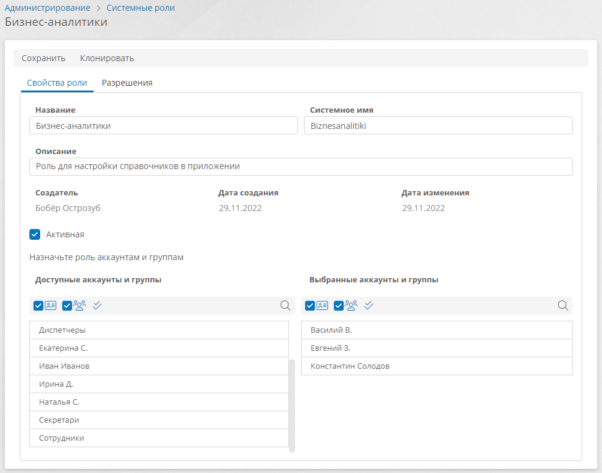
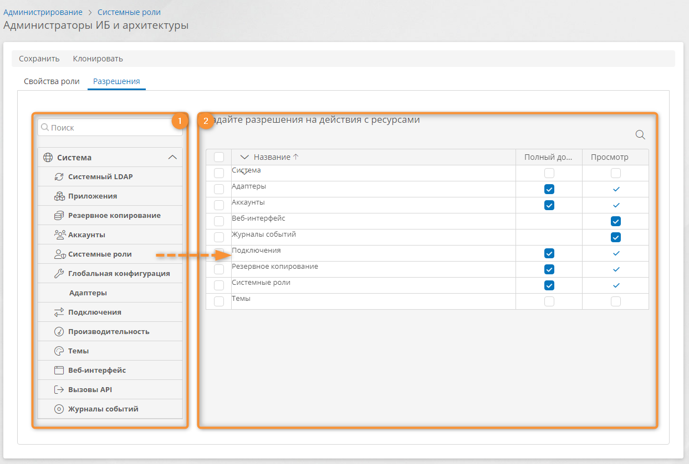

# Системные роли. Определения, настройка, объединение, удаление {: #system_roles}

## Определения {: .admonition-title #definitions}

В **{{ productName }}** предусмотрена возможность контроля доступа к различным ресурсам посредством ролей, разрешений и прав доступа.

Для контроля доступа к системным ресурсам используются **системные роли.**

**Системные роли** определяют политику безопасности для:

- пользователей, настраивающих систему и приложения;
- служебных аккаунтов, используемых для интеграции с внешними системами посредством API и LDAP.

Можно создать **особые системные** **роли** со специальными свойствами и разрешениями или [объединить](#объединение-системных-ролей) стандартные системные роли для создания особой роли.

Для контроля доступа конечных пользователей к ресурсам приложения используются **[роли в приложении][roles]**. **Роли в приложении** не дают доступа к настройке приложений или системы и использованию API.



## Стандартные системные роли {: .pageBreakBefore }

В **{{ productName }}** предусмотрены перечисленные ниже стандартные системные роли с заранее заданными разрешениями на доступ к ресурсам системы.

- **Системные администраторы** — могут изменять все параметры на странице «**Администрирование**» и во всех приложениях, а также использовать все методы API, настраивать, создавать, редактировать и удалять все шаблоны, записи, экземпляры процессов, аккаунты, диаграммы и любые другие сущности в системе.
    - ***Полный доступ***
        - **Система**— доступ ко всем ресурсам системы.
        - Функции администрирования на страницах:
            - [**Адаптеры**][adapters] — настройка особых адаптеров для интеграции с внешними сервисами.
            - [**Аккаунты**][accounts] — настройка пользователей.
            - [**Глобальная конфигурация**][global_configuration] — настройка параметров сервера.
            - [**Журналы событий**][logs] — просмотр журналов работы системы и взаимодействия с внешними сервисами.
            - [**Подключения**][connections] — настройка подключений к внешним сервисам и путей передачи данных.
            - [**Приложения**][apps] — настройка приложений.
            - [**Производительность**][performance] — просмотр показателей производительности системы.
            - [**Резервное копирование**][backup] — настройка конфигураций резервного копирования.
            - [**Системные роли**][system_roles] — настройка системных ролей.
            - [**Темы**][themes] — настройка тем визуального оформления системы.
        - Системные ресурсы:
        
            - [**Веб-интерфейс**][using_the_system] — использование интерфейса конечного пользователя приложений.
            - [**Вызовы API**][api_calls] — использование всех методов API.
            - [**Системный LDAP**][accounts_dc_sync] — настройка синхронизации аккаунтов посредством протокола LDAP.
- **Администраторы безопасности** — могут настраивать параметры безопасности системы, но не могут настраивать приложения и подключения к внешним службам, а также изменять данные в шаблонах.
    - ***Полный доступ***
        - [**Аккаунты**][accounts]
        - [**Системные роли**][system_roles]
    - ***Просмотр***
        - [**Журналы событий**][logs]
- **Администраторы инфраструктуры** — могут настраивать подключения к внешним службам и резервное копирование, но не могут настраивать параметры безопасности системы и приложения, а также изменять данные в шаблонах.
    - ***Полный доступ***
        - [**Адаптеры**][adapters]
        - [**Подключения**][connections]
        - [**Резервное копирование**][backup]
    - ***Просмотр***
        - [**Журналы событий**][logs]
- **Системные архитекторы** — могут только настраивать приложения и изменять данные в шаблонах.
    - ***Полный доступ***
        - [**Приложения**][apps]

## Просмотр списка системных ролей и настройка роли {: .pageBreakBefore }

!!! note "Примечание"

    - Настроить [свойства](#настройка-свойств-роли) и [разрешения](#настройка-разрешений-для-ресурсов) можно только у системных ролей, созданных пользователями, т. е. ролей, у которых в списке указан создатель.
    - Если выбрать системную роль, созданную системой (у которой в списке не указан создатель), у неё можно настроить только [участников роли](#role_members).

1. На странице «[**Администрирование**][administration]» в разделе — «**Администрирование аккаунтов**» выберите пункт «**Системные роли**» <i class=" fa-light  fa-user-shield "></i>.
2. Отобразится список системных ролей.
3. Нажмите кнопку «**Создать**» или дважды нажмите строку роли в списке.
4. Отобразится страница системной роли с вкладками **«Свойства роли»** и **«Разрешения».**
5. Настройте [свойства роли](#настройка-свойств-роли).
6. Настройте [разрешения](#настройка-разрешений-для-ресурсов) на доступ к ресурсам.
7. Сохраните роль.

__

### Настройка свойств роли


- **Активная** — установите или снимите этот флажок, чтобы использовать или отключить данную роль. Данный флажок нельзя снять для ролей, созданных системой (у которых не указан создатель).


__

### Настройка разрешений для ресурсов

1. Откройте вкладку «**Разрешения**», на которой предусмотрены следующие области:

    **(1)** **Список системных ресурсов** — содержит ресурсы, к которым можно предоставить доступ участникам данной роли.

    **(2)** **Список разрешений** — показывает ресурсы и назначенные для них разрешения для данной роли. Каждая строка задаёт набор разрешений для одного ресурса.

    __

2. Перетаскивайте ресурсы из **списка ресурсов** в **список разрешений**, чтобы настроить полномочия на действия с ресурсами в рамках системной роли:  

    - **Система**— доступ ко всем ресурсам системы.
    - [**Адаптеры**][adapters] — настройка особых адаптеров для интеграции с внешними сервисами.
    - [**Аккаунты**][accounts] — настройка пользователей.
    - [**Веб-интерфейс**][using_the_system] — использование интерфейса конечного пользователя приложений.
    - [**Вызовы API**][api_calls] — использование всех методов API.
    - [**Глобальная конфигурация**][global_configuration] — настройка параметров сервера.
    - [**Журналы событий**][logs] — просмотр журналов работы системы и взаимодействия с внешними сервисами.
    - [**Подключения**][connections] — настройка подключений к внешним сервисам и путей передачи данных.
    - [**Приложения**][apps] — настройка и использование приложений.
    - [**Производительность**][performance] — просмотр показателей производительности системы.
    - [**Резервное копирование**][backup] — настройка конфигураций резервного копирования.
    - [**Системные роли**][system_roles] — настройка системных ролей.
    - [**Системный LDAP**][accounts_dc_sync] — настройка синхронизации посредством протокола LDAP.
    - [**Темы**][themes] — настройка тем визуального оформления системы.

3. Разворачивайте и сворачивайте пункты в списке ресурсов, чтобы просмотреть дочерние и родительские ресурсы.
4. Чтобы отфильтровать список ресурсов, начните вводить название ресурса в поле «**Поиск**» <i class="fa-light  fa-search"></i>. В списке ресурсов отобразятся искомые ресурсы.
5. Устанавливайте флажки в следующих столбцах, чтобы настроить разрешения для ресурсов:

    - **Просмотр** — разрешение на просмотр данных ресурса.
    - **Полный доступ** — предоставление доступа ко всем функциям администрирования ресурса.

### Удаление разрешений для ресурсов



## Восстановление исходных разрешений системной роли



## Объединение системных ролей



## Клонирование системной роли



## Удаление системной роли

!!! note "Примечание"

    - Удалить можно только системные роли, созданные пользователями, т. е. роли, у которых в списке указан создатель.
    - Если выбрать системную роль, созданную системой (у которой в списке не указан создатель), то кнопка «**Удалить**» не будет отображаться.



--8<-- "related_topics_heading.md"

**[Роли в приложении][roles]**

**[Шаблон роли][role_templates]**


