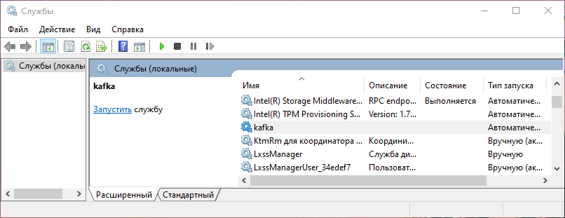

# Установка Kafka на ОС Windows и подключение к Comindware Business Application Platform

## Введение

Для обмена данными с внешними системами можно настроить подключение к брокеру сообщений Kafka. Эта программа обеспечивает высокую пропускную способность при передаче данных.

Здесь представлена инструкция, как установить Kafka на ОС Windows и подключить её к **{{ productName }}**.

## Предварительные условия

Должна быть установлена Java и прописаны следующие системные переменные:

- `Path` — короткий путь к файлам Java вида `%JAVA_HOME%\bin`
- `JAVA_HOME` — путь к исполняемым файлам Open JDK, например `C:\Program Files\jdk\jdk-<version>\bin`
- `JAVA_HOME_DLL` — путь к DLL-файлу Open JDK, например `C:\Program Files\jdk\jdk-<version>\bin\server\jvm.dll`

## Процесс установки

1. Загрузите последнюю версию Kafka с **[официального сайта](https://kafka.apache.org/downloads)**.

!!! warning "Внимание"

    Для корректной работы Kafka рекомендуется скачивать архив с бинарными файлами.

2. Распакуйте файлы архива в следующую папку:

```
C:\kafka\kafka
```

!!! warning "Внимание"

    Рекомендуется использовать путь минимальной длины и названия папок без пробелов, иначе некоторые команды могут не сработать.

3. Создайте папку для журналов:

```
X:\kafka\logs
```

!!! warning "Внимание"

    Рекомендуется создавать папку для журналов не на том же диске, где установлена сама Kafka.

4. Откройте следующий файл конфигурации:

```
C:\kafka\kafka\config\kraft\server.properties
```

5. Отредактируйте файл конфигурации, указав свой IP-адрес и папку для журналов логирования. При указании папки нужно использовать обычный слэш '/':

``` py
process.roles=broker,controller
node.id=1
# укажите свой IP-адрес 
controller.quorum.voters=1@10.9.8.7:9093
# укажите свой IP-адрес 
listeners=PLAINTEXT://10.9.8.7:9092,CONTROLLER://10.9.8.7:9093
inter.broker.listener.name=PLAINTEXT
# укажите свой IP-адрес 
advertised.listeners=PLAINTEXT://10.9.8.7:9092
controller.listener.names=CONTROLLER
listener.security.protocol.map=CONTROLLER:PLAINTEXT,PLAINTEXT:PLAINTEXT,SSL:SSL,SASL_PLAINTEXT:SASL_PLAINTEXT,SASL_SSL:SASL_SSL
num.network.threads=3
num.io.threads=8
socket.send.buffer.bytes=102400
socket.receive.buffer.bytes=102400
socket.request.max.bytes=104857600
# укажите путь к папке журналов логирования
log.dirs=X:/kafka/logs
num.partitions=1
num.recovery.threads.per.data.dir=1
offsets.topic.replication.factor=1
transaction.state.log.replication.factor=1
transaction.state.log.min.isr=1
log.retention.hours=168
log.segment.bytes=1073741824
log.retention.check.interval.ms=300000
```

6. Откройте `powershell.exe` или `cmd.exe` от имени администратора и выполните следующие команды:

``` powershell
cd "C:\kafka\kafka\bin\windows\"
.\kafka-storage.bat random-uuid
## Пример вывода результата
kNZtrWDsRvW0udJeaEahsg
## Конец примера вывода результата
.\kafka-storage.bat format -t kNZtrWDsRvW0udJeaEahsg -c C:\kafka\kafka\config\kraft\server.properties
```

7. Загрузите с **[официального сайта](https://nssm.cc/download)** архив NSSM и распакуйте его.
8. В папке `\win64` найдите файл `nssm.exe` и скопируйте его в следующую папку:

```
C:\kafka\kafka\bin\windows\
```

9. В `powerdshell.exe` или `cmd.exe` от имени администратора выполните следующую команду:
   
```
.\nssm install kafka
```

10. Запустится диалоговое окно `NSSM service installer`.

__

11. В диалоговом окне укажите следующие пути:
    * для Path
  
    ```
    C:\kafka\kafka\bin\windows\kafka-server-start.bat
    ```

    * для Startup directory
  
    ```
    C:\kafka\kafka\bin\windows\
    ```

    * для Arguments
  
    ```
    C:\kafka\kafka\config\kraft\server.properties
    ```

12. Нажмите кнопку «Установить сервис».
13. Произойдёт установка сервиса.
14. По завершении установки откройте «Службы» и найдите в списке kafka.

__

15. Включите и настройте автоматический перезапуск kafka.

__

16. Вы можете протестировать работу Kafka, запустив в `powershell.exe` или `cmd.exe` следующие команды:

``` powershell
cd "C:\kafka\kafka\bin\windows\"
.\kafka-console-producer.bat --bootstrap-server 10.9.8.7:9092 --topic TEST
# отправьте любое сообщение
hello
```

17. При правильной работе Kafka пришлёт предупреждение, что раннее такой ветки сообщений не было, и создаст её.

__

## Подключение Kafka к Comindware Business Application Platform

1. Откройте папку:

```
C:\ProgramData\comindware\configs\instance
```

2. Откройте файл с именем экземпляра ПО `instanceName.yml` и измените или добавьте следующую директиву:

```
# укажите ваш IP-адрес
mq.server: 10.9.8.7:9092
# укажите имя вашего сервера
mq.name: <имя экземпляра ПО>
```

3. Удалите следующую строчку из файла:

```
kafkaBootstrapServer:
```

4. Перезапустите экземпляр продукта с помощью Утилиты администрирования.
5. Проверьте соединение с Kafka в браузере по ссылке:

```
<имя экземпляра ПО>/async
```
