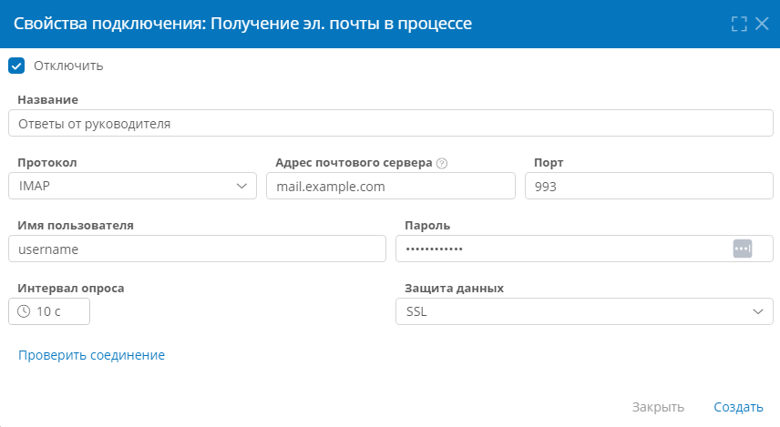

# Получение эл. почты и веб-запросов в процессе. Настройка подключения и пути передачи данных {: #process_receiving_connection}

## Введение

Здесь представлены инструкции по настройке подключения и пути передачи передачи данных из эл. писем и веб-запросов в бизнес-процессе.

Кроме того, потребуется настроить **[начальное](receive_message_start_event.md)** или **[промежуточное](receive_message_intermediate_event.md) событие-получение сообщения** на диаграмме процесса.

Подробный пример настройки приложения для обмена данными посредством эл. почты см. в статье _«[Пример: согласование заявлений по эл. почте. Настройка подключений, путей передачи данных и диаграммы процесса][process_email_configure]»_.

## Порядок настройки получения эл. писем

1. [Настройте подключение](#настройка-подключения) типа «**Получение эл. почты в процессе**».
2. [Настройте путь передачи данных](#настройка-пути-передачи-данных) типа «**Получение эл. почты в процессе**».
3. Настройте **[начальное](receive_message_start_event.md)** или [**промежуточное**](receive_message_intermediate_event.md) **событие-получение сообщения** на диаграмме процесса:

    - укажите настроенный **путь передачи данных**;
    - настройте сопоставление **данных сообщения**.

## Настройка подключения

--8<-- "email_receive_logics.md"

1. Откройте страницу **«Администрирование» – «Подключения»**.
2. Откройте двойным нажатием или создайте создайте **подключение к электронной почте** типа «**Получение эл. почты в процессе**».
3. Настройте подключение к IMAP-серверу:

    - **Отключить** — установите этот флажок, если требуется временно деактивировать данное подключение.
    - **Название** — наименование подключения.
    - **Протокол** — выберите почтовый протокол:

        - **IMAP**;
        - **Microsoft Exchange**.

    - **Адрес почтового сервера** — укажите URL почтового сервера.

        !!! note "Примечание"

            - Для **SMTP не** указывайте протокол (`SMTP`, `HTTPS`, `HTTP`).
            - Для **Exchange укажите** протокол (`HTTPS`, `HTTP`).

    - **Порт** — укажите порт для подключения к почтовому серверу.
    - **Имя пользователя** — укажите учётную запись для подключения к почтовому серверу.
    - **Пароль** — введите пароль к учётной записи для подключения к почтовому серверу.
    - **Интервал опроса** — укажите интервал, с которым **{{ productName }}** будет проверять наличие новых писем.
    - **Защита данных** — выберите протокол шифрования:

        - **Нет**;
        - **SSL**;
        - **TLS**.
    - **Проверить соединение** — нажмите эту кнопку, чтобы проверить соединение с почтовым сервером.

4. Нажмите кнопку «Создать».

__

## Настройка пути передачи данных

Путь передачи данных для получения эл. почты служит для преобразования и передачи данных из эл. письма в **{{ productName }}**.

1. Откройте страницу «**Администрирование**»  — «**Архитектура**» или страницу «**Администрирование**» приложения.
2. Выберите пункт «[**Пути передачи данных**][communication_routes]» <i class="fa-light fa-route " aria-hidden="true"></i>.
4. Откройте двойным нажатием в списке или создайте путь передачи данных типа «**Подключения к электронной почте**» – «**Получение эл. почты в процессе**».
5. Настройте свойства пути передачи данных на следующих вкладках:

   - [**Основные свойства**](#основные-свойства)
   - [**Атрибуты сообщения**](#атрибуты-сообщения)

6. Сохраните путь передачи данных.

## Основные свойства

На вкладке «**Основные свойства**» настройте базовые параметры пути передачи данных:

- **Отключить** — установите этот флажок, чтобы временно деактивировать путь передачи данных.
- **Название** — введите наглядное наименование пути передачи данных.
- **Подключение** — выберите подключение типа «**Получение эл. почты в процессе**».
- **Имя сообщения** — введите _уникальный_ идентификатор сообщения, проходящего по данному пути передачи данных.
- **Приложение** — выберите бизнес-приложение, в котором будет использоваться путь передачи данных.
- **Процесс** — выберите процесс из приложения, в котором будет использоваться путь передачи данных;
- **Назначение** — укажите полученным сообщением:

    - **Новый экземпляр процесса** — полученное сообщение будет создавать новый экземпляр указанного процесса;
    - **Существующий экземпляр процесса** — полученное сообщение будет отправлено в определенный экземпляр указанного процесса.

- **Ключевое поле** — атрибут для поиска существующего экземпляра процесса. Доступно при указании «**Существующий экземпляр процесса**» в «**Назначении**».

__

## Атрибуты сообщения

На вкладке «**Атрибуты сообщения**» заполните таблицу соответствия атрибутов сообщения с атрибутами электронного письма.

!!! tip "Извлечение значений атрибутов из эл. письма"

    Путь передачи данных для получения эл. почты служит для передачи данных из эл. письма в **{{ productName }}**.

    - На вкладке «[**Атрибуты сообщения**](#атрибуты-сообщения)» пути передачи данных задайте набор атрибутов, значения которых требуется извлечь из письма. Для этого создайте атрибуты и сопоставьте их с полями эл. письма.

        - Например, поместите текст эл. письма в атрибут _EmailBody_:

            - **Название:** _Текст письма_
            - **Системное имя:** _Email__Body_
            - **Тип данных: текст**
            - **Поместить тело ответа в этот атрибут:** _Сообщение_

    - Передайте значения атрибутов сообщения в атрибуты записи с помощью вкладки «**[Данные сообщения](receive_message_start_event.md#данные-сообщения)**» в свойствах **события-получения сообщения**, использующего этот путь передачи данных.

Чтобы создать атрибут сообщения и сопоставить его с полем письма, нажмите кнопку «**Создать**» и заполните строку таблицы сопоставления:

- **Название** — введите наглядное название атрибута.
- **Системное имя** — введите уникальное имя атрибута.
- **Тип данных** — выберите тип данных:

    - **Текст**
    - **Число**
    - **Длительность**
    - **Дата и время**
    - **Логический**
    - **Документ**
    - **Аккаунт**

- **Поместить тело ответа в атрибут** — выберите поле электронного письма, значение которого требуется присвоить атрибуту сообщения:

    - **Адрес отправителя**
    - **Имя отправителя**
    - **Адрес получателя**
    - **Тема**
    - **Сообщение**
    - **Адрес для отправки копии**
    - **Адрес для отправки скрытой копии**
    - **Прикрепленные файлы**

__

<!-- ДОПОЛНИТЬ СТАТЬЮ ИНСТРУКЦИЯМИ 
ПО НАСТРОЙКЕ СОБЫТИЯ НА ДИАГРАММЕ ПО ОБРАЗЦУ:
process_sending_connection.md-->

--8<-- "related_topics_heading.md"

**[Пример: согласование заявлений по эл. почте. Настройка подключений, путей передачи данных и диаграммы процесса][process_email_configure]**

**[Начальное событие-получение сообщения][receive_message_start_event]**

**[Промежуточное событие-получение сообщения][receive_message_intermediate_event]**

**[Отправка эл. почты из процесса. Настройка подключения, пути передачи данных и события на диаграмме процесса][process_sending_connection]**

**[Получение эл. почты с помощью сценария через Exchange и IMAP. Настройка подключения, пути передачи данных и сценария][scenario_receive_email]**

**[Отправка эл. почты из сценариев через SMTP и Exchange. Настройка подключения, пути передачи данных и сценария][scenario_send_email]**


