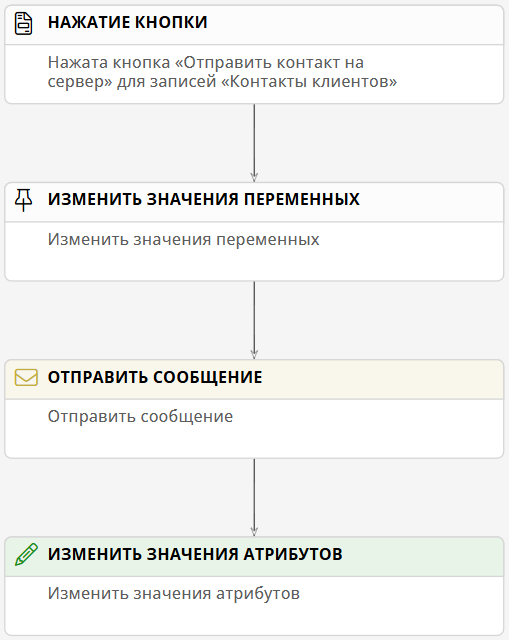

---
kbId:
title: HTTP-запросы типа POST. Отправка и получение ответа
kbTitle: 'HTTP-запросы типа POST. Отправка и получение ответа. Пример: настройка подключения, пути передачи данных и сценария'
---

# HTTP-запросы типа POST. Отправка и получение ответа {: #http_send_post}

## Введение

**{{ productName }}** позволяет отправлять HTTP-запросы типа `POST` для взаимодействия с внешними системами.

Здесь представлен пример настройки подключения, пути передачи данных, шаблона записи и сценария для отправки HTTP-запросов типа `POST` на внешний сервер и записи данных из ответа сервера в атрибуты шаблона записи.

## Прикладная задача

Имеется внешний сервер, на котором хранятся данные контактов:

``` json
[ 
    {
        "Contact":{
            "ID":"STRING",
            "FullName":"STRING",
            "PhoneNumber":"STRING"
        }
    }
]
```

В ответ на HTTP-запрос с данными контакта внешний сервер отправляет ответ со значением `true`, если данные на сервере были обновлены:

``` json
{
    "Success":"BOOL"
}
```

В **{{ productName }}** имеется шаблон записи _«Контакты клиентов»_.

Требуется:
- настроить кнопку, которая будет обновлять данные на внешнем сервере данными из шаблона _«Контакты клиентов»_.
- получить ответ сервера;
- в случае успешного обновления данных установить для логического атрибута _«Данные обработаны»_ значение `true`.

## Настройка подключения

--8<-- "http_send_connection_configure.md"

## Настройка пути передачи данных

1. На странице «**Администрирование**» в разделе «**Архитектура**» выберите пункт «[**Пути передачи данных**][communication_routes]» <i class="fa-light fa-route " aria-hidden="true"></i>.
2. Откройте или создайте путь передачи данных типа «**Подключения REST и OData**» — «**Отправка HTTP-запросов**».
3. Настройте свойства пути передачи данных на следующих вкладках:

    - [**Основные свойства**](#основные-свойства)
    - [**Атрибуты сообщений**](#атрибуты-сообщений)
    - [**Интеграция**](#интеграция)

4. Сохраните путь передачи данных.

### Основные свойства

На вкладке «**Основные свойства**» настройте параметры использования пути передачи данных:

- **Подключение** — выберите [подключение для отправки HTTP-запросов](#настройка-подключения).
- **Системное имя** — введите уникальное имя пути передачи данных.
--8<-- "system_name_requirements.md:no_autofill"
- **Отключить** — установите этот флажок, если требуется временно деактивировать путь передачи данных.
- **Описание** — введите наглядное описание пути передачи данных, например _«Путь передачи данных для отправки файлов по HTTP»_.
- **Номер шины данных** — выберите номер от 0 до 3, если требуется распределить потоки данных нескольких путей для повышения производительности.

### Атрибуты сообщения

!!! warning "Составление атрибута сообщения типа «Объект»"

    Чтобы составить **атрибут сообщения** типа «**Объект**» для хранения структурированных данных, необходимо создать структуру из родительского и дочерних атрибутов:

    --8<-- "communication_route_message_attribute_object.md"

1. Выберите тип сообщения «**Отправка HTTP-запросов**».
2. В таблицу «**Запрос**» добавьте атрибут типа «**Строка**», например _ID_ — системное имя должно совпадать с именем соответствующего поля на внешнем сервере.
3. В таблицу «**Запрос**» добавьте атрибут типа «**Объект**», например _Contact_ — системное имя должно совпадать с именем соответствующего поля на внешнем сервере.
4. Добавьте дочерние атрибуты типа «**Строка**», например _FullName_ и _PhoneNumber_ — системные имена должны совпадать с именами соответствующих полей на внешнем сервере.
5. В таблицу «**Ответ**» добавьте атрибут типа «**Логический**», например _Success_ — это системное имя может быть произвольным.

### Интеграция

 1. Выберите **метод запроса POST**.
 2. В поле «**Атрибуты для сериализации в тело запроса**» укажите _ID, Contact_.
 3. Заполните таблицы «**Укажите атрибуты для десериализации ответа без ошибки**» и «**Укажите атрибуты для десериализации ответа с ошибкой**»:

    - **Путь к атрибуту:** _$_
    - **Выражение на языке запросов:** _$_

## Настройка шаблона записи

1. Создайте шаблон _«Контакты клиентов»_.
2. Создайте следующие атрибуты:

    |      Название      | Системное имя |       Тип      |
    |--------------------|---------------|----------------|
    |   _ID на сервере_  |      _ID_     |    **Текст**   |
    |     _Ф. И. О._     |   _FullName_  |    **Текст**   |
    |     _Телефон_      | _PhoneNumber_ |    **Текст**   |
    | _Данные обновлены_ | _DataUpdated_ | **Логический** |

3. Создайте кнопку _«Отправить контакт на сервер»_ со следующими свойствами:

    - **Контекст операции: запись**
    - **Операция: вызвать событие «Нажата кнопка»**
    - **Результат выполнения: обновить данные**

4. Поместите атрибуты _«ID на сервере»_, _«Ф. И. О.»_, _«Телефон»_, _«Данные обновлены»_ и кнопку _«Отправить контакт на сервер»_ на форму.

## Настройка сценария

!!! warning "Логика работы сценария отправки файлов"

    - Сценарий срабатывает при нажатии кнопки _«Отправить контакт на сервер»_ на форме записи с прикреплёнными файлами.
    - Формируется переменная-объект с данными контакта, содержащие значения соответствующих атрибутов шаблона _«Контакты клиентов»_:

        ``` json
        {
            "Message":{
                "Contact" {
                    "ID":"STRING",
                    "FullName":"STRING",
                    "PhoneNumber":"STRING"
                }
            }
        }
        ```
        
        - `$$Message->Contact->ID` — значение атрибута `$ID`.
        - `$$Message->Contact->FullName` — значение атрибута `$FullName`.
        - `$$Message->Contact->PhoneNumber` — значение атрибута `$PhoneNumber`.

    - Формируется и отправляется HTTP-запрос, содержащий данные контакта в формате JSON из переменной `$$Message`:
        
        ``` json
        {
            "Contact" {
                "ID":"STRING",
                "FullName":"STRING",
                "PhoneNumber":"STRING"
            }
        }
        ```
    - Ответ сервера помещается в **логический** атрибут _«Данные обновлены»_.

1. Создайте сценарий _«Отправка контакта на сервер»_.
2. В свойствах события «**Нажатие кнопки**» выберите **контекстный шаблон** _«Контакты клиентов»_ и **кнопку** _«Отправить контакт на сервер»_.
3. После события «**Нажатие кнопки**» создайте действие «**Изменить значение переменных**» со следующими свойствами:

    - **Операция со значениями переменных: заменить**
    - **Набор переменных:** _Message_

4. В свойствах действия «**Изменить значения переменных**» настройте переменные, как указано ниже.

    !!! warning "Сопоставление переменных и объектов с атрибутами сообщения"

        Для передачи значения переменной в атрибут сообщения типа «**Объект**», необходимо создать родительскую и дочерние переменные с такой же структурой, как у атрибута сообщения:

        --8<-- "communication_route_message_attribute_variable.md"

    - _Contact_ — с дочерними переменными:
        - _ID_ — **значение: формула**

            ``` cs
            $ID
            ```

        - _FullName_ — **значение: формула**

            ``` cs
            $FullName
            ```

        - _PhoneNumber_ — **значение: формула**

            ``` cs
            $PhoneNumber
            ```

        Здесь `$ID`, `$FullName` и `$PhoneNumber` — атрибуты шаблона записи _«Контакты клиентов»_.

5. Создайте действие «**Отправить сообщение**» со следующими свойствами:

    - **Подключение:** выберите [подключение для отправки HTTP-запросов](#настройка-подключения).
    - **Путь передачи данных:** выберите [путь передачи данных для отправки HTTP-запросов](#настройка-пути-передачи-данных).
    - **Переменная с сообщением:** _Message_
    - **Переменная для успешного ответа:** _Response_

6. Создайте действие «**Изменить значения атрибутов**» со следующими свойствами:

    - **Атрибут:** _Данные обновлены_
    - **Операция со значениями: заменить**
    - **Значение: формула**

        ``` cs
        $$Response->Success
        ```

__

## Тестирование

1. Создайте запись в шаблоне _«Контакты клиентов»_.
2. Заполните поля контакта и нажмите кнопку «**Сохранить**».
3. Нажмите кнопку _«Отправить контакт на сервер»_.
4. При успешном обновлении данных контакта на внешнем сервере у атрибута _«Данные обновлены»_ будет установлен флажок.

--8<-- "related_topics_heading.md"

- _[HTTP-запросы типа POST. Отправка составного содержимого и файлов][http_send_file]_
- _[Отправка HTTP-запросов. Настройка подключения][send_http_connection]_
- _[Отправка HTTP-запросов типа GET. Пример: настройка подключения, пути передачи данных и сценария для обработки запросов в формате JSON][send_http_example]_
- _[Подключения. Типы, создание, настройка, удаление][connections]_
- _[Пути передачи данных. Типы, создание, настройка, удаление][communication_routes]_

</div>


