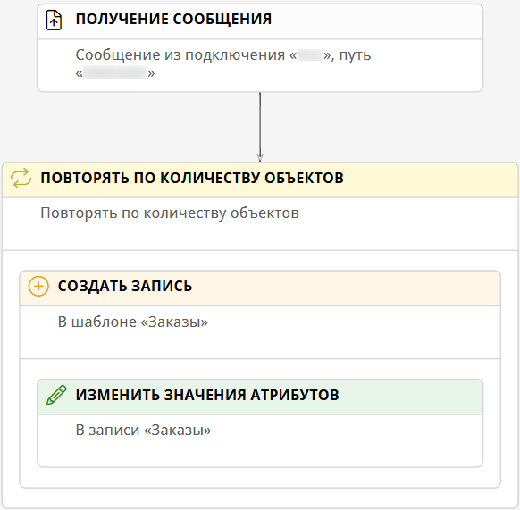

# Получение HTTP-запросов с обработкой JSON-запросов {: #receive_http_example}

## Введение

**{{ productName }}** может получать HTTP-запросы с помощью встроенного HTTP-адаптера.

Здесь на примере сценария приема заказов мы разберем настройку получения и обработки HTTP-запроса в формате JSON.

Настройка для обработки XML и простого текста будет аналогичной.



## Исходные данные

Пример JSON-данных из запроса, поступающего в систему из внешней системы:

``` js
{
   "ListZakazov":[
      {
         "Zakaz":{
            "Client":"Петров",
            "Nomer":54,
            "Tovar":"Яблоко"
         }
      },
      {
         "Zakaz":{
            "Client":"Иванов",
            "Nomer":60,
            "Tovar":"Банан"
         }
      },
      {
         "Zakaz":{
            "Client":"Сидоров",
            "Nomer":61,
            "Tovar":"Груша"
         }
      }
   ]
}
```

В приложении имеется шаблон записи _«Заказы»_, с атрибутами:

- _Номер_ типа «**Число**»
- _Клиент_ типа «**Текст**»
- _Товар_ типа «**Текст**»

!!! note "Примечание"

    Здесь не рассматривается проверка полученных данных на уникальность и совпадение с имеющимися в записях.

## Настройка подключения

1. Перейдите в раздел «**Администрирование**» — «**Инфраструктура**» — «**Подключения**». Нажмите кнопку «**Создать**» и выберите пункт «**Подключения REST и OData**» — «**Получение HTTP-запросов**».
2. Настройте свойства нового подключения:

    - **Системное имя** (на латинице) нового подключения;
    - **Описание** — отображаемое название нового подключения;
    - **Базовый путь получения HTTP-запросов** — добавьте **путь URI**, например `uploadData`. При необходимости введите дополнительный **путь URI** на вкладке «**Интеграция**» в свойствах [пути передачи данных](#настройка-пути-передачи-данных). Укажите результирующий путь на внешнем сервере в качестве получателя запроса.
    - **Формат данных** — **JSON**. Также поддерживаются **XML** и **простой текст**, но здесь рассматривается обработка данных в формате JSON.

3. Сохраните подключение.

## Настройка пути передачи данных {: .pageBreakBefore }

1. Перейдите в раздел **Администрирование — Инфраструктура — Пути передачи данных**. Нажмите кнопку «**Создать**» и выберите пункт  «**Подключения REST и OData**» — «**Получение HTTP-запросов**».
2. В окне создания нового пути передачи данных укажите:

    - **Подключение** — выберите ранее созданное [подключение](#настройка-подключения).
    - **Системное имя** (на латинице) нового пути передачи данных;
    - **Описание** — наглядное наименование нового пути передачи данных.

3. Перейдите на вкладку «**Атрибуты сообщений**».
4. Выберите **тип сообщения** «**Обработка HTTP-запросов**».
5. В таблице «**Запрос**» сопоставьте данные JSON сопоставляются с атрибутами **{{ productName }}**, то есть воссоздайте структуру входных данных JSON с помощью кнопки «**Добавить**».

    На данном этапе следует посмотреть структуру JSON-данных, поступающих в запросе, и разобрать их на атрибуты с указанием типов данных:

    - _ListZakazov_ — атрибут типа «**Объект**», который содержит в себе данные по всем заказам.
    - _Zakaz_ — атрибут типа «**Объект**», который содержит в себе данные по одному заказу.
    - _Nomer_ — атрибут типа «**Число**», содержащий значение номера заказа.
    - _Client_ — атрибут типа «**Строка**», содержащий значение клиента заказа.
    - _Tovar_ — атрибут типа «**Строка**», содержащий значение товара заказа.

    !!! warning "Составление атрибута сообщения типа «Объект»"

        Чтобы составить **атрибут сообщения** типа «**Объект**» для хранения имени и содержимого файла, необходимо создать структуру из родительского и дочерних атрибутов:

        --8<-- "communication_route_message_attribute_object.md"

    __

6. При необходимости настройте **ответ** — здесь можно составить макет JSON, который будет ответом на запрос, и ответ с ошибкой — здесь можно составить макет JSON, который будет ответом на запрос, в котором произошла ошибка.
7. Перейдите на вкладку «**Интеграция**».
8.  При необходимости укажите дополнительный суффикс в поле «**Путь URI**». Этот суффикс будет добавлен к URL-адресу в поле «**Базовый путь получения HTTP-запросов**» (совпадает с путём, настроенным в [подключении](#настройка-подключения)). Укажите результирующий адрес на внешнем сервере в качестве получателя запросов.
9. Укажите **атрибуты для десериализации данных**. По умолчанию следует указать `$` в обоих столбцах, чтобы получить всю структуру JSON из запроса. Для поиска определенного атрибута используйте JSONPath.
10. При необходимости укажите **атрибут для заголовков**, в котором будут содержаться все атрибуты заголовков запроса, **атрибут для параметров запроса**, в котором будут содержаться все параметры запроса, и **атрибут для тела запроса**, в котором будет содержаться всё тело запроса.
11. В поле «**Базовый путь для приема HTTP-запросов**» указан адрес, на который внешняя система должна отправлять запросы в **{{ productName }}**.
12. Сохраните путь передачи данных.

__

## Настройка сценария для обработки полученного JSON-запроса {: .pageBreakBefore }

1. Создайте новый сценарий _«Обработка заказов»_.
2. У начального события измените тип на «**Получение сообщения**» и настройте его:

    - **Контекстный шаблон:** _Заказы_
    - **Подключение:** [подключение для получения HTTP-запросов](#настройка-подключения)
    - **Путь передачи данных:** [путь передачи данных для получения HTTP-запросов](#настройка-пути-передачи-данных)
    - **Имя переменной:** _Request_
    

3. Добавьте действие «**Повторять по количеству объектов**» со следующими свойствами:

   - **Имя переменной:** _local_
   - **Атрибут или выражение для поиска объектов: N3**

        ``` turtle
        # Импортируем функции для работы
        # с данными текущего сеанса и переменными
        @prefix session: <http://comindware.com/ontology/session#>.
        @prefix var: <http://comindware.com/ontology/session/variable#>.
        {
            # Request — переменная из первого блока, 
            # в которой находится разобранный JSON
            session:context var:Request ?req.
            # ListZakazov - переменная, 
            # в которой находится массив объектов
            ?req var:ListZakazov ?value.
        }
        ```

4. Внутрь действия «**Повторять по количеству объектов**» добавьте действие «**Создать запись**» и укажите  шаблон записи _«Заказы»_.

    

5. Внутрь действия «**Создать запись**» добавьте действие «**Изменить значения атрибутов**».
6. В действии «**Изменить значения атрибутов**» на вкладке «**Дополнительно**» установите флажок «**Сбрасывать кэш значений**».
7. На вкладке «**Основные**» настройте следующие атрибуты::

    | Атрибут  | Операция со значениями | Значение                            |
    | -------- | ---------------------- | ----------------------------------- |
    | _Клиент_ | **Заменить**           | **Формула:** `$$local—Zakaz—Client` |
    | _Номер_  | **Заменить**           | **Формула:** `$$local—Zakaz—Nomer`  |
    | _Товар_  | **Заменить**           | **Формула:** `$$local—Zakaz—Tovar`  |

    !!! note "Примечание"
    
        Переменная `$$local` — хранит значение текущего объекта итерации. Пример:

        ``` json
        {
            "Zakaz":{
                "Client":"Петров",
                "Nomer":54,
                "Tovar":"Яблоко"
            }
        }
        ```

        Переменная `$$local—Zakaz` содержит массив данных по заказу из текущего объекта итерации. Пример:

        ``` json
        {
            "Client":"Петров",
            "Nomer":54,
            "Tovar":"Яблоко"
        }
        ```

        Переменная `$$local—Zakaz—Tovar` содержит данные о товаре по заказу из текущего объекта итерации. Пример:

        ``` json
        "Яблоко"
        ```

    

8. Получившийся сценарий должен выглядеть следующим образом:

    __

## Тестирование

1. Отправьте запрос из внешней системы в **{{ productName }}** на адрес, указанный в поле «**Базовый путь для приема HTTP-запросов**» в [свойствах пути передачи данных](#настройка-пути-передачи-данных).

2. Проверьте обработку запроса: должны быть созданы записи в шаблоне «_Заказы_», соответствующие полученному запросу, как показано на иллюстрации:

__

<div class="relatedTopics" markdown="block">

--8<-- "related_topics_heading.md"

- _[Сценарии. Определения, создание, настройка, использование][scenarios]_

</div>


