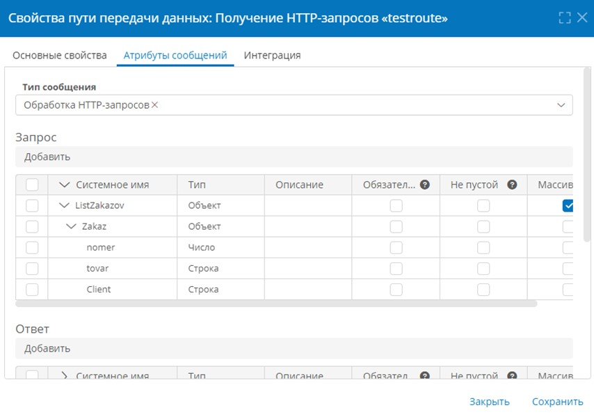
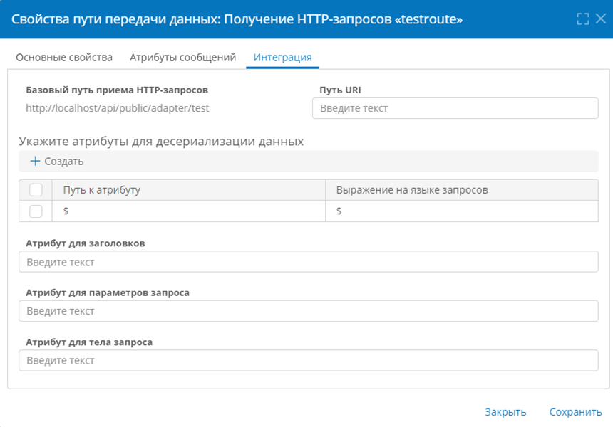
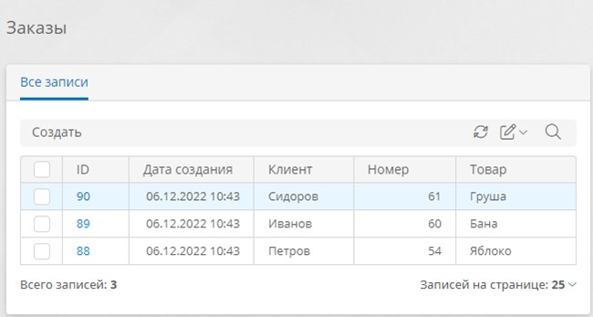

# HTTP-запросы. Получение JSON-данных в сценарии {: #http_receive_example}

## Введение

**{{ productName }}** может получать и обрабатывать HTTP-запросы из внешних систем.

Здесь представлен пример настройки подключения, пути передачи данных и сценария для получения и обработки HTTP-запроса в формате JSON с данными заказов.

Настройка для обработки XML и простого текста будет аналогичной.





См. также _«[HTTP-запросы с составным содержимым. Получение файлов в сценарии][http_receive_file]»_

## Прикладная задача

- Имеется шаблон записи _«Заказы»_, с атрибутами:
    - _Номер_ типа «**Число**»
    - _Клиент_ типа «**Текст**»
    - _Товар_ типа «**Текст**»
- Внешний сервер отправляет в **{{ productName }}** HTTP-запросы с данными в формате JSON следующего вида:

    ``` json
    {
        "ListZakazov":[
            {
                "Zakaz":{
                    "Client": "STRING",
                    "Nomer": "NUMBER",
                    "Tovar": "STRING"
                }
            }
        ]
    }
    ```

- Требуется настроить получение c внешнего сервера HTTP-запросов с данными заказов.
- При получении HTTP-запроса требуется создать запись в шаблоне _«Заказы»_ и заполнить её полученными данными.

!!! note "Примечание"

    Здесь не рассматривается проверка полученных данных на уникальность и совпадение с имеющимися в записях.

## Порядок настройки получения HTTP-запросов

--8<-- "http_receive_configure_sequence.md"

## Настройка подключения

1. На странице «**Администрирование**» выберите пункт «**Инфраструктура**» — «[**Подключения**][connections]» <i fal fa-exchange-alt></i>.
2. Откройте или создайте подключение типа «**Подключения REST и OData**» — «**Получение HTTP-запросов**».
3. Настройте подключение к серверу:

    - **Системное имя** — введите уникальное имя подключения.
        --8<-- "system_name_requirements.md:no_autofill"
    - **Отключить** — установите этот флажок, если требуется временно деактивировать данное подключение.
    - **Описание** — введите наглядное описание подключения, например _«Подключение для получения заказов HTTP»_.
    - **Запись в файловые журналы** — выберите, какие события следует записывать в журналы:
        - **Полные сведения об обработке сообщения**;
        - **Только ошибки**;
        - **Отключить** — не регистрировать в журнале события получения запросов.
    - **Базовый путь получения HTTP-запросов** — добавьте **путь URI**, например `uploadData`. При необходимости введите дополнительный **путь URI** на вкладке «**Интеграция**» в свойствах [пути передачи данных](#настройка-пути-передачи-данных). Укажите результирующий путь на внешнем сервере в качестве получателя запроса, например:

        ```
        https://example.com/api/public/adapter/uploadData
        ```

    - **Формат данных** — выберите представление данных:
        - **JSON** — используется в данном примере;
        - **XML**;
        - **Простой текст**.
    - **Тип аутентификации** — выберите способ проверки подлинности, используемый сервером:
        - **Отсутствует**;
        - **Базовая**;
        - **Аутентификация Windows**.

4. Сохраните подключение.

## Настройка пути передачи данных {: .pageBreakBefore }

1. Откройте страницу «**Администрирование**» — «**Архитектура**» или страницу «**Администрирование**» приложения.
2. Выберите пункт «[**Пути передачи данных**][communication_routes]» <i class="fa-light fa-route " aria-hidden="true"></i>.
3. Откройте или создайте путь передачи данных типа «**Подключения REST и OData**» — «**Получение HTTP-запросов**».
4. Настройте свойства пути передачи данных на следующих вкладках:

    - [**Основные свойства**](#основные-свойства)
    - [**Атрибуты сообщений**](#атрибуты-сообщений)
    - [**Интеграция**](#интеграция)

5. Сохраните путь передачи данных.

### Основные свойства

На вкладке «**Основные свойства**» настройте параметры использования пути передачи данных:

- **Подключение** — выберите [подключение для получения HTTP-запросов](#настройка-подключения).
- **Системное имя** — введите уникальное имя пути передачи данных.
    --8<-- "system_name_requirements.md:no_autofill"
- **Отключить** — установите этот флажок, если требуется временно деактивировать путь передачи данных.
- **Описание** — введите наглядное описание пути передачи данных, например _«Получение заказов по HTTP»_.
- **Номер шины данных** — выберите номер от 0 до 3, если требуется распределить потоки данных нескольких путей для повышения производительности.

### Атрибуты сообщений

!!! warning "Составление атрибута сообщения типа «Объект»"

    Чтобы составить **атрибут сообщения** типа «**Объект**» для хранения структурированных данных, необходимо создать структуру из родительского и дочерних атрибутов:

    --8<-- "communication_route_message_attribute_object.md"

1. Выберите **тип сообщения** «**Обработка HTTP-запросов**».
2. В таблице «**Запрос**» сопоставьте данные HTTP-запроса с атрибутами **{{ productName }}**, то есть воссоздайте структуру JSON входящего запроса:

    - В таблицу «**Запрос**» добавьте атрибут _ListZakazov_ типа «**Объект**». Установите флажок «**Массив**», так как этот атрибут будет содержать массив данных по всем заказам. **Системное имя** должно совпадать с именем соответствующего поля HTTP-запроса.
    - В атрибут _FileObject_ добавьте дочерний атрибут _Zakaz_ типа «**Объект**». Он будет содержать данные по одному заказу.
    - В атрибут _Zakaz_ добавьте следующие дочерние атрибуты:

    | Системное имя | Тип        | Описание         |
    | ------------- | ---------- | ---------------- |
    | _Nomer_       | **Число**  | Номер заказа     |
    | _Client_      | **Строка** | Название клиента |
    | _Tovar_       | **Строка** | Название товара  |

    **Системные имена** этих атрибутов должны совпадать с именами соответствующих полей HTTP-запроса.

    __

3. При необходимости настройте **ответ** — здесь можно составить структуру JSON, которая будет отправляться в ответе на запрос после его успешной обработки, и ответ с ошибкой — структуру JSON для ответа на запрос, при обработке которого произошла ошибка.

### Интеграция

1. При необходимости укажите дополнительный суффикс в поле «**Путь URI**». Этот суффикс будет добавлен к URL-адресу в поле «**Базовый путь получения HTTP-запросов**» (совпадает с путём, настроенным в [подключении](#настройка-подключения)). Укажите результирующий адрес на внешнем сервере в качестве получателя запросов, например:

    ```
    https://example.com/api/public/adapter/uploadData
    ```

2. Укажите **атрибуты для десериализации данных**. По умолчанию следует указать `$` в обоих столбцах, чтобы получить всю структуру JSON из запроса. Для поиска определенного атрибута используйте JSONPath.
3. При необходимости укажите **атрибут для заголовков**, в котором будут содержаться все атрибуты заголовков запроса, **атрибут для параметров запроса**, в котором будут содержаться все параметры запроса, и **атрибут для тела запроса**, в котором будет содержаться всё тело запроса.

    __

## Настройка сценария {: .pageBreakBefore }

1. Создайте новый сценарий _«Обработка заказов»_.
2. У начального события измените тип на «**Получение сообщения**» и настройте его:

    - **Контекстный шаблон:** _Заказы_
    - **Подключение:** [подключение для получения HTTP-запросов](#настройка-подключения)
    - **Путь передачи данных:** [путь передачи данных для получения HTTP-запросов](#настройка-пути-передачи-данных)
    - **Имя переменной:** _Request_
    

3. Добавьте действие «**Повторять по количеству объектов**» со следующими свойствами:

   - **Имя переменной:** _local_
   - **Атрибут или выражение для поиска объектов: N3**

    ``` turtle
    # Импортируем функции для работы
    # с данными текущего сеанса и переменными
    @prefix session: <http://comindware.com/ontology/session#>.
    @prefix var: <http://comindware.com/ontology/session/variable#>.
    {
        # Request — переменная из первого блока, 
        # в которой находится разобранный JSON
        session:context var:Request ?req.
        # ListZakazov - переменная, 
        # в которой находится массив объектов
        ?req var:ListZakazov ?value.
    }
    ```

4. Внутрь действия «**Повторять по количеству объектов**» добавьте действие «**Создать запись**» и укажите  шаблон записи _«Заказы»_.

    

5. Внутрь действия «**Создать запись**» добавьте действие «**Изменить значения атрибутов**».
6. В действии «**Изменить значения атрибутов**» на вкладке «**Дополнительно**» установите флажок «**Сбрасывать кэш значений**».
7. На вкладке «**Основные**» настройте следующие атрибуты::

    | Атрибут  | Операция со значениями | Значение                            |
    | -------- | ---------------------- | ----------------------------------- |
    | _Клиент_ | **Заменить**           | **Формула:** `$$local—Zakaz—Client` |
    | _Номер_  | **Заменить**           | **Формула:** `$$local—Zakaz—Nomer`  |
    | _Товар_  | **Заменить**           | **Формула:** `$$local—Zakaz—Tovar`  |

    !!! note "Примечание"

        Переменная `$$local` — хранит значение текущего объекта итерации. Пример:

        ``` json
        {
            "Zakaz":{
                "Client": "Петров",
                "Nomer": 54,
                "Tovar": "Яблоко"
            }
        }
        ```

        Переменная `$$local—>Zakaz` содержит данные заказа из текущего объекта итерации. Пример:

        ``` json
        {
            "Client": "Петров",
            "Nomer": 54,
            "Tovar": "Яблоко"
        }
        ```

        Переменная `$$local—>Zakaz—>Tovar` содержит данные о товаре по заказу из текущего объекта итерации. Пример:

        ``` json
        "Яблоко"
        ```

    

8. Получившийся сценарий должен выглядеть следующим образом:

    __

## Тестирование

1. С внешнего сервера отправьте в **{{ productName }}** запрос с данными заказов, например:

    ``` sh
    curl -X POST \
        -u username:password \
        -H "Content-Type: application/json" \
        -d '{
            "ListZakazov": [
                {
                    "Zakaz": {
                        "Client": "Петров",
                        "Nomer": 54,
                        "Tovar": "Яблоко"
                    }
                },
                {
                    "Zakaz": {
                        "Client": "Иванов",
                        "Nomer": 60,
                        "Tovar": "Банан"
                    }
                },
                {
                    "Zakaz": {
                        "Client": "Сидоров",
                        "Nomer": 61,
                        "Tovar": "Груша"
                    }
                }
            ]
        }' \
        https://example.com/api/public/adapter/uploadData
        - v
    ```
    Здесь:

    - `-X POST` — метод запроса (необязательный ключ);
    - `-u username:password` — базовая аутентификация c учётными данными аккаунта с разрешением на **вызовы API** **{{ productName }}**;
    - `-H "Content-Type: application/json"` — заголовок, указывающий на формат данных JSON;
    - `-d '...'` — тело запроса с JSON-структурой;
    - `https://example.com/api/public/adapter/uploadData` — **базовый путь получения HTTP-запросов** и **путь URI**, настроенные в [пути передачи данных](#настройка-пути-передачи-данных);
    - `-v` — вывод отладочных данных (необязательный ключ).

2. Проверьте обработку запроса: должны быть созданы записи в шаблоне _«Заказы»_, соответствующие полученному запросу, как показано на иллюстрации:

__

<div class="relatedTopics" markdown="block">

--8<-- "related_topics_heading.md"

- _[HTTP-запросы с составным содержимым. Получение файлов в сценарии][http_receive_file]_
- _[HTTP-запросы типа POST. Отправка составного содержимого и файлов][http_send_file]_
- _[Сценарии][scenarios]_
- _[Аккаунты][accounts]_
- _[Системные роли][system_roles]_
- _[Ключи аутентификации API][authentication_keys]_

</div>


