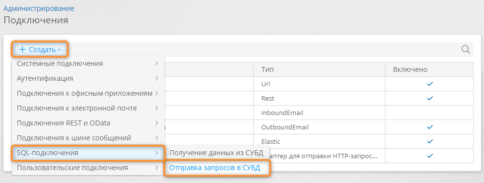
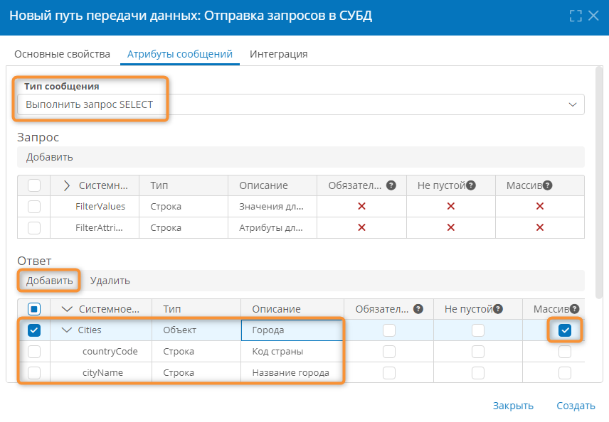
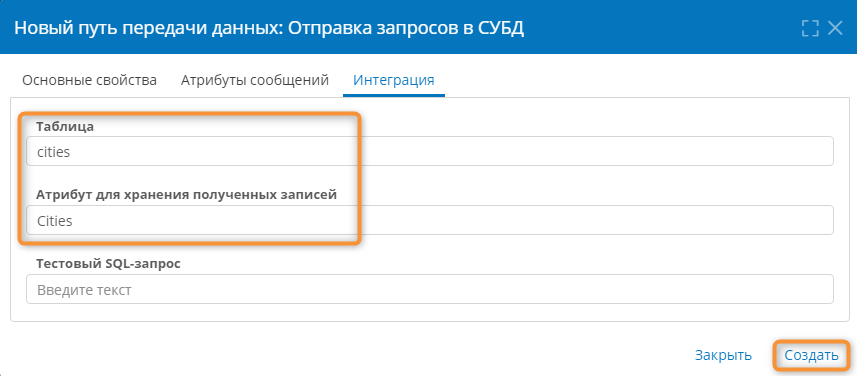
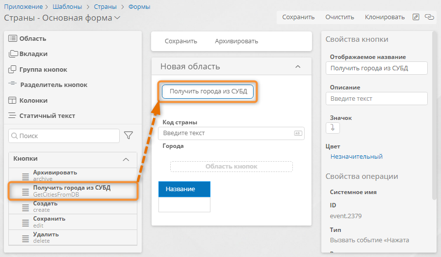
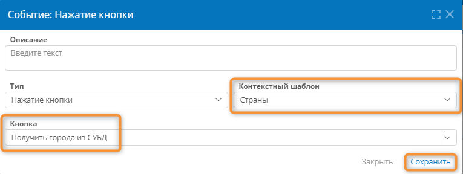
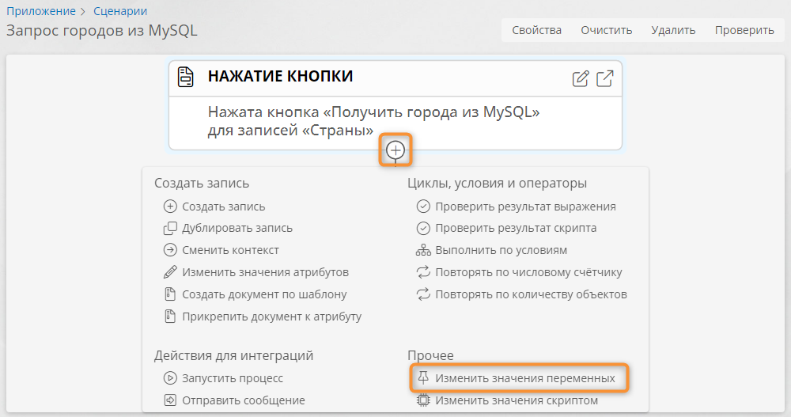
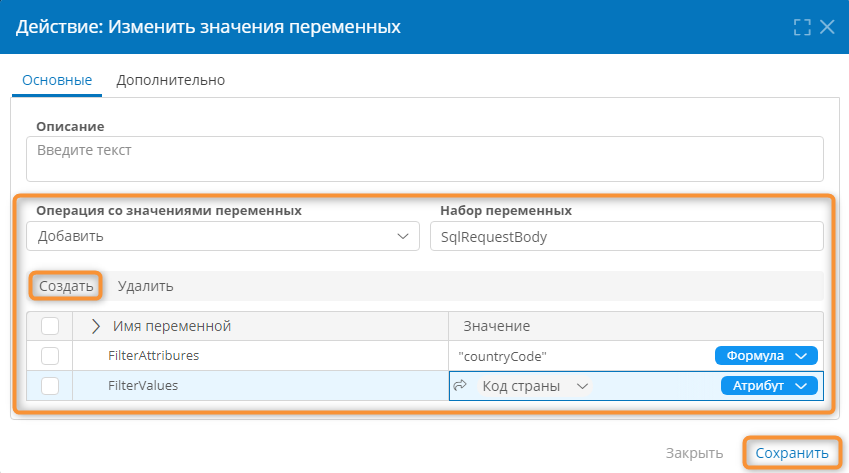
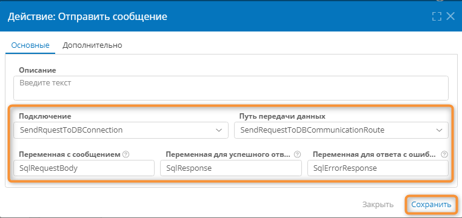
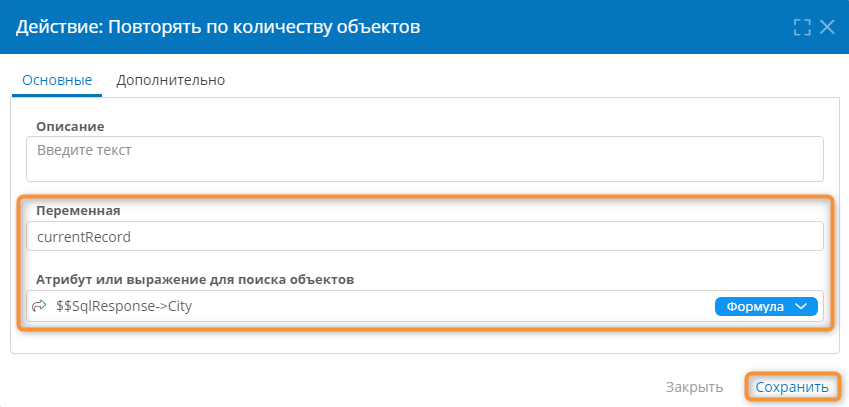
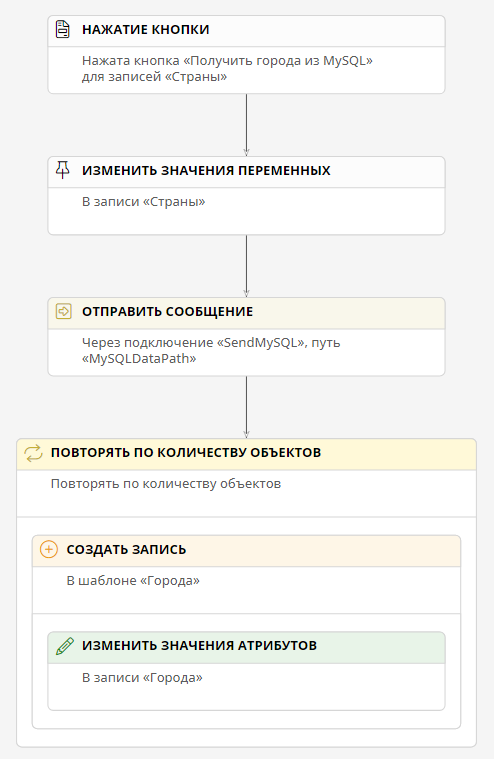

# Внешняя СУБД (MySQL, MSSQL, Oracle, PostgreSQL). Отправка SQL-запроса. Настройка подключения, пути передачи данных и сценария {: #sql_send_connection}

## Введение

Здесь представлены инструкции по настройке подключения, пути передачи данных и сценария для отправки SQL-запросов во внешнюю систему управления базами данных (СУБД) с целью получения данных из внешней базы данных (БД) в приложение на основе **{{ productName }}** (далее «Приложение»).

Для обмена данными с СУБД поддерживаются следующие SQL-запросы:

- `SELECT`
    - задайте таблицу для выборки записей из СУБД;
    - задайте условие `WHERE` (необязательно) для выборки записей из СУБД;
    - задайте атрибут для хранения полученных записей из СУБД;
- `UPDATE`
    - задайте таблицу для выборки записей из СУБД;
    - задайте условие `WHERE` (необязательно) для выборки записей из СУБД;
    - задайте атрибуты (поля) записей, которые требуется изменить в СУБД;
- `INSERT`
    - задайте таблицу для выборки записей из СУБД;
    - задайте атрибуты (поля) записей, которые требуется создать в СУБД;
- `DELETE`
    - задайте таблицу для выборки записей из СУБД;
    - задайте условие `WHERE` (обязательно) для выборки записей, которые требуется удалить из СУБД;
- пользовательский запрос:
    - задайте собственный шаблон запроса, в который можно подставить значения **атрибутов сообщения**, например:
      ``` sql
      -- {my_id} — заполнитель с системным именем атрибута сообщения,
      -- значение которого будет подставлено в запрос
      SELECT * FROM TableName WHERE Id={my_id}
      ```
    - задайте атрибут для хранения полученного результата;
    - задайте тип возвращаемого результата:
        - **без результата**;
        - **набор записей**;
        - **скалярное значение** (возвращаемое скалярной функцией SQL).

Настройка приложения для обмена данными с СУБД MySQL, MSSQL, Oracle и PostgreSQL осуществляется аналогичным образом.

См. также статью _«[Внешняя СУБД (MySQL, MSSQL, Oracle, PostgreSQL). Получение данных по таймеру. Настройка подключения, пути передачи данных и сценария][sql_receive_connection]»._

## Прикладная задача

Посредством запроса `SELECT` к внешней СУБД необходимо получать из таблицы `cities` названия городов, находящихся в стране, по трехбуквенному коду страны в формате ISO 3166-1.

### Исходные данные

Внешняя БД содержит таблицу `cities` со следующими столбцами:

- `countryCode` типа `CHAR(3)` — трехбуквенный код страны, в которой находится город;
- `cityName` типа `TINYTEXT` — название города.

В приложении имеется шаблон записи _«Страны»_ с атрибутами:

- _Код страны_ (системное имя _CountryCode_):
    - **Тип данных: текст**
- _Города страны_
    - **Системное имя:** _Cities_
    - **Тип данных: запись**
    - **Связанный шаблон**: _Города_
    - **Хранить несколько значений**: флажок установлен

В приложении имеется шаблон записи _«Города»_ с атрибутом:

- _Название города_
    - **Системное имя**: _cityName_
    - **Тип данных: текст**
    - **Использовать как заголовок записей**: флажок установлен

В шаблоне записи _«Страны»_ на основную форму вынесены следующие атрибуты:

- _Код страны_ — текстовое поле;
- _Города страны_ — таблица со столбцом _«Название города»._

## Подготовка сервера СУБД

Перед подключением из **{{ productName }}** необходимо подготовить конфигурацию сервера СУБД, как указано ниже.

### Настройка конфигурации сервера PostgreSQL

Настройка серверов MySQL, MSSQL и Oracle осуществляется аналогично.

1. Откройте для редактирования файл `postgresql.conf`.

    - В ОС Linux путь к этому файлу можно узнать с помощью следующей команды:  

        ``` shell
        sudo -u postgres psql -c 'SHOW config_file'
        ```

    - В ОС Windows путь к файлу по умолчанию:

        ``` powershell
        C:\ProgramData\PostgreSQL\X.X\data\postgresql.conf
        ```

        Здесь `X.X` — номер версии PostgreSQL.

2. В файле `postgresql.conf` добавьте следующие директивы:  

    - Разрешите подключение со всех IP адресов:

        ``` shell
        listen_addresses = '*'
        ```

    - Задайте локаль для вывода сообщений об ошибках:

        ``` shell
        lc_messages = 'en_EN.utf-8'
        ```

3. Откройте для редактирования конфигурационный файл `pg_hba.conf` (в той же директории, что файло `postgresql.conf`).
4. В файле `pg_hba.conf` разрешите подключение с адреса сервера **{{ productName }}** (например, `123.45.67.89`):

    ``` ini
    host    all    all    123.45.67.89    md5
    ```

5. Перезапустите службу `postgresql`:  
    **Linux**

    ``` shell
    sudo systemctl restart postgresql
    ```

    **Windows**

    ``` powershell
    net stop postgresql-x64-<номер_версии>
    ```

## Создание подключения к СУБД

1. Откройте страницу «**Администрирование**» — «**Подключения**».
2. Создайте **SQL-подключение** типа «**Отправки запросов в СУБД**».

    __

3. В поле «**Системное имя**» введите уникальное имя подключения, например `SendRquestToDBConnection`.
4. В поле «**Описание**» введите наглядное описание назначения подключения, например _«Подключение для отправки запросов в СУБД»_.
5. В поле «**Запись в файловые журналы**» укажите, какие события при обмене данными с сервером СУБД следует регистрировать в журнале:

   - **Полные сведения об обработке сообщения**
   - **Только ошибки**
   - **Отключить**

6. В поле «**Строка подключения**» введите адрес сервера, имя базы данных, имя пользователя и пароль для подключения к СУБД:  
    **MySQL**

    ``` shell
    Server=ServerAddress;Database=DataBaseName;Uid=Username;Pwd=Password;
    ```

    **MSSQL**

    ``` shell
    Server=ServerAddress;Database=DataBaseName;User Id=Username;Pwd=Password;
    ```

    **Oracle**

    ``` shell
    Data Source=DataBaseName;User Id=Username;Password=Password;Integrated Security=no;
    ```

    **PostgreSQL**  

    ``` shell
    Host=ServerAddress;Database=DataBaseName;User ID=Username;Password=Password;
    ```

7. В поле «**Система управления базами данных**» выберите тип СУБД:

    - **MySQL**
    - **MSSQL**
    - **Oracle**
    - **PostgreSQL**

8. Нажмите кнопку «**Создать**».
9. В списке подключений дважды нажмите строку созданного подключения.  
10. В окне свойств подключения нажмите кнопку «**Проверить соединение**».
11. Если проверка соединения не выдала ошибок, нажмите кнопку «**Сохранить**».

## Создание пути для обмена данными с СУБД

1. Со страницы «**Администрирование**» приложения перейдите в раздел «**Пути передачи данных**».
2. Создайте **путь передачи данных** типа «**SQL-подключения — Отправка запросов в СУБД**».

    __

3. В поле «**Подключение**» выберите ранее созданное подключение для отправки запросов в СУБД, например _«Отправка запросов в СУБД»_.
4. В поле «**Системное имя**» введите уникальное имя пути передачи данных, например `SendRequestToDBCommunicationRoute`.
5. В поле «**Описание**» введите наглядное описание пути передачи данных, например _«Путь для отправки данных в СУБД»_.  
6. Откройте вкладку «**Атрибуты сообщений**».
7. В поле «**Тип сообщения**» выберите пункт «**Выполнить запрос SELECT**».
8. В таблице «**Запрос**» оставьте созданные автоматически атрибуты, они будут использоваться в сценарии для формирования SQL-запроса.
{: #message_attributes}
9. В области «**Ответ**» нажмите кнопку «**Добавить**», чтобы создать:  

    - атрибут `Cities` типа «**Объект**» с установленным флажком «**Массив**» — этот атрибут будет содержать массив названий городов, полученных из внешней БД (системное имя этого атрибута может быть любым);

10. В таблице атрибутов установите флажок у атрибута `Cities` и нажмите кнопку «**Добавить**», чтобы создать:

    - вложенный атрибут `cityName` типа «**Строка**» — этот атрибут будет содержать название города, и его системное имя должно совпадать с именем столбца с названиями городов в таблице полученной из внешней БД.
    - вложенный атрибут `countryCode` типа «**Строка**» — этот атрибут будет содержать код страны, и его системное имя должно совпадать с именем столбца с кодами стран в таблице полученной из внешней БД.  

    __

11. Откройте вкладку «**Интеграция**».
12. В поле «**Таблица**» укажите имя таблицы в базе данных, из которой требуется получать данные, например `cities`.
13. В поле «**Атрибут для хранения полученных записей**» укажите системное имя атрибута `Cities`, созданного на вкладке «**[Атрибуты сообщений](#message_attributes)**».
14. Поле «**SQL-запрос**» оставьте пустым. Если его заполнить, то будет проигнорирован запрос, сформированный с помощью сценария и атрибутов на вкладке «[**Атрибуты сообщений**](#message_attributes)».
15. Сохраните настроенный путь для обмена данными с СУБД.  

    __

## Создание кнопки для отправки SQL-запроса в СУБД

1. Откройте вкладку «**Кнопки**» шаблона записи _«Страны»_.
2. Создайте кнопку _«Получить города из СУБД»_ со следующими свойствами:

    - **Контекст операции: запись**
    - **Операция: вызвать событие «Нажата кнопка»**
    - **Результат выполнения: обновить данные**

    __

3. Добавьте кнопку _«Получить города из СУБД»_ на основную форму шаблона _«Страны»_.

    __

## Создание сценария для отправки SQL-запроса и получения данных из СУБД

1. Со страницы «**Администрирование**» приложения перейдите в раздел «**Сценарии**».
2. Создайте новый сценарий, нажав кнопку «**Создать**».
3. Настройте свойства сценария:

    - **Название** — введите наглядное название сценария, например _«Запрос городов из СУБД»_.
    - **Системное имя** — введите уникальное имя сценария, например `getCitiesFromDB`.
    - **Контекст выполнения** — выберите пункт «**От имени системы**».

4. Сохраните сценарий.
5. Откройте конструктор сценария, дважды нажав строку созданного сценария в списке сценариев.  
6. В отобразившемся конструкторе сценария нажмите кнопку изменить на элементе «**Нажатие кнопки**».  

    __

7. Настройте свойства события:

    - **Контекстный шаблон** — выберите шаблон записи _«Страны»_;
    - **Кнопка** — выберите ранее созданную кнопку _«Получить города из СУБД»_.

8. Нажмите кнопку «**Сохранить**».  

    __

9. Нажмите кнопку «**Добавить действие**» под элементом «**Нажата кнопка**».  

    __

10. Добавьте действие «**Изменить значения переменных**» и настройте его свойства:

    - **Операция со значениями переменных** — **добавить**.
    - **Набор переменных** — укажите наглядное имя, например `SqlRequestBody`, оно будет использоваться в последующих действиях сценария.
    - Нажмите кнопку «**Создать**» над таблицей переменных и добавьте две переменных:

        - **FilterAttributes** — в поле «**Значение**» введите имя столбца `countryCode` из таблицы `cities` во внешней БД.
        - **FilterValues** — в поле «**Значение**» выберите **атрибут** _«Код страны»_.
        - Из этих переменных в последующем действии «**Отправить сообщение**» в SQL-запросе будет сформировано предложение `WHERE FilterAttributes=FilterValues` (например, `WHERE countryCode='RUS'`).

    - Сохраните действие «**Изменить значения переменных**».

    __

11. После действия «**Изменить значения переменных**» добавьте действие «**Отправить сообщение**» и настройте его свойства:
{: #send_message}

    - **Подключение** — выберите ранее созданное _Подключение для отправки запросов в СУБД_.
    - **Путь передачи данных** — выберите ранее созданный _Путь для отправки данных в СУБД_.
    - **Переменная с сообщением** — введите наглядное имя **набора переменных** `SqlRequestBody`, заданное в предшествующем действии «**Изменить значения переменных**».
    - **Переменная для успешного ответа** — введите наглядное имя переменной для хранения записей, полученных из внешней БД, например `SqlResponse`.
    - введите имя переменной для хранения ответа сервера об успешной операции.
    - **Переменная для ответа с ошибкой** — введите имя переменной для хранения ответа сервера об операции, которую не удалось выполнить.
    - Сохраните действие «**Отправить сообщение**».

    __

12. За действием «**Отправить сообщение**» добавьте действие «**Повторять по количеству объектов**» и настройте его свойства:
{: #object_cycle}

    - В поле «**Переменная**» введите наглядное имя переменной для итераций в цикле, например `currentRecord`;
    - В поле «**Атрибут или выражение для поиска объектов**» введите следующее выражение:

        - **Формула**

            ``` cs
            $$SqlResponse->City
            ```

        - **N3**

            ``` turtle
            @prefix session: <http://comindware.com/ontology/session#>. 
            @prefix var: <http://comindware.com/ontology/session/variable#>. 
            { 
                session:context var:SqlResponse ?message. 
                ?message var:City ?value. 
            }
            ```

        - Здесь:
            - `SqlResponse` — имя **переменной для успешного ответа**, указанное в свойствах свойствах события «**[Отправить сообщение](#send_message)**».
            - `City` — системное имя атрибута-массива, созданного [на вкладке «**Атрибуты сообщений**»](#message_attributes) в свойствах пути передачи данных.

    - Сохраните действие «**Повторять по количеству объектов**».

    __

13. Добавьте в действие «**Цикл по объектам**» вложенное действие «**Создать запись**» и настройте его свойства:
{: #create_record}

    - В поле «**Целевой шаблон записи**» выберите шаблон _«Города»_, в котором будут создаваться записи с данными, полученными из внешней БД.  

    __

14. Добавьте в действие «**Создать запись**» вложенное действие «**Изменить значения атрибутов**» и настройте его:

    - Нажмите кнопку «**Создать**».
    - В столбце «**Атрибут**» выберите атрибут шаблона, указанного [в свойствах действия «**Создать запись**»](#create_record), в который будут помещаться названия городов, полученные из внешней БД.
    - В столбце «**Операция со значениями**» выберите пункт «**Заменить**».
    - В Столбце «**Значение**» введите следующее выражение:
        - **Формула**

            ```
            $$currentRecord->cityName
            ```

        - **N3**

            ```
            @prefix session: <http://comindware.com/ontology/session#>. 
            @prefix var: <http://comindware.com/ontology/session/variable#>. 
            { 
                session:context var:currentRecord ?record. 
                ?record var:cityName ?value. 
            }
            ```

        - Здесь:
            - `currentRecord` — имя переменной, заданное [в свойствах действия «**Повторять по количеству объектов**»](#object_cycle).
            - `cityName` — системное имя строкового атрибута (в массиве `City`), созданного [на вкладке «**Атрибуты сообщений**»](#message_attributes) в свойствах пути передачи данных.  

    - Сохраните действие «**Изменить значения атрибутов**».

    __

15. Должен получиться показанный на следующей иллюстрации сценарий.  

    __

## Тестирование сценария

1. Создайте запись в шаблоне _«Страны»_ и заполните поле _«Код страны»._
2. Нажмите кнопку _«Получить города из СУБД»_.
3. [Настроенный для кнопки сценарий](#создание-сценария-для-отправки-sql-запроса-и-получения-данных-из-субд) должен создать в шаблоне записи _«Города»_ записи с названиями городов, полученных из внешней БД по указанному коду страны.

--8<-- "related_topics_heading.md"

**[Внешняя СУБД (MySQL, MSSQL, Oracle, PostgreSQL). Получение данных по таймеру. Настройка подключения, пути передачи данных и сценария][sql_receive_connection]**


