# Общие уведомления. Настройка приложения и глобальной конфигурации {: #common_notifications}

<div class="admonition question" markdown="block">

## Определения {: .admonition-title #definitions}

**Общие уведомления** — это сообщения, которые отображаются для всех авторизованных пользователей системы в течение заданного промежутка времени:

- при нажатии значка «**Уведомления**» <i class="fa-light fa-bell">‌</i> в информационной панели;
- на странице входа (если в [свойствах сообщения](#message_properties) не установлен флажок «**Внутреннее уведомление**»).

</div>

_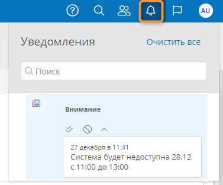_

_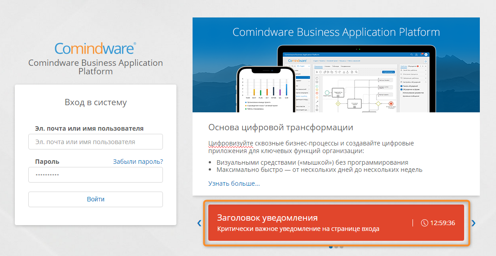_

## Порядок настройки общих уведомлений

1. Включите получение уведомлений в [**Глобальной конфигурации**](#global_configuration_setting).
2. Настройте [**путь передачи данных**](#communication_routes_setting) типа «**Общие уведомления**».
3. Используйте настроенный путь передачи данных в качестве **места назначения** в **[промежуточном событии-отправке сообщения][process_diagram_elements_send_message_intermediate_event]** или **[конечном событии-отправке сообщения][process_diagram_elements_send_message_end_event]**.

См. также _[Пример: вывод общих уведомлений в информационной панели и на странице входа][common_notification_example]._

## Настройка глобальной конфигурации {: #global_configuration_setting}

1. На странице «[**Администрирование**][administration] в разделе «**Инфраструктура**» выберите пункт «**Глобальная конфигурация**» <i class="fa-light fa-desktop">‌</i>.
2. Установите флажок «**Включить получение уведомлений (кроме уведомлений о задачах)**».
3. Сохраните глобальную конфигурацию.
4. Перезапустите экземпляр **{{ productName }}**, чтобы изменения вступили в силу. Для этого может потребоваться обратиться к системному администратору.

_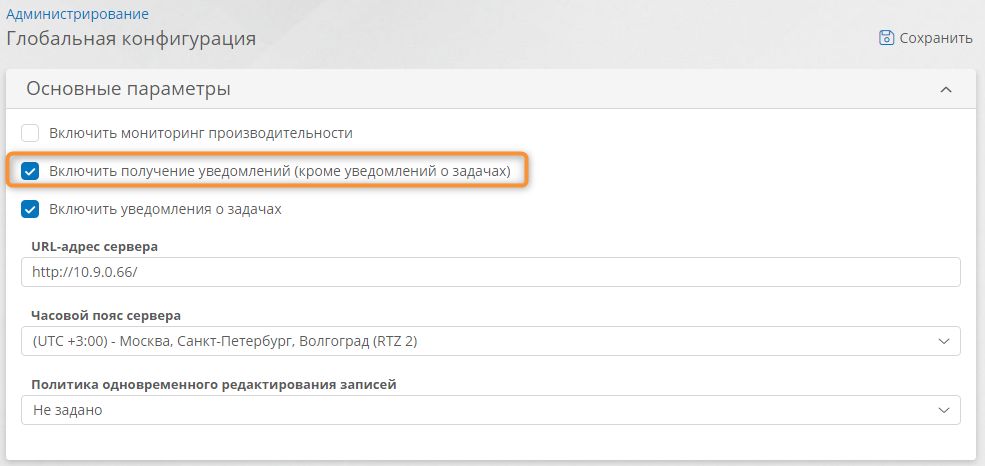_

## Настройка пути передачи данных {: #communication_routes_setting .pageBreakBefore }

1. Откройте страницу «**Администрирование**» — «**Архитектура**» или страницу «**Администрирование**» приложения.
2. Выберите пункт «**Пути передачи данных**» <i class="fa-light fa-route">‌</i>.
3. Отобразится список путей передачи данных.
4. Дважды нажмите в списке или создайте путь передачи данных типа «**Системные подключения**» — «**Общие уведомления**».
5. [Настройте свойства](#communication_routes_properties) пути передачи данных.
6. Сохраните путь передачи данных.

### Свойства пути передачи данных {: #communication_routes_properties}

#### Основные свойства

Вкладка «**Основные свойства**» содержит основные параметры пути передачи данных:

- **Отключить** — установите этот флажок, чтобы временно деактивировать путь передачи данных.
- **Название** — введите наглядное наименование пути передачи данных.
- **Имя сообщения** — введите _уникальный_ идентификатор сообщения, проходящего по данному пути передачи данных.
- **Приложение** — выберите бизнес-приложение, в котором будет использоваться путь передачи данных.

_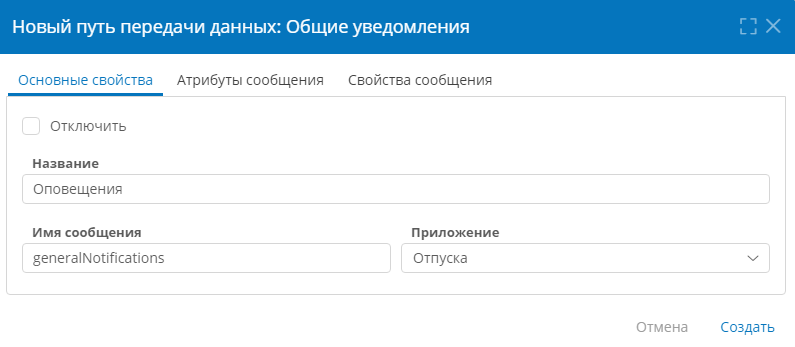_

#### Атрибуты сообщения {: #message_attributes}

На вкладке «**Атрибуты сообщения**» заполните таблицу соответствия атрибутов сообщения с атрибутами уведомления.

Настроенные на этой вкладке атрибуты будут использоваться для передачи данных из процесса в уведомление.

Эти атрибуты следует использовать на вкладке «**[Свойства сообщения](#message_properties)** » пути передачи данных,

Значения этих атрибутов необходимо задать на вкладке «**Данные сообщения** » в свойствах  **[промежуточного события-отправки сообщения][process_diagram_elements_send_message_intermediate_event]** и **[конечного события-отправки сообщения][process_diagram_elements_send_message_end_event]**.

Чтобы создать атрибут сообщения и сопоставить его с полем уведомления, нажмите кнопку «**Создать**» и заполните строку таблицы сопоставления:

- **Название** — введите наглядное название атрибута.
- **Системное имя** — введите уникальное имя атрибута, оно будет использоваться в уведомления на вкладке «**Свойства сообщения**».
- **Тип данных** — выберите тип данных  в соответствии с данными, которые в него будут передаваться из процесса:

    - **Текст**
    - **Число**
    - **Длительность**
    - **Дата и время**
    - **Логический**
    - **Документ**

    - **Аккаунт**

Чтобы удалить атрибут, установите рядом с ним флажок, и нажмите кнопку «**Удалить**».

_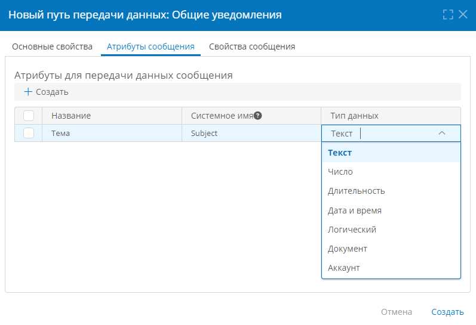_

#### Свойства сообщения {: #message_properties}

На вкладке «**Свойства сообщения**» настройте шаблон уведомления с использованием атрибутов с вкладки «**Атрибуты сообщения**».**

- **Список атрибутов, которые можно использовать при написании эл. письма** содержит настроенные [**атрибуты сообщения**](#message_attributes).

    !!! tip "Подстановка значений атрибутов сообщения в уведомление"

        - Чтобы поместить значение атрибута сообщения в эл. письмо, введите его системное имя в фигурных скобках `{ }` в соответствующее поле письма.
        - В текстовые поля письма (адреса и имена отправителей и получателей, тема, текст сообщения, место встречи) можно вводить произвольный текст и несколько **атрибутов сообщений**.
        - Например, в поле «**Заголовок**» можно ввести строку:

            ```
            Уведомление «{Title}» от {Date}
            ```

            Здесь: `{Title}` — атрибут сообщения, содержащий название уведомления, а `{Date}` — дата формирования уведомления.

- **Электронное письмо** — это шаблон, в полях которого следует ввести статические значения и системные имена **атрибутов сообщения**. В шаблоне уведомления предусмотрены перечисленные ниже поля.

    - **Заголовок** — введите тему письма или укажите **атрибут сообщения** типа «**Текст**», содержащий тему письма.
    - **Текст сообщения** — введите текст письма или укажите **атрибут сообщения** типа «**Текст**», содержащий текст письма.
    - **Длительность** — задайте длительность отображения уведомления.
    - **Важность** — выберите уровень важности уведомления:

        - Критический
        - Высокий
        - Обычный
        - Низкий

    - **Внутреннее уведомление** — установите этот флажок, чтобы уведомление отображалось только для авторизованных пользователей.

_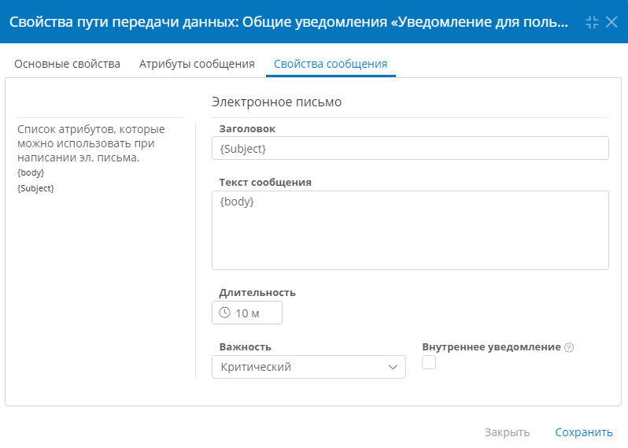_

## Пример: вывод общих уведомлений в информационной панели и на странице входа {: #common_notification_example .pageBreakBefore }

Рассмотрим пример настройки приложения для вывода общих уведомлений с текстом, содержащим значения атрибутов.

Уведомления будут отображаться в информационной панели и на странице входа.

### Настройка приложения

1. Включите получение уведомлений в [**Глобальной конфигурации**](#global_configuration_setting).
2. Создайте шаблон процесса _«Отправка общих уведомлений»_.
3. Перейдите к [конструктору диаграммы процесса][process_diagram_designer].
4. Откройте **стартовую форму** начального события с помощью меню элемента.
5. С помощью панели элементов создайте и поместите на стартовую форму два атрибута типа «**Текст**» (см. _«[Редактирование формы. Создание атрибута][form_designer]»_):

    - _Тема сообщения_
    - _Текст сообщения_

        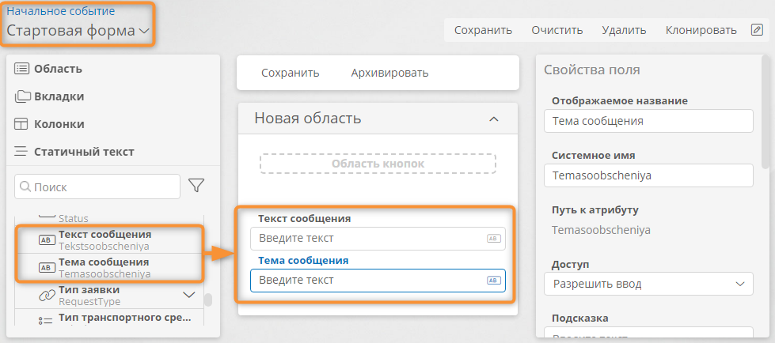

6. Сохраните стартовую форму.
7. Вернитесь к диаграмме процесса, нажав в браузере кнопку «**Назад**».

    {{ pdfPageBreakHard }}

8. Добавьте на диаграмму процесса **промежуточное событие-отправку сообщения**.

    _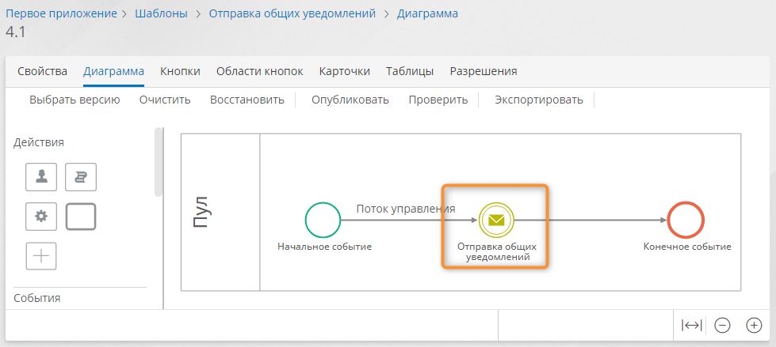_

9. Откройте свойства события-отправки сообщения.
10. На вкладке «**Дополнительные**» в группе «**Место назначения**» выберите «**Общее уведомление**».
11. В раскрывающемся списке «**Использовать путь передачи данных**» создайте путь передачи данных типа «**Общие уведомления**».

    _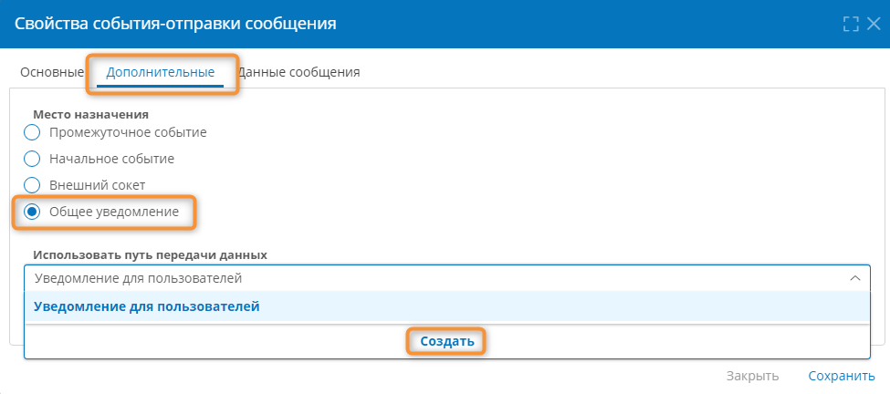_

12. Настройте путь передачи данных, как указано ниже. Подробные инструкции см. в параграфе _«[Настройка пути передачи данных](#communication_routes_setting)»_.

    - **Основные свойства**

        - **Название:** _Уведомление для пользователей_
        - **Имя сообщения:** _UserNotification_

    - **Атрибуты сообщения**

        | Название          | Системное имя | Тип данных |
        | ----------------- | ------------- | ---------- |
        | _Текст сообщения_ | _body_        | **Текст**  |
        | _Тема_            | _subject_     | **Текст**  |

    - **Свойства сообщения**
        - **Заголовок:** `{subject}`
        - **Текст сообщения:** `{body}`
        - **Длительность: 5 минут**
        - **Важность: Критический**

    _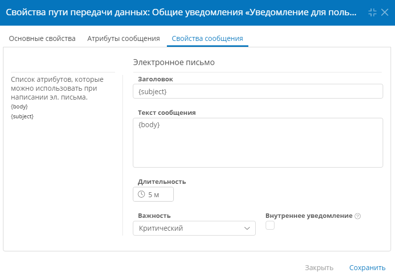_

13. Задайте значения атрибутов на вкладке «**Данные сообщения**». См. параграфы _«[Настройка пути передачи данных](#communication_routes_setting)»_.

    __

14. Опубликуйте диаграмму процесса.

### Тестирование уведомлений {: .pageBreakBefore }

1. Откройте шаблон процесса _«Отправка общих уведомлений»_.
2. Нажмите кнопку «**Перейти к экземплярам**».
3. В списке экземпляров процесса нажмите кнопку «**Создать**».
4. Отобразится стартовая форма процесса.
5. Заполните поля _«Тема сообщения»_ и _«Текст сообщения»_.
6. Нажмите кнопку «Создать».

    __

7. Нажмите значок «**Уведомления**» <i class="fa-light fa-bell">‌</i> в информационной панели, чтобы просмотреть уведомление.

    __

8. Выйдите из системы, чтобы просмотреть уведомление на странице входа.

    _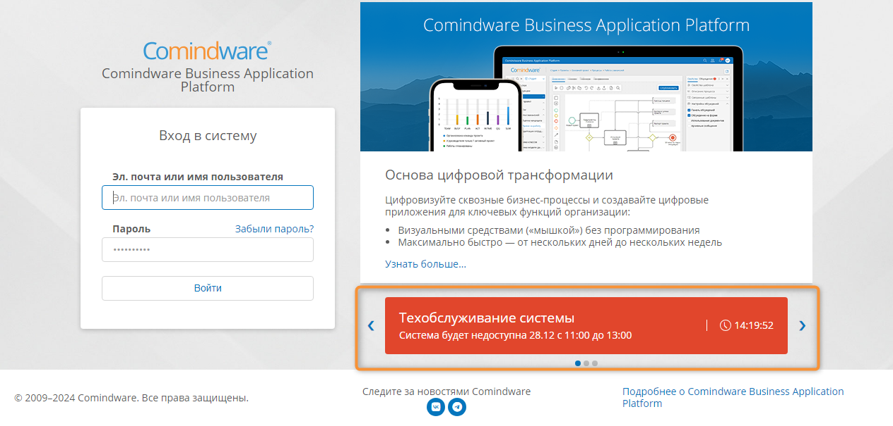_
    {{ pdfEndOfBlockHack }}

--8<-- "related_topics_heading.md"

**[Глобальная конфигурация][global_configuration]**

**[Простое начальное событие][process_diagram_elements_none_start_event]**

**[Конечное событие-отправка сообщения][process_diagram_elements_send_message_end_event]**

**[Промежуточное событие-отправка сообщения][process_diagram_elements_send_message_intermediate_event]**

**[Редактирование формы. Создание атрибута][form_designer]**


