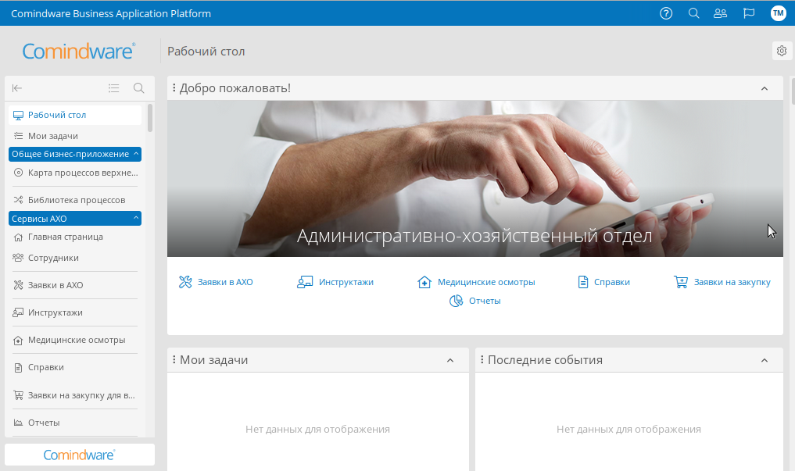

# Установка, запуск, инициализация и остановка ПО {: #deploy_guide_linux}

## Введение

Для работы **{{ productName }}** требуются операционная система, сервер базы данных, веб-сервер, обратный прокси-сервер и сервер журналов.

Для быстрого развёртывания **{{ productName }}** в Linux компания **{{ companyName }}** предоставляет дистрибутив с установщиком, настраивающим необходимое программное обеспечение. См. _[{{ productName }} {{ productVersion }}. Перечень стороннего программного обеспечения для Linux][auxiliary_software_list]_.

Здесь представлены инструкции по развёртыванию и инициализации **{{ productName }}** из дистрибутива в ОС Linux.

## Установка {{ productName }} {: #deploy_guide_linux_install_sw }

1. Перейдите в режим суперпользователя:

    --8<-- "linux_sudo.md"

2. Скачайте и распакуйте дистрибутив **{{ productName }}**, полученный по ссылке от компании **{{ companyName }}** (`X.X.XXXX.X` — номер версии ПО, `<osname>` — название операционной системы):

    ``` sh
    tar -xf X.X-release-ru-X.X.XXXX.X.<osname>.tar.gz
    ```

    !!! tip "Совет"

        По завершению распаковки архив можно удалить для экономии места:

        ``` sh
        rm -f X.X-release-ru-X.X.XXXX.X.<osname>.tar.gz
        ```

3. Перейдите в распакованную директорию:

    ``` sh
    cd CMW_<osname>/
    ```

4. Установите ПО из дистрибутива:
{: #install.sh}

    ``` sh
    sh install.sh -p [-k] [-e]
    ```

    Скрипт `install.sh` поддерживает следующие ключи:
    {: .pageBreakBefore }

    - `p` — установить ПО {{ productName }}.
    - `k` — установить ПО Kafka.
    - `e` — установить ПО Elasticsearch.
    - `h` — вызов краткой справки по использованию скрипта (указывать только без остальных ключей).

    !!! tip "Вызов справки для скриптов"

        Для ознакомления с ключами и назначением любого скрипта используйте ключ `-h` без каких-либо других ключей, например:

        ``` sh
        sh install.sh -h
        ```

5. Если отобразится запрос на перезагрузку ОС, выполните перезагрузку:

    ``` sh
    reboot
    ```

    После перезагрузки ОС заново запустите [установку ПО из дистрибутива (шаг 4)](#install.sh).

6. Дождитесь завершения установки ПО.
7. После успешного завершения установки подождите 3–5 минут. Этого времени обычно достаточно для автоматического запуска и инициализации установленных служб (в зависимости от конфигурации машины).
8. Удостоверьтесь, что ПО установлено, просмотрев список установленных версий ПО:

    ``` sh
    ls /var/www/.cmw_version/
    ```

## Создание экземпляра ПО {: .pageBreakBefore }

### Подготовка к созданию экземпляра ПО

Перед созданием экземпляра ПО необходимо проверить конфигурацию Linux и при необходимости внести в неё перечисленные ниже изменения.

1. Перейдите в режим суперпользователя:

    --8<-- "linux_sudo.md"

2. Откройте для редактирования файл `limits.conf`:

    ``` sh
    nano /etc/security/limits.conf
    ```

3. Установите следующие директивы:

    - **Astra Linux**, **Ubuntu**, **Debian**
    
    ``` systemd
    www-data soft nproc 200000
    www-data hard nproc 200000
    www-data soft nofile 200000
    www-data hard nofile 200000
    ```

    - **РЕД ОС**, **Rocky**

    ``` systemd
    nginx soft nproc 200000
    nginx hard nproc 200000
    nginx soft nofile 200000
    nginx hard nofile 200000
    ```

    - **Альт Сервер**

    ``` systemd
    _nginx soft nproc 200000
    _nginx hard nproc 200000
    _nginx soft nofile 200000
    _nginx hard nofile 200000
    ```

4. Откройте для редактирования файл `common-session`:

    ``` sh
    nano /etc/pam.d/common-session
    ```

5. Установите следующую директиву:

    ``` systemd
    session required pam_limits.so
    ```

6. Откройте для редактирования файл `sysctl.conf`:

    ``` sh
    nano /etc/sysctl.conf
    ```

7. Установите следующие директивы:

    ``` cs
    fs.file-max=2097152
    vm.max_map_count=262144
    fs.inotify.max_user_instances=524288
    ```

8. Откройте для редактирования файл `user.conf`:

    ``` sh
    nano /etc/systemd/user.conf
    ```

9. Установите следующую директиву:

    ``` cs
    DefaultLimitNOFILE=200000
    ```

10. Откройте для редактирования файл `system.conf`:

    ``` sh
    nano /etc/systemd/system.conf
    ```

11. Установите следующую директиву:

    ``` cs
    DefaultLimitNOFILE=200000
    ```

12. После внесения изменений перезапустите демоны:

    ``` sh
    sysctl -p
    systemctl daemon-reexec
    ```

### Создание единственного экземпляра ПО {: .pageBreakBefore }

1. Перейдите в режим суперпользователя:

    --8<-- "linux_sudo.md"

2. Перейдите в директорию со скриптами для развёртывания ПО **{{ productName }}**:

    ``` sh
    cd <path>/CMW_<osname>/scripts/instance
    ```

    Здесь:  `<path>/CMW_<osname>` — путь к распакованному дистрибутиву ПО.

3. Разверните экземпляр ПО:

    ``` sh
    sh create.sh -n=<instanceName> -v=<versionNumber> [-p=<portNumber>]
    ```

    Скрипт `create.sh` поддерживает следующие ключи:

    - `-n=<instanceName>` — имя экземпляра ПО (**обязательный** ключ).
    - `-v=<versionNumber>` — номер версии ПО вида `X.X.XXXX.X` (например: 5.0.0000.0, **обязательный** ключ). Версия должна быть установлена, см. _«[Установка {{ productName }}](#deploy_guide_linux_install_sw)»_.
    - `-p=<portNumber>` — порт для экземпляра ПО, по умолчанию: 80 (необязательный ключ).
    - `-h` — вызов краткой справки по использованию скрипта (указывать только без остальных ключей).

4. Удостоверьтесь, что была создана директория с файлами конфигурации экземпляра ПО.

    ``` sh
    ls -lhF /var/www/<instanceName>/
    ```

5. По ответу команды `ls` удостоверьтесь, что в путях указана верная версия ПО, например `5.0.0000.0`:

    ``` sh
    lrwxrwxrwx. 1 nginx nginx   36 Oct 11 17:54 bin -> /var/www/.cmw_version/5.0.0000.0/bin/
    lrwxrwxrwx. 1 nginx nginx   41 Oct 11 17:54 compiled -> /var/www/.cmw_version/5.0.0000.0/compiled/
    lrwxrwxrwx. 1 nginx nginx   37 Oct 11 17:54 data -> /var/www/.cmw_version/5.0.0000.0/data/
    lrwxrwxrwx. 1 nginx nginx   44 Oct 11 17:54 favicon.ico -> /var/www/.cmw_version/5.0.0000.0/favicon.ico
    lrwxrwxrwx. 1 nginx nginx   44 Oct 11 17:54 Global.asax -> /var/www/.cmw_version/5.0.0000.0/Global.asax
    lrwxrwxrwx. 1 nginx nginx   39 Oct 11 17:54 mobile -> /var/www/.cmw_version/5.0.0000.0/mobile/
    lrwxrwxrwx. 1 nginx nginx   46 Oct 11 17:54 redirect.aspx -> /var/www/.cmw_version/5.0.0000.0/redirect.aspx
    lrwxrwxrwx. 1 nginx nginx   42 Oct 11 17:54 resources -> /var/www/.cmw_version/5.0.0000.0/resources/
    lrwxrwxrwx. 1 nginx nginx   43 Oct 11 17:54 robots.txt -> /var/www/.cmw_version/5.0.0000.0/robots.txt
    lrwxrwxrwx. 1 nginx nginx   45 Oct 11 17:54 unauthorized -> /var/www/.cmw_version/5.0.0000.0/unauthorized/
    ```

### Создание дополнительного экземпляра ПО {: .pageBreakBefore }

На одном сервере можно развернуть несколько экземпляров ПО **{{ productName }}**.

1. Перейдите в режим суперпользователя:

    --8<-- "linux_sudo.md"

2. Просмотрите список имеющихся экземпляров ПО **{{ productName }}**:

    ``` sh
    cat /usr/share/comindware/configs/instance/* | grep -E '(configPath:)'
    ```

3. Просмотрите список используемых портов:

    ``` sh
    ss -tunlp
    ```

    Также можно узнать, используется ли определённый порт (`<portNumber>`):

    ``` sh
    ss -tunlp | grep :<portNumber>
    ```

4. Просмотрите список установленных версий ПО:

    ``` sh
    ls /var/www/.cmw_version/
    ```

5. Создайте новый экземпляр ПО согласно приведённым выше [инструкциям](#создание-экземпляра-по), указав для него уникальные имя и порт.
6. Откройте для редактирования три службы каждого из установленных экземпляров ПО (`<instanceName>`):

    ``` sh
    nano /usr/lib/systemd/system/comindware<instanceName>.service
    nano /usr/lib/systemd/system/apigateway<instanceName>.service
    nano /usr/lib/systemd/system/adapterhost<instanceName>.service
    ```

7. Если используются локальные службы Kafka и Elasticsearch, откройте их для редактирования:

    ``` sh
    nano /usr/lib/systemd/system/kafka.service
    nano /usr/lib/systemd/system/elasticsearch.service
    ```

8. В каждом файле службы установите следующие директивы:

    ``` cs
    # Макс. количество открытых файлов
    LimitNOFILE=200000
    # Макс. количество процессов
    LimitNPROC=8192
    ```

## Запуск экземпляра ПО

1. Перейдите в режим суперпользователя:

    --8<-- "linux_sudo.md"

2. Удостоверьтесь, что основные службы установлены, запущены и имеют статус `Active (running)`:

    ``` sh
    systemctl status comindware<instanceName>
    systemctl status kafka
    systemctl status nginx
    systemctl status elasticsearch
    ```

3. Если какая-либо служба не работает, запустите её:

    ``` sh
    systemctl start comindware<instanceName>
    systemctl start kafka
    systemctl start nginx
    systemctl start elasticsearch
    ```

4. Выполните инициализацию ПО.

## Инициализация {{ productName }} {: #deploy_guide_linux_initialize .pageBreakBefore }

<!--initialize-start-->
1. Запустите веб-браузер и в адресной строке введите ссылку следующего вида, при необходимости указав порт, на котором был развёрнут экземпляр ПО:

    ``` sh
    http://localhost:<portNumber>
    ```

2. Дождитесь запуска и отображения веб-сайта **{{ productName }}**, что может занять примерно 5 минут.
3. Откроется страница создания аккаунта администратора **{{ productName }}**.

    __

4. Введите учётные данные аккаунта администратора и нажмите кнопку «**Создать аккаунт**».

    !!! warning "Внимание!"

        - В экземпляре ПО всегда должен оставаться хотя бы один аккаунт администратора. Он может потребоваться для восстановления системы.
        - Аккаунт администратора, созданный при инициализации экземпляра ПО, не следует удалять, даже если впоследствии аккаунты будут синхронизироваться с Active Directory.

5. При необходимости откроется страница инициализации служб. Выберите службы, которые должны быть запущены, и нажмите кнопку «**Далее**».

    __

6. При необходимости откроется страница активации ПО. Выполните **онлайн-** или **ручную активацию** либо нажмите кнопку «**Пропустить**» для первоначального ознакомления с ПО без активации.
7. При необходимости откроется страница настройки подключения к службе Elasticsearch.
8. В поле «**URI**» введите адрес сервера Elasticsearch, например: `http://localhost:9200`
9. Оставьте **имя пользователя** и **пароль** Elasticsearch пустыми. Или введите их, если в конфигурации Elasticsearch включена аутентификация.
10. Установите уникальный **префикс индекса**, например `mycompanyprefix`. Он служит для идентификации в Elasticsearch данных экземпляра ПО. Поэтому во избежание конфликтов данных для каждого экземпляра ПО следует указывать собственный префикс индекса.
11. Нажмите кнопку «**Далее**».
12. При необходимости откроется страница инициализации данных в Elasticsearch.

    __

13. Нажмите кнопку «**Обновить**».
14. Дождитесь открытия начальной страницы **{{ productName }}**.

    __

15. На этом этапе развертывание экземпляра **{{ productName }}** завершено и можно приступать к созданию и использованию приложений.
<!--initialize-end-->

## Остановка экземпляра ПО {: .pageBreakBefore }

1. Перейдите в режим суперпользователя:

    --8<-- "linux_sudo.md"

2. Перед тем как выполнять любые действия с файлами ПО и базы данных, остановите службы, поддерживающие работу ПО:

    ``` sh
    systemctl stop comindware<instanceName>
    systemctl stop kafka
    systemctl stop nginx
    systemctl stop elasticsearch
    ```

3. Удостоверьтесь, что службы остановлены:

    ``` sh
    systemctl status comindware<instanceName>
    systemctl status kafka
    systemctl status nginx
    systemctl status elasticsearch
    ```

## Удаление экземпляра ПО {: .pageBreakBefore }

1. Перейдите в режим суперпользователя:

    --8<-- "linux_sudo.md"

2. Остановите экземпляр ПО согласно [инструкции](#остановка-экземпляра-по).
3. Перейдите в директорию со скриптами для развёртывания ПО **{{ productName }}**:

    ``` sh
    cd CMW_<osname>/scripts/instance
    ```

4. Запустите удаление экземпляра ПО:

    ``` sh
    sh delete.sh -n=<instanceName>
    ```

    Скрипт `delete.sh` поддерживает следующие ключи:

    - `-n=<instanceName>` — создать экземпляр ПО с указанным именем (**обязательный** ключ).
    - `-h` — вызов краткой справки по использованию скрипта (указывать только без остальных ключей).

## Удаление версии ПО {: .pageBreakBefore }

1. Перейдите в режим суперпользователя:

    --8<-- "linux_sudo.md"

2. Просмотрите список экземпляров ПО с указанием версий:

    ``` sh
    cat /usr/share/comindware/configs/instance/* | grep -E '(configPath:|version:)'
    ```

3. Удалите все экземпляры с версией ПО, которую требуется удалить, или обновите их до другой версии. Удалить версию ПО, которая используется в каких-либо экземплярах, не удастся. См. _«[Удаление экземпляра ПО](#удаление-экземпляра-по)»_.
4. Удалите версию ПО:

    ``` sh
    rm -r /var/www/.cmw_version/<versionNumber>
    ```

    Здесь: `<versionNumber>` — номер версии ПО вида `X.X.XXXX.X` (например: `5.0.0000.0`).


