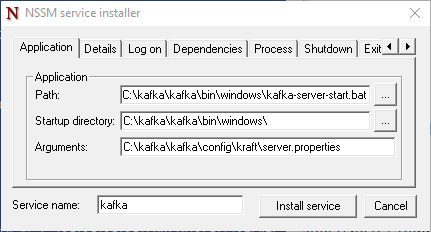
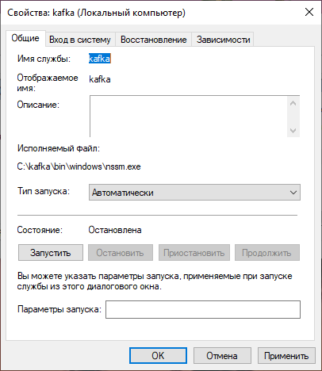

# Установка Kafka В ОС Windows и подключение к {{ productName }}

## Введение

Для обмена данными между **{{ productName }}** и внешними системами (а также для работы обсуждений) необходимо настроить подключение к брокеру сообщений Kafka.

Здесь представлена инструкция по установке Kafka в ОС Windows с использованием KRaft (без использования Zookeeper) и подключению Kafka к **{{ productName }}**.

## Предварительные условия

Должно быть установлено ПО Java и заданы следующие системные переменные:

- `JAVA_HOME` — путь к исполняемым файлам Open JDK, например `C:\Program Files\jdk\jdk-<version>\bin`
- `JAVA_HOME_DLL` — путь к DLL-файлу Open JDK, например `C:\Program Files\jdk\jdk-<version>\bin\server\jvm.dll`
- `Path` — короткий путь к файлам Java: `%JAVA_HOME%\bin`

## Процесс установки

1. Скачайте последнюю версию Kafka с **[официального сайта](https://kafka.apache.org/downloads)**.

    !!! warning "Внимание!"

        Для корректной работы Kafka рекомендуется скачивать архив с бинарными файлами.

2. Распакуйте файлы архива, например в папку `C:\kafka`

    !!! warning "Внимание!"

        Рекомендуется использовать путь минимальной длины и названия папок без пробелов, иначе некоторые команды могут не сработать.

3. Создайте папку для журналов, например `X:\kafka\logs`.

    !!! warning "Внимание!"

        Рекомендуется создавать папку для журналов на отдельном диске, а не на диске где установлено ПО Kafka.

4. Откройте файл конфигурации Kafka `C:\kafka\config\kraft\server.properties`.
5. Отредактируйте файл конфигурации, указав IP-адрес сервера Kafka, папку для журналов и размеры сообщений.

    !!! warning "Внимание!"

        При указании пути к папке журналов используйте косую черту `/` вместо `\`:

    ``` ini
    process.roles=broker,controller
    node.id=1
    # Укажите IP-адрес сервера Kafka
    controller.quorum.voters=1@10.2.3.4:9093
    # Укажите IP-адрес сервера Kafka
    listeners=PLAINTEXT://10.2.3.4:9092,CONTROLLER://10.2.3.4:9093
    inter.broker.listener.name=PLAINTEXT
    # Укажите IP-адрес сервера Kafka
    advertised.listeners=PLAINTEXT://10.2.3.4:9092
    controller.listener.names=CONTROLLER
    listener.security.protocol.map=CONTROLLER:PLAINTEXT,PLAINTEXT:PLAINTEXT,SSL:SSL,SASL_PLAINTEXT:SASL_PLAINTEXT,SASL_SSL:SASL_SSL
    num.network.threads=3
    num.io.threads=8
    socket.send.buffer.bytes=102400
    socket.receive.buffer.bytes=102400
    socket.request.max.bytes=104857600
    # Укажите путь к папке журналов
    log.dirs=X:/kafka/logs
    num.partitions=1
    num.recovery.threads.per.data.dir=1
    offsets.topic.replication.factor=1
    transaction.state.log.replication.factor=1
    transaction.state.log.min.isr=1
    log.retention.hours=168
    log.segment.bytes=1073741824
    log.retention.check.interval.ms=300000
    # Настройте размеры запросов и сообщений
    max.request.size=104857600
    max.message.bytes=104857600
    message.max.bytes=104857600
    fetch.message.max.bytes=104857600
    replica.fetch.max.bytes=104857600
    ```

6. Откройте _PowerShell_ от имени администратора и выполните команды:

    ``` powershell
    cd "C:\kafka\bin\windows\"
    .\kafka-storage.bat random-uuid
    ```

7. Kafka выдаст UID, например, `kNZtrWDsRvW0udJeaEahsg`
8. Используйте полученный UID в следующей команде:

    ``` powershell
    .\kafka-storage.bat format -t kNZtrWDsRvW0udJeaEahsg -c C:\kafka\config\kraft\server.properties
    ```

9. Загрузите с **[официального сайта](https://nssm.cc/download)** архив _NSSM_ и распакуйте его.
10. В папке `\win64` найдите файл `nssm.exe` и скопируйте его в папку `C:\kafka\bin\windows\`.
11. В _PowerShell_ от имени администратора выполните следующую команду:

    ``` powershell
    .\nssm install kafka
    ```

12. Запустится программа `NSSM service installer`.

    __

13. Укажите следующие пути к файлам службы Kafka:

    - **Path**

    ``` powershell
    C:\kafka\bin\windows\kafka-server-start.bat
    ```

    - **Startup directory**

    ``` powershell
    C:\kafka\bin\windows\
    ```

    - **Arguments**

    ``` powershell
    C:\kafka\config\kraft\server.properties
    ```

14. Нажмите кнопку «**Install service**».
15. Произойдёт установка сервиса.
16. По завершении установки откройте программу _«Службы_» (_Services_) и найдите в списке `kafka`.

    __

17. С помощью свойств службы включите и настройте автоматический перезапуск Kafka.

    __

18. Протестируйте работу Kafka, выполнив в _PowerShell_ следующие команды:

    ``` powershell
    cd "C:\kafka\bin\windows\"
    .\kafka-console-producer.bat --bootstrap-server 10.2.3.4:9092 --topic TEST
    # Отправьте любое сообщение, например:
    hello
    ```

19. При правильной работе Kafka выдаст предупреждение, что раннее такой ветки сообщений не было, и создаст её.

    __

## Подключение Kafka к {{ productName }}

1. Откройте папку `C:\ProgramData\comindware\configs\instance`

2. Откройте файл конфигурации экземпляра ПО `<instanceName>.yml` (`<instanceName>` — имя экземпляра) и измените или добавьте следующие директивы:

    ``` powershell
    # Укажите IP-адрес сервера Kafka
    mq.server: 10.2.3.4:9092
    # Укажите имя экземпляра ПО
    mq.name: <instanceName>
    ```

3. Удалите следующую строку из файла `<instanceName>.yml`:

    ``` powershell
    kafkaBootstrapServer:
    ```

4. Перезапустите экземпляр ПО с помощью Утилиты администрирования.
5. Проверьте соединение с Kafka в браузере по ссылке:

    ``` powershell
    <instanceName>/async
    ```
