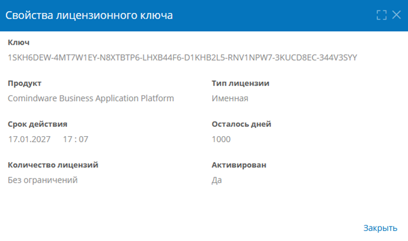
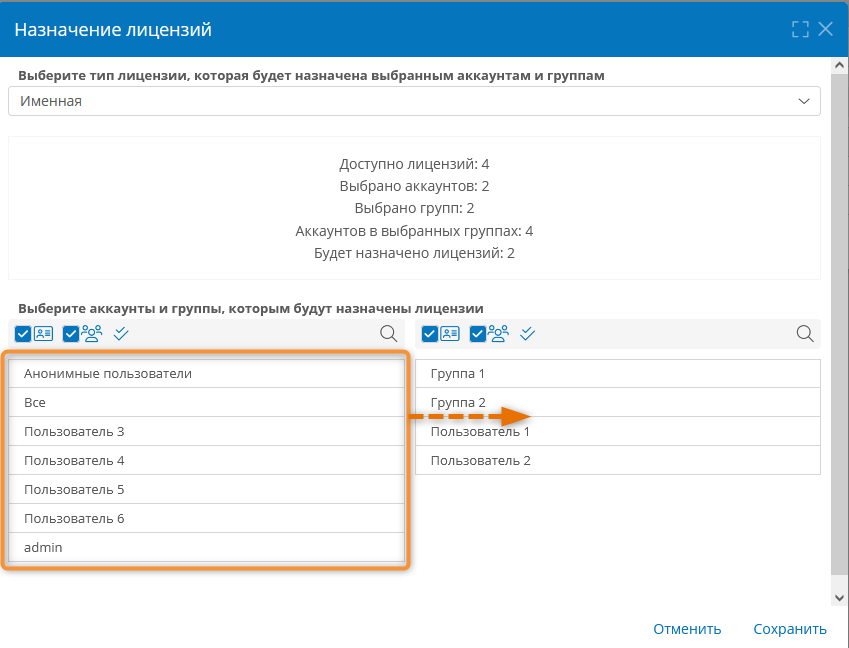
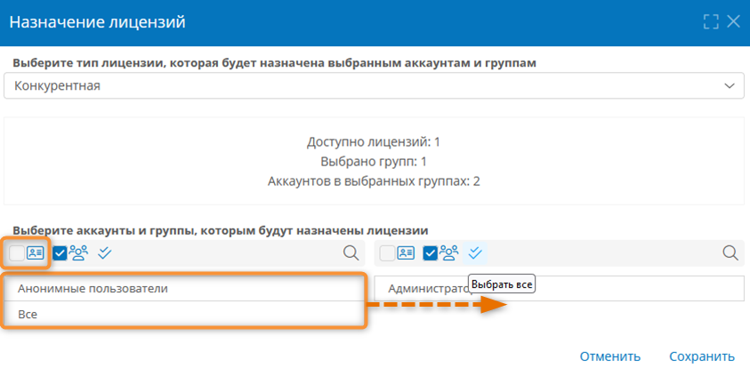

# Лицензирование. Активация продукта, использование ключей, назначение, отзыв и продление лицензий {:#licensing}

## Определения {: .admonition-title #definitions}

Для использования **{{ productName }}** необходимо активировать с помощью **лицензионного ключа**.

- **Лицензионный ключ** — это уникальный код, позволяющий активировать одну или несколько лицензий на **продукт**.
- **Продукт**, **Именная лицензия**, **Конкурентная** **лицензия** — см. определения в _**[Лицензионном соглашении конечного пользователя программного обеспечения Comindware](https://www.comindware.ru/assets/dl2/pdf/Comindware_End_User_License_Agreement_ru.pdf)**._
- При [активации продукта](#добавление-лицензионного-ключа-и-активация-продукта) лицензионный ключ привязывается к аппаратному обеспечению сервера. После этого продукт нельзя активировать с использованием данного ключа на другом сервере.
- Для привязки ключа к аппаратному обеспечению сервера в процессе активации формируется идентификатор оборудования по следующим правилам:
    - Linux-сервер
        - Используются идентификатор машины и серийный номер материнской платы сервера.
    - Windows-сервер
        - Используются идентификатор центрального процессора и серийный номер материнской платы сервера.
        - Если не удаётся считать идентификатор ЦП и серийный номер материнской платы, используется серийный номер диска `C`.

## Использование списка лицензионных ключей

1. На странице «[**Администрирование**][administration]» в разделе «**Инфраструктура**» выберите пункт «**Лицензирование**» <i class="fa-light fa-key"></i>.
2. Отобразится список лицензионных ключей со следующими сведениями:

    - **Лицензионный ключ**;
    - **Продукт** — тип продукта, для которого подходит ключ;
    - **Тип лицензии**:
        - **Именная**;
        - **Конкурентная**;
    - **Лицензий** — количество лицензий, которые предоставляет данный ключ;
    - **Активен** — статус ключа, флажок означает активный ключ;
    - **Осталось дней** — количество дней до окончания действия ключа, предоставляемых по нему лицензий;
    - **Язык** — язык пользовательского интерфейса продукта, лицензируемый данным ключом.

3. [Добавьте](#добавление-лицензионного-ключа-и-активация-продукта) лицензионные ключи,
4. [Назначьте](#назначение-именных-лицензий-аккаунтам-и-группам) лицензии аккаунтам или группам.
5. [Удалите](#удаление-лицензионного-ключа) ненужные или просроченные ключи, например, чтобы [продлить](#продление-лицензии) лицензию.

__

## Добавление лицензионного ключа и активация продукта

1. Нажмите кнопку «**Добавить**» в списке лицензионных ключей.
2. Отобразится окно «**Активация {{ productName }}**».

    __

3. Выберите способ активации ключа:

    - **Онлайн-активация** — для активации будет использоваться сервер Comindware;
    - **Ручная активация** — если подключение к интернету отсутствует, для активации потребуется использовать файлы запроса и ответа активации.

4. Выполните шаги, указанные в разделе «[**Онлайн-активация**](#онлайн-активация)» или « [**Ручная активация**](#ручная-активация) ».

### Онлайн-активация

1. Выберите пункт «**Онлайн-активация**» на шаге «**1. Способ активации**» в окне «**Активация {{ productName }}**».

    __

2. Нажмите кнопку «**Продолжить**».

    __

3. На шаге «**2. Проверка ключей**» введите один или несколько ключей для их проверки: по одному ключу на строке. При необходимости на этом шаге перейти на страницу покупки ключа или запроса пробного ключа.
4. Нажмите кнопку «**Активировать продукт**».
5. В случае успешной активации отобразится сообщение «**Продукт активирован**».

    __

### Ручная активация

1. Выберите пункт «**Ручная активация**» на шаге «**1. Способ активации**» в окне «**Активация {{ productName }}**».

    __

2. Если у вас уже имеется файл ответа активации, нажмите кнопку «**Перейти к загрузке ответа активации**», чтобы перейти к шагу «[**3. Получение ответа**](#получение-ответа)».
3. Если у вас нет файла ответа активации, Нажмите кнопку «**Продолжить**».

    __

4. На шаге «**2. Генерация запроса**» введите один или несколько ключей: по одному ключу на строке. При необходимости на этом шаге перейти на страницу покупки ключа или запроса пробного ключа.
5. Нажмите кнопку «**Сгенерировать файл запроса активации**».

    __

6. На шаге «**3. Получение ответа**» скачайте файл запроса активации, нажав кнопку «**Скачать файл запроса активации**».
{: #получение-ответа }
7. Загрузите файл запроса активации в личный кабинет **{{ companyName }}**.
8. Получите в личном кабинете **{{ companyName }}** файл ответа активации.
9.  Загрузите полученный файл ответа активации, нажав кнопку «**Выберите файл**».
10.  Нажмите кнопку «**Активировать продукт**».
11.  В случае успешной активации отобразится сообщение «**Продукт активирован**».

    __

## Просмотр свойств лицензионного ключа

1. Дважды нажмите лицензионный ключ в [списке](#использование-списка-лицензионных-ключей).
2. Отобразится окно «**Свойства лицензионного ключа**» со следующими сведениями:

    - **Ключ** — уникальный код, позволяющий активировать одну или несколько лицензий на продукт.
    - **Продукт** — тип продукта, для которого подходит ключ.
    - **Тип лицензии**:

        - **Именная**;
        - **Конкурентная**;

    - **Срок действия** — дата, когда данный ключ прекратит действовать.
    - **Осталось дней** — количество дней до окончания действия ключа и его лицензий.
    - **Количество лицензий** — количество лицензий, которые предоставляет данный ключ.
    - **Активирован** — статус ключа:

        - **Да** — ключ активирован;
        - **Нет** — ключ не активирован.

__

## Назначение именных лицензий аккаунтам и группам

1. Нажмите кнопку «**Назначить лицензии**» в списке лицензионных ключей.
2. Отобразится окно «**Назначение лицензий**».
3. Выберите тип лицензии «**Именная**».
4. Щелкайте аккаунты в левом списке, чтобы назначить им лицензии.
5. Щелкайте группы в левом списке, чтобы их участники могли получить лицензию при ее наличии.
6. Чтобы назначить лицензии всем аккаунтам и группам, нажмите кнопку «**Выбрать все**» <i class="fa-light fa-check-double"></i> в левом списке.
7. Аккаунты и группы, которым назначены лицензии, отобразятся в правом списке.
8. Нажмите кнопку «**Сохранить**».

!!! warning "Логика назначения именных лицензий участникам группы"

    При назначении именных лицензий группе, лицензии фактически расходуются при входе участников группы в систему.

    **Исходные данные**

    - Имеется четыре именных лицензии.
    - Имеются _Пользователи 1–7_.
    - Имеются _Группа 1_, в которую входят _Пользователи 3 и 4,_ и _Группа 2_ с _Пользователями 5, 6 и 7_.
    - Две из четырёх лицензий назначены _Пользователям 1 и 2_. При этом расходуется 2 лицензии.
    - _Группы 1 и 2_ добавлены в список лицензиатов. При этом при назначении не расходуется ни одна лицензия.

    **Результирующее поведение**

    - _Пользователи 1 и 2_ будут иметь назначенные им лицензии до тех пор, пока лицензии не будут отозваны.
    - Если в систему войдут _Пользователи 3 и 6_, то будут израсходованы 2 оставшиеся лицензии и _Пользователи 4, 5 и 7_ не получат лицензий.
    - Если войдут _Пользователи 1–6_, то они получат лицензии, а _Пользователь 7_ не получат лицензий.
    - Если в систему войдут _Пользователи 5 и 6_, то будут израсходованы 2 оставшиеся лицензии. При этом _Пользователь 7_ из _Группы 2_ и участники _Группы 1_ не получат лицензий.
    - Если пользователю назначена именная лицензия напрямую и его группе назначена лицензия, для этого пользователя не будет расходоваться лицензия, назначенная группе. Пользователь будет использовать лицензию, назначенную ему напрямую.
    - Если пользователь вошёл в систему, после чего у него была отозвана лицензия, назначенная напрямую или через группу, лицензия будет продолжать действовать не более периода, установленного **_[Лицензионным соглашением](https://www.comindware.ru/assets/dl2/pdf/Comindware_End_User_License_Agreement_ru.pdf) [конечного](https://www.comindware.ru/assets/dl2/pdf/Comindware_End_User_License_Agreement_ru.pdf) [пользователя программного обеспечения Comindware](https://www.comindware.ru/assets/dl2/pdf/Comindware_End_User_License_Agreement_ru.pdf)._**
    - Если лицензия будет отозвана у группы, то при следующем входе её участники не получат лицензии, ранее назначенные этой группе.

__

## Назначение конкурентных лицензий группам

1. Нажмите кнопку «**Назначить лицензии**» в списке лицензионных ключей.
2. Отобразится окно «**Назначение лицензий**».
3. Выберите тип лицензии «**Конкурентная**».
4. Снимите флажок «**Аккаунты**», чтобы отобразить только группы (конкурентная лицензия назначается группам).
5. Щелкайте группы в левом списке, чтобы назначить их участникам конкурентную лицензию. В поле «**Доступно лицензий**» отображается количество аккаунтов из всех выбранных групп, которые могут одновременно использовать лицензию.
6. Чтобы назначить лицензию всем группам, нажмите кнопку «**Выбрать все**» <i class="fa-light fa-check-double"></i> в левом списке.
7. Группы, которым назначена лицензия, отобразятся в правом списке.
8. Нажмите кнопку «**Сохранить**».

!!! warning "Логика назначения конкурентных лицензий участникам группы"

    При назначении конкурентной лицензии группе, лицензии фактически расходуются при входе участников группы в систему.

    **Исходные данные**

    - Имеется одна конкурентная лицензия на четыре пользователя.
    - Имеются _Группа 1_, в которую входят _Пользователи 1 и 2_, и _Группа 2_ с _Пользователями 4, 6 и 7_.
    - Лицензия назначена _Группам 1 и 2_.

    **Результирующее поведение**

    - Если войдут _Пользователи 1–6_, то они получат лицензии, а _Пользователь 7_ не получит лицензий.
    - Если пользователь получил конкурентную лицензию, она будет отозвана у него при выходе из системы, а также после периода бездействия, установленного **_[Лицензионным соглашением](https://www.comindware.ru/assets/dl2/pdf/Comindware_End_User_License_Agreement_ru.pdf) [конечного](https://www.comindware.ru/assets/dl2/pdf/Comindware_End_User_License_Agreement_ru.pdf) [пользователя программного обеспечения Comindware](https://www.comindware.ru/assets/dl2/pdf/Comindware_End_User_License_Agreement_ru.pdf)_**_._ При следующем входе пользователь сможет снова получить лицензию при наличии свободных лицензий.
    - Если лицензия будет отозвана у группы, то при следующем входе её участники не получат лицензии, назначенные этой группе.

__

## Отзыв лицензий у аккаунтов и групп

1. Нажмите кнопку «**Назначить лицензии**» в списке лицензионных ключей.
2. Отобразится окно «**Назначение лицензий**».
3. Щелкайте аккаунты и группы в правом списке, чтобы отозвать у них лицензии.
4. Чтобы отозвать лицензии у всех аккаунтов и групп, нажмите кнопку «**Выбрать все**» <i class="fa-light fa-check-double"></i> в правом списке.
5. Аккаунты и группы, которым не назначены лицензии, отобразятся в левом списке.
6. Нажмите кнопку «**Сохранить**».

__

## Удаление лицензионного ключа

1. Установите для подлежащих удалению ключей флажки выбора в списке.
2. Нажмите кнопку «**Удалить**».
3. В отобразившемся окне подтверждения нажмите кнопку «**Удалить**».
4. Снова подтвердите удаление ключа, нажав кнопку «**Да**».

## Продление лицензии

1. [Удалите лицензионный ключ](#удаление-лицензионного-ключа), срок действия которого истёк.
2. [Добавьте и активируйте](#добавление-лицензионного-ключа-и-активация-продукта) новый лицензионный ключ.
3. Заново назначьте [именные](#назначение-именных-лицензий-аккаунтам-и-группам) или [конкурентные](#назначение-конкурентных-лицензий-группам) лицензии.


