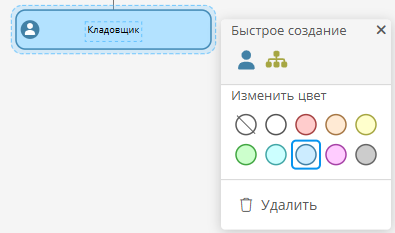

# Конструктор организационных единиц {: #architect_organiztional_structure_designer}

В **{{ productNameEnterprise }}** для моделирования корпоративной архитектуры предусмотрен визуальный конструктор организационных единиц.

## Переход к конструктору организационных единиц

1. Выберите элемент организационной единицы в [панели навигации][navigation_panel] или дважды нажмите его строку в [реестре оргединиц][architect_organizational_structure_modelling].
2. Откроется диаграмма организационной единицы в режиме просмотра.
3. Нажмите кнопку «**Редактировать**» <i class=" fal  fa-pen-nib " aria-hidden="true"></i>.
4. Отобразится конструктор организационных единиц.

__

## Элементы конструктора организационных единиц {: #architect_organiztional_structure_designer}

__

1. Кнопки типовых операций:
    - **Просмотр** <i class="fa-light fa-eye"></i> — переход в режим просмотра организационной единицы.
    - **Очистить** <i class="fa-light fa-trash"></i> — безвозвратное удаление всех элементов организационной единицы. При нажатии этой кнопки отобразится запрос подтверждения.
    - **Обсуждение** <i class="fa-light fa-comment-dots"></i> — отображение чата для обсуждения организационной единицы.
    - **Свойства** <i class="fa-light fa-sidebar-flip"></i> — [настройка свойств][architect_configuring_organizational_unit] выбранного элемента или всей организационной единицы.
2. Кнопки работы с диаграммой:
    - **Указатель** <i class=" fal  fa-arrow-pointer "></i> — режим выбора одного элемента.
    - **Лассо** <i class=" fal  fa-square-dashed "></i> — режим захвата нескольких элементов.
    - **Отменить** <i class=" fal  fa-arrow-rotate-left "></i> — отмена последнего действия.
    - **Повторить** <i class=" fal  fa-arrow-rotate-right "></i> — повтор последнего отменённого действия.
3. Палитра элементов — содержит элементы нотации организационной единицы.
--8<-- "process_architecture_diagram_zoom_controls.md"
6. Панель свойств. В этой области также отображается панель обсуждения.

### Управление с помощью клавиатуры

В конструкторе организационной единицы можно использовать следующие сочетания клавиш:

- ++ctrl+c++ — копировать выбранные элементы в буфер обмена.
- ++ctrl+v++ — вставить элементы из буфера обмена.
- ++ctrl+x++ — вырезать выбранные элементы в буфер обмена.
- ++ctrl+z++ — отменить последнее действие.
- ++ctrl+y++ или ++ctrl+shift+z++ — повторить последнее отменённое действие.
- ++del++ — удалить выбранные элементы.

!!! note "Подключение буфера обмена в Google Chrome"

    Чтобы подключить буфер обмена для работы с элементами диаграммы в браузере Google Chrome, выполните следующие действия:

    1. Введите в адресную строку: 
        
        ``` html
        chrome://flags/#unsafely-treat-insecure-origin-as-secure
        ```
    
    2. Включите функцию **“Insecure origins treated as secure”**.
    3. Добавьте в поле функции адрес сервера **{{ productName }}**, например:

        ``` html
        http://your-host/
        ```

    4. Нажмите кнопку «**Перезапустить**».

### Меню элемента {: #organizational_structure_designer_element_menu}

При выборе любого элемента на диаграмме отображается его контекстное меню с перечисленными ниже пунктами.

__

- **Быстрое создание** — создание элемента, связанного посредством потока управления с текущим элементом. Для создания доступны элементы типа должность и подразделение.
- **Изменить цвет** — выбор цвета рамки и фона элемента.
- **Удалить** — удаление текущего элемента.

### Кнопки типовых операций

Область кнопок типовых операций можно настроить следующим образом:

1. Откройте список шаблонов оргединиц.
2. Перейдите к настройке **шаблона организационной единицы**.
3. Откройте вкладку «**Область кнопок**».
4. Перейдите к настройке **области кнопок для диаграммы моделей**.
5. Поместите на форму кнопки, которые должны отображаться при работе с диаграммой организационной единицы.
6. При необходимости создайте новые кнопки, нажав на <i class="fal  fa-plus"></i> рядом с заголовком «**Кнопки**».
7. Нажмите кнопку «**Сохранить**».

__

<div class="relatedTopics" markdown="block">

--8<-- "related_topics_heading.md"

- _[Просмотр реестра процессов][architect_process_architecture_modelling]_
- _[Редактирование диаграммы][architect_edit_diagram]_
- _[Просмотр диаграммы][architect_viewing_diagram]_
- _[Экспорт диаграмм и регламентов процессов][architect_exporting_process_entity]_
- _[Импорт диаграмм процессов][architect_importing_process_entity]_

</div>



