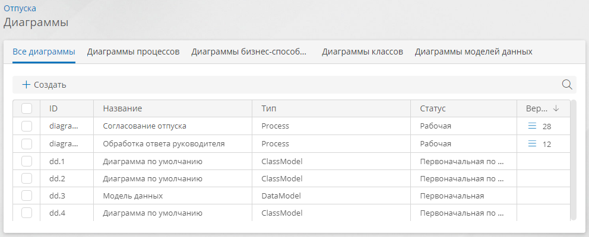
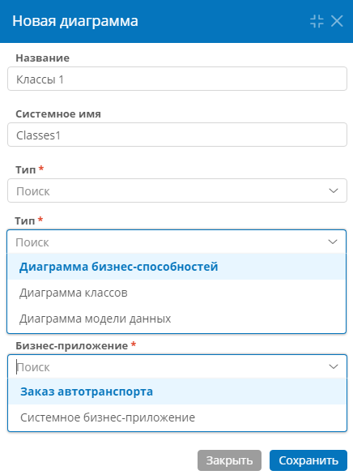

# Диаграммы. Определения, создание, редактирование, просмотр, удаление  {: #diagrams}

## Определения {: .admonition-title #definitions}

- В **{{ productName }}** предусмотрены диаграммы процессов, бизнес-способностей, моделей данных и классов.
- [**Диаграмма процесса**][process_diagram] составляется по стандарту BPMN 2.0 и позволяет визуализировать и исполнять бизнес-процесс с назначением задач исполнителям, выполнением сценариев, отправкой внутренних и внешних сообщений, просмотром журнала действий.
- **Диаграмма бизнес-способностей** позволяет представить связи и взаимодействие объектов процессной архитектуры: бизнес-процессов и ресурсов.
- **Диаграмма модели данных** показывает и позволяет задавать связи шаблонов записей и шаблонов аккаунтов, а также позволяет создавать новые [шаблоны][templates].
- **Диаграмма классов** показывает и позволяет редактировать и создавать новые шаблоны.

## Просмотр списка и настройка диаграмм в приложении {: #diagram_list }

Для каждого приложения предусмотрены отдельные диаграммы процессов, бизнес-способностей, моделей данных и классов.

1. На странице [«**Администрирование**»][administration] в разделе «**Архитектура**» выберите пункт «**Приложения**» <i class="fa-light  fa-project-diagram"></i>.
2. Отобразится список приложений.
3. Дважды нажмите строку приложения в списке.
4. В разделе **«[Администрирование][apps]»** приложения выберите пункт «**Диаграммы**» <i class="fa-light  fa-project-diagram ">‌</i>.
5. Отобразится список диаграмм для данного приложения.
6. [Создайте диаграмму][diagram_creation] или дважды нажмите строку диаграммы в списке.
7. Просмотрите или отредактируйте диаграмму.

!!! note "Примечание"

    Для [диаграмм процессов][process_diagram] в списке отображаются количество версий диаграммы и кнопка «**Показать все версии**» для [просмотра списка версий][diagram_version_list_view] диаграммы.

## Просмотр списка и настройка диаграмм из всех приложений

1. На странице [«**Администрирование**»][administration] в разделе «**Архитектура**» выберите пункт «**Диаграммы**» <i class="fa-light  fa-project-diagram ">‌</i>‌.
2. Отобразится общий список всех диаграмм из всех [приложений][apps].
3. [Создайте диаграмму][diagram_creation] или дважды нажмите строку диаграммы в списке.
4. Просмотрите или отредактируйте диаграмму.

__

## Создание диаграммы {: #diagram_creation}

!!! note "Примечание"

    Создать вручную можно диаграмму **бизнес-способностей, классов** или **модели данных**.

    [**Диаграмма процесса**][process_diagram] создается вместе с [**шаблоном процесса**][process_templates].

1. Откройте [список диаграмм][diagram_list].
2. Нажмите кнопку «**Создать**».
3. Отобразится окно «**Новая диаграмма**».
4. Укажите **название**, **системное имя** и **тип диаграммы**.

    - При создании диаграммы в общем списке диаграмм выберите **приложение**.

5. Нажмите кнопку «**Сохранить**».
6. Созданная диаграмма отобразится в списке.
7. Дважды нажмите диаграмму в списке, чтобы просмотреть или отредактировать её.

__

## Удаление диаграмм

1. Откройте [список диаграмм][diagram_list].
2. Установите для подлежащих удалению диаграмм флажки выбора.
3. Нажмите кнопку «**Удалить**» над списком диаграмм.
4. Подтвердите удаление диаграмм.

--8<-- "related_topics_heading.md"

- _[Управление версиями диаграммы процесса][process_diagram_version_control]_


