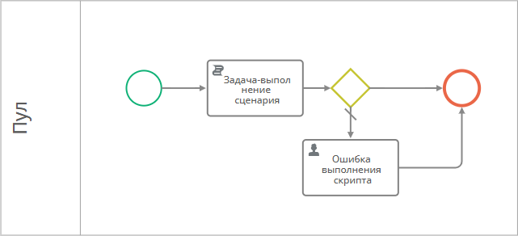

# Инструменты отслеживания ошибок в экземплярах процесса

## Введение

**{{ productName }}** предоставляет возможность моделирования бизнес-процессов и их реализации с назначением задач исполнителям, выполнением сценариев, отправкой внутренних и внешних сообщений, просмотром журнала действий.

В ходе выполнения процесса могут возникнуть ошибки различного рода, например:

- ошибки в ходе выполнения задач;
- ошибки в сценариях;
- ошибки в выполнении C#-скриптов.

**{{ productName }}** предлагает различные встроенные механизмы по отслеживанию ошибок, а также даёт возможность настроить свои собственные. Здесь представлены инструкции по настройке некоторых инструментов, таких как:

- таблица экземпляров процесса с фильтром по наличию ошибок;
- использование вспомогательного атрибута для отслеживания ошибок при выполнении C#-скрипта.

## Настройка таблицы для отслеживания ошибок в экземплярах процесса

Чтобы отслеживать процессы, в которых произошла ошибка, настройте таблицу экземпляров процесса и задайте фильтр по наличию ошибок:

1. Перейдите на вкладку «**Таблицы**» процесса.
2. Откройте двойным нажатием в списке или создайте новую таблицу _«Процессы с ошибками»_.
3. В поле «**Системный фильтр**» добавьте следующее выражение N3:

    ``` turtle
    # Импортируем функции для работы с процессами
    @prefix process: <http://comindware.com/ontology/process#>.
    @prefix cmw: <http://comindware.com/logics#>.
    {
    # Собираем данные по всем экземпляра процесса
    ?item process:businessObject ?.
    # Фильтруем экземпляры процесса по наличию ошибок в них
    ?item process:hasTokenError true.
    }
    ```

4. Сохраните таблицу.
5. Перейдите к списку экземпляров процесса.
6. Откройте вкладку _«Процессы с ошибками»_.
7. Отобразится список процессов, при выполнении которых произошли ошибки.

## Остановка процесса при возникновении ошибок в задаче-выполнении сценария

Для использования C#-скриптов в процессе предусмотрена задача-выполнение сценария. В ходе выполнения C#-скрипта могут возникнуть ошибки, при этом процесс будет остановлен. Чтобы отследить ошибки в скриптах, но не останавливать процесс, можно воспользоваться конструкцией `try..catch`. См. _«[Отладка формул, выражений N3, сценариев и C#-скриптов][expression_debug]»_.

Чтобы просмотреть, какие проблемы возникли при выполнении C#-скрипта, можно поместить сообщение об ошибке в текстовый атрибут и вывести его в отдельной задаче:

1. Создайте атрибут _«Отслеживание ошибок»_ `<ErrorMonitoring>` в шаблоне, связанным с процессом.
2. Добавьте на процесс задачу-выполнение сценария со скриптом по следующему образцу:

    ``` cs
    using System;
    using System.Collections.Generic;
    using System.Linq;
    using Comindware.Data.Entity;
    using Comindware.TeamNetwork.Api.Data.UserCommands;
    using Comindware.TeamNetwork.Api.Data;

    class Script
    {
        public static string Main(Comindware.Process.Api.Data.ScriptContext context, Comindware.Entities entities)
        {
            // Добавьте входные данные.
            int Result = 0;
            try
            {
                // Добавьте код, который должен работать в штатном режиме.
                Result = 1;
                    // ErrorMonitoring — системное имя атрибута «Отслеживание ошибок».
                    // Строка "Нет ошибок выполнения скрипта" будет передаваться в значение атрибута «Отслеживание ошибок».
                var data = new Dictionary<string, object>{{"ErrorMonitoring", "Нет ошибок выполнения скрипта"}};
                Api.TeamNetwork.ObjectService.EditWithAlias(context.BusinessObjectId, data);
            }
            catch
            {
                // Добавьте код, который должен отработать в случае ошибки.
                Result = -1;
                    // ErrorMonitoring — системное имя атрибута «Отслеживание ошибок».
                    // Строка "Ошибка выполнения скрипта" будет передаваться в значение атрибута «Отслеживание ошибок».
                var data = new Dictionary<string, object>{{"ErrorMonitoring", "Ошибка выполнения скрипта"}};
                Api.TeamNetwork.ObjectService.EditWithAlias(context.BusinessObjectId, data);
            }
            // Эта строка отобразится в поле «Выходные данные» в событии «Скрипт выполнен» в цепочке событий для задачи-выполнения сценария.
            return string.Format("Результат: {0}", Result);
        }
    }
    ```

3. Создайте задачу _«Ошибка выполнения скрипта»_ и добавьте на её форму атрибут _«Отслеживание ошибок»_.
4. После задачи-выполнения сценария добавьте развилку «**или/или**».
5. Соедините развилку «**или/или**» с задачей _«Ошибка выполнения скрипта»_ и следующим этапом процесса.
6. Настройте исходящие потоки на развилке «**или/или**»:

    <table block="markdown">
    <tbody block="markdown">
    <tr block="markdown">
    <th block="markdown">
    Поток «иначе»
    </th>
    <th block="markdown">
    Конечная точка
    </th>
    <th block="markdown">
    Условие
    </th>
    </tr>
    <tr block="markdown">
    <td block="markdown">
    Флажок установлен
    </td>
    <td block="markdown">
    Пользовательская задача _«Ошибка выполнения скрипта»_
    </td>
    <td block="markdown">
    </td>
    </tr>
    <tr block="markdown">
    <td block="markdown">
    </td>
    <td block="markdown">
    Следующий этап процесса
    </td>
    <td block="markdown">
    **Формула:**

    ``` cs
    $ErrorMonitoring == "Нет ошибок выполнения скрипта"
    ```

    </td>
    </tr>
    </tbody>
    </table>

7. Настройте остальные действия процесса.

__

### Тестирование

1. Запустите экземпляр процесса.
2. Дождитесь завершения выполнения C#-скрипта.
3. При возникновении ошибок при выполнении C#-скрипта отобразится задача _«Ошибка выполнения скрипта»_.
4. Откройте задачу _«Ошибка выполнения скрипта»_ и посмотрите сообщение в поле атрибута _«Отслеживание ошибок»_.
5. Нажмите <i class=" fal  fa-edit "></i> и выберите пункт «Перейти к диаграмме процесса».
6. Откроется диаграмма процесса.
7. Откройте **журнал изменений** и нажмите значок {: width="20px"} рядом с названием задачи-выполнения сценария.
8. Откроется **цепочка событий** и отобразится информация о ходе выполнения C#-скрипта в панели «**Выполнение элемента процесса**».

См. также _«[Просмотр цепочки событий][events_chain_view]»_.

--8<-- "related_topics_heading.md"

**[Использование диаграммы экземпляра процесса][process_diagram_view_instance]**

**[Отладка формул, выражений N3, сценариев и C#-скриптов][expression_debug]**


