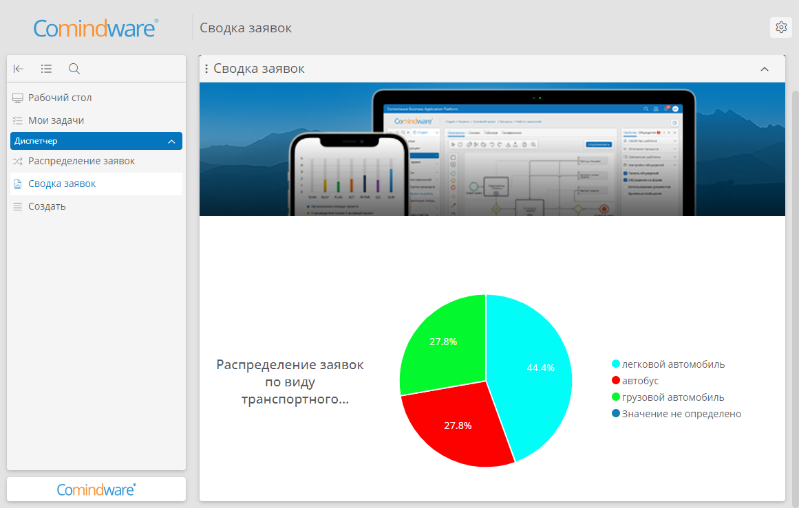

# Информационные страницы. Контроль доступа {: #page_access_control}

## Введение

При настройке приложения может потребоваться разграничить доступ к информационным страницам (и пользовательским ссылкам) в соответствии с **[ролями][roles]**.

Поэтому, чтобы информационную страницу (или пользовательскую ссылку) видели пользователи только определённой роли, создайте отдельный раздел навигации, назначьте его только данной роли и поместите в него требуемую страницу (или пользовательскую ссылку).

!!! warning "Логика отображения ресурсов в разделе навигации"

    В рамках одного раздела навигации нельзя настроить видимость отдельных страниц и пунктов, так как роли назначаются разделу навигации в целом:

    - каждой роли внутри приложения можно назначить только один раздел навигации;
    - один и тот же раздел навигации может быть назначен нескольким ролям.

    При этом отображение данных для конкретного пользователя зависит от разрешений, которые предоставлены его роли:

    - Если роли не предоставлен доступ к приложению, таблице с записями или экземплярами процесса, кнопкам, диаграмме процесса, модели данных или классов, то пункты для них не отображаются в разделе навигации.
    - Информационные страницы в разделе навигации и на рабочем столе отображаются для тех пользователей, роли которых назначены данному разделу.
        - При этом от разрешений роли зависит отображение виджетов на страницах: если доступ к данным того или иного виджета отсутствует, то он будет отображаться пустым.
    - Системные виджеты на информационных страницах отображаются независимо от роли пользователя.
    - Пользовательские ссылки в разделе навигации отображаются для всех пользователей, роли которых назначены данному разделу.

## Пример настройки раздела навигации для разграничения доступа

Здесь представлен пример настройки ролей и раздела навигации для разграничения доступа к ресурсам приложения и информационным страницам, а также продемонстрировано, как отображаются раздел навигации и страница для пользователей с разными правами доступа.

### Исходные данные

В приложении _«Автопарк»_ создан процесс _«Распределение заявок»_, который связан с шаблоном _«Заявки»_. Этот шаблон содержит атрибут _«Вид ТС»_ типа _«Список значений»_. В шаблоне _«Заявки»_ имеется несколько записей с разными _видами ТС_.

### Настройка приложения

1. Создайте роль _«Сотрудники»_ и дайте разрешение на создание экземпляров процесса _«Распределение заявок»_ и использование кнопки «**Создать**» этого процесса.
2. Создайте роль _«Диспетчеры»_ и дайте разрешение на создание и просмотр экземпляров процесса _«Распределение заявок»_, а также на создание, просмотр и ввод данных в шаблоне записи _«Заявки»_.
3. Создайте и сохраните новый раздел навигации.
4. Создайте и сохраните страницу _«Сводка заявок»_.
5. Создайте диаграмму _«Распределение заявок по виду транспортного средства»_ со следующими параметрами:

    - **Шаблон** — _заявки_;
    - **Категории** — _вид ТС_;
    - **Вычислять** — **количество**.

6. Создайте баннер _«Автопарк»_ и прикрепите к нему изображение.
7. Добавьте созданные баннер и диаграмму на страницу _«Сводка заявок»_.
8. Сохраните страницу _«Сводка заявок»_.
9. Добавьте в раздел навигации страницу _«Сводка заявок»_, таблицу _«Все записи»_ шаблона процесса _«Распределение заявок»_ и кнопку «**Создать**» этого шаблона процесса.
10. Выберите роли _«Сотрудники»_ и _«Диспетчеры»_ в свойствах раздела навигации.
11. Сохраните раздел навигации.

## Тестирование

1. Выполните вход в аккаунт с ролью _«Диспетчеры»_.
2. В панели навигации отобразятся пункты _«Распределение заявок»_, _«Сводка заявок»_ и _«Создать»_.
3. Перейдите на страницу _«Сводка заявок»_.
4. На странице отобразятся баннер и диаграмма _«Распределение заявок по виду транспортного средства»_. Так как у роли _«Диспетчеры»_ есть доступ к данным в шаблоне _«Заявки»_, то диаграмма отображается корректно.
5. Чтобы создать новую заявку, выберите пункт _«Создать»_.
6. Чтобы посмотреть список экземпляров процесса, выберите пункт _«Распределение заявок»_.

    __

7. Выполните вход в аккаунт с ролью _«Сотрудники»_.
8. В панели навигации отобразятся пункты _«Сводка заявок»_ и _«Создать»_.
9. Пункт _«Распределение заявок»_ отображаться не будет, так как у роли _«Сотрудники»_ нет доступа к просмотру экземпляров данного процесса.
10. Перейдите на страницу _«Сводка заявок»_.
11. На странице отобразится баннер. На диаграмме _«Распределение заявок по виду транспортного средства»_ будет видна надпись «**Нет данных**», так как аккаунтам с ролью _«Сотрудники»_ не предоставлен доступ к данным по заявкам.

    __

--8<-- "related_topics_heading.md"

- _[Панель и разделы навигации. Настройка][navigation_sections_setup]_
- _[Роли в приложении. Определения, настройка, объединение, удаление][roles]_
- _[Информационные страницы. Настройка][pages_setup]_
- _[Информационные страницы. Использование][pages]_
- _[Рабочий стол. Использование][desktop_setup]_
- _[Рабочий стол. Использование][desktop]_


