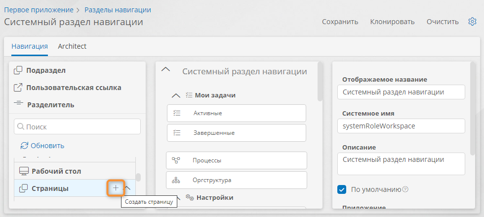
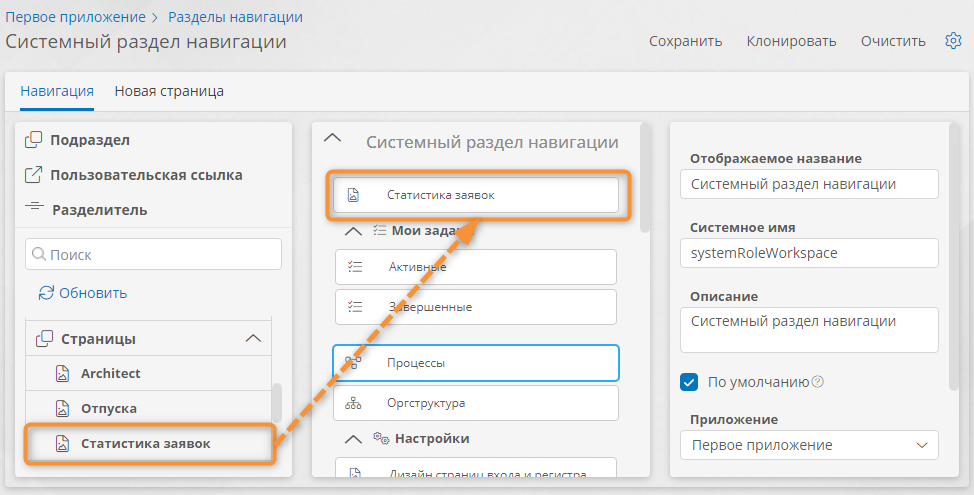
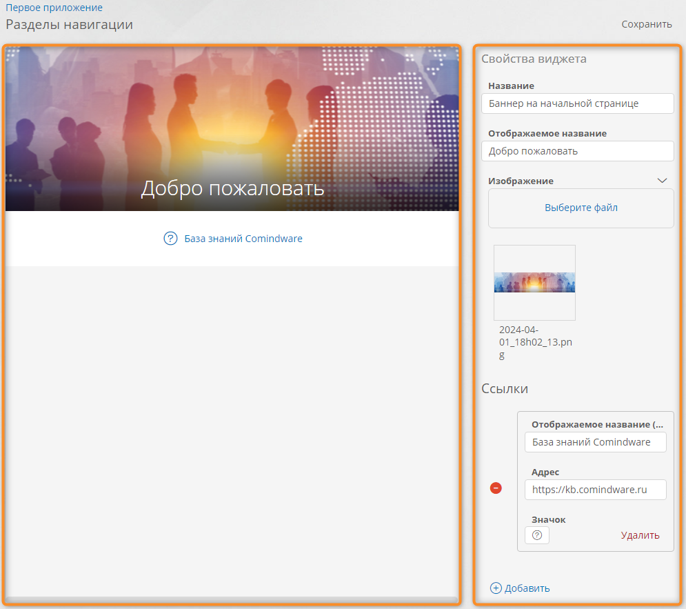
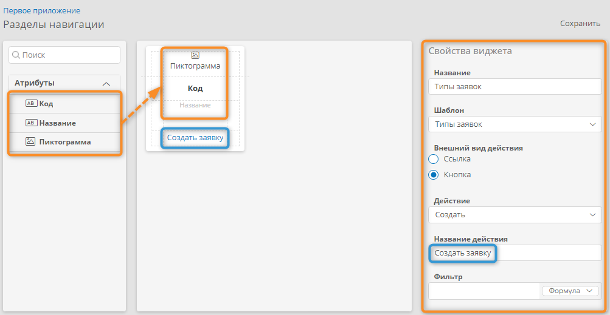
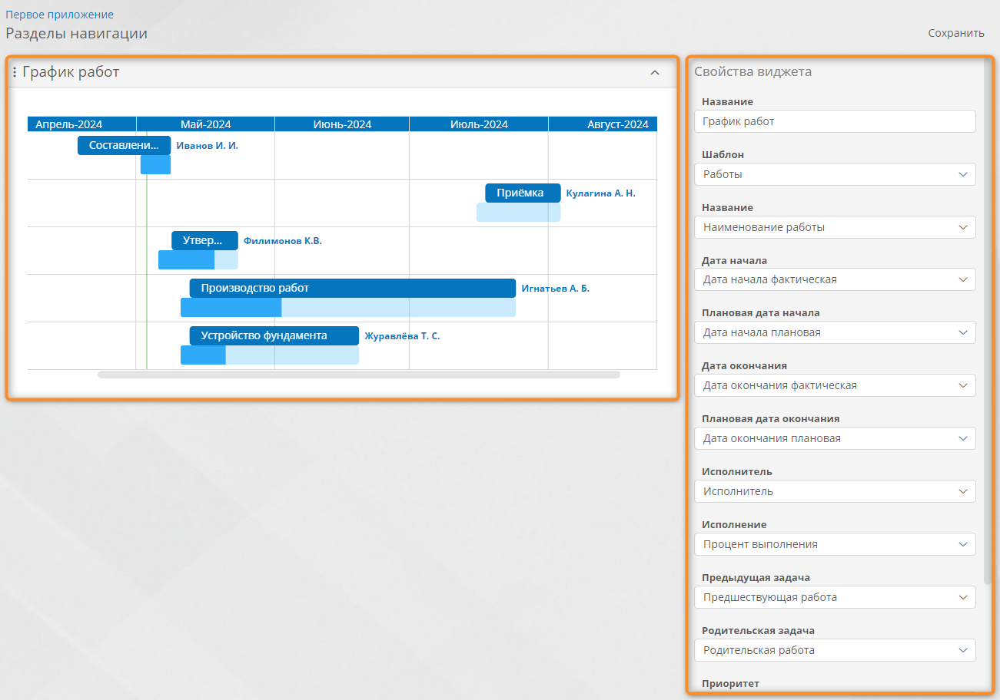
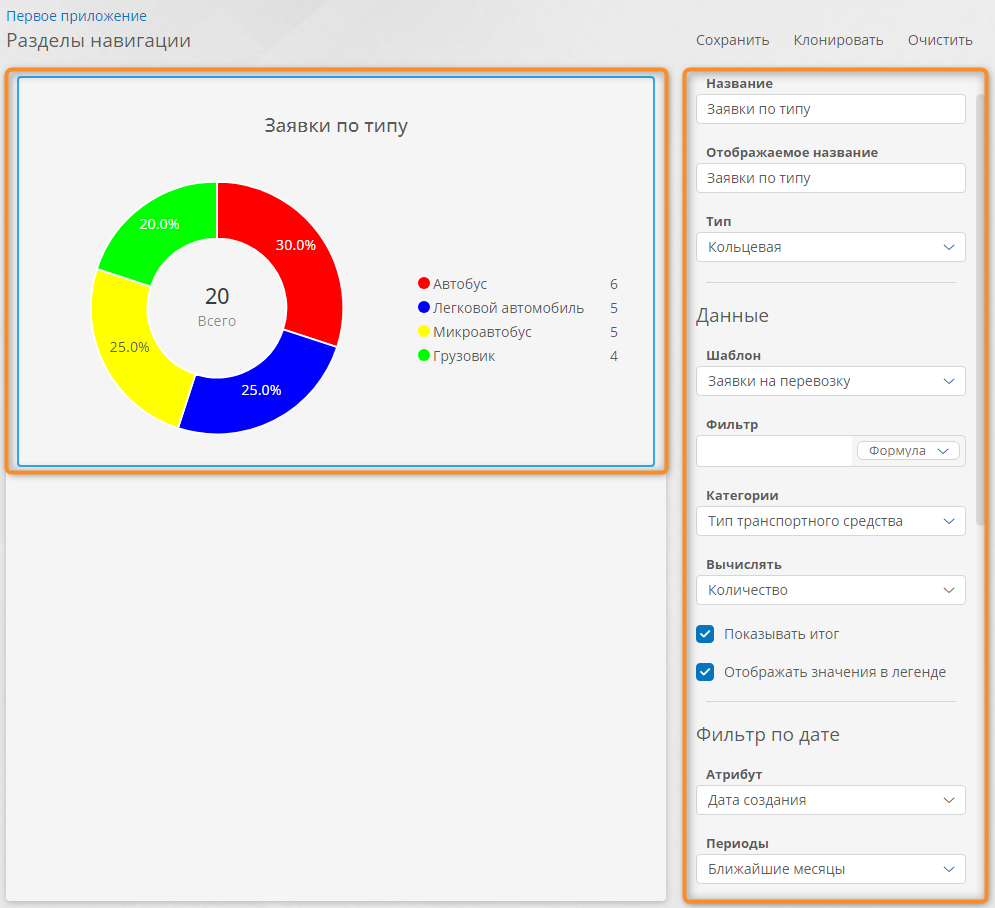
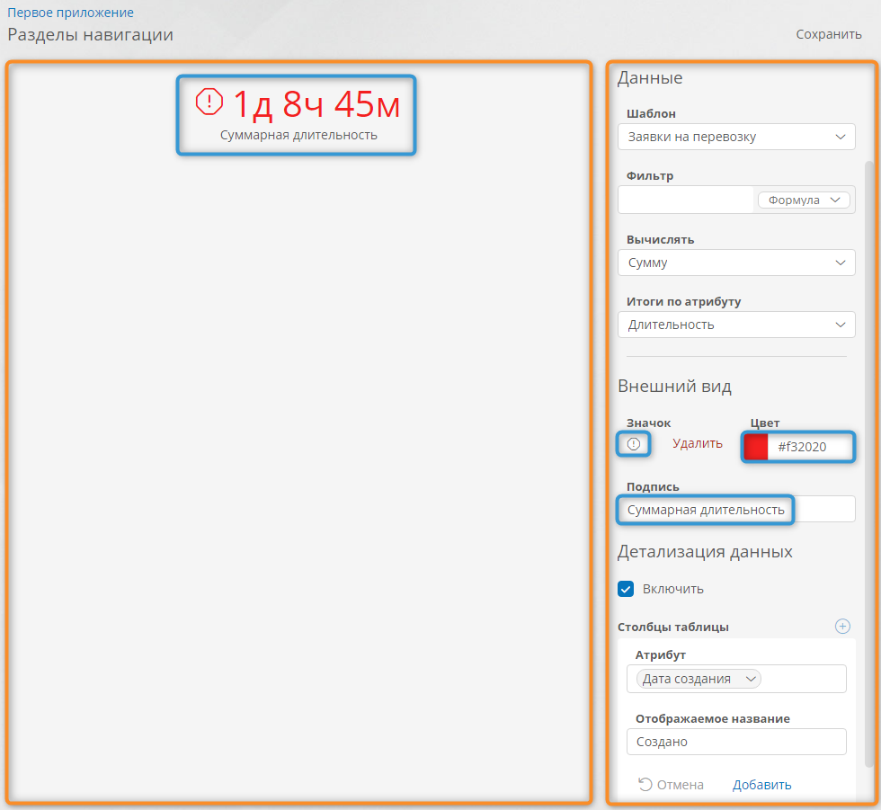
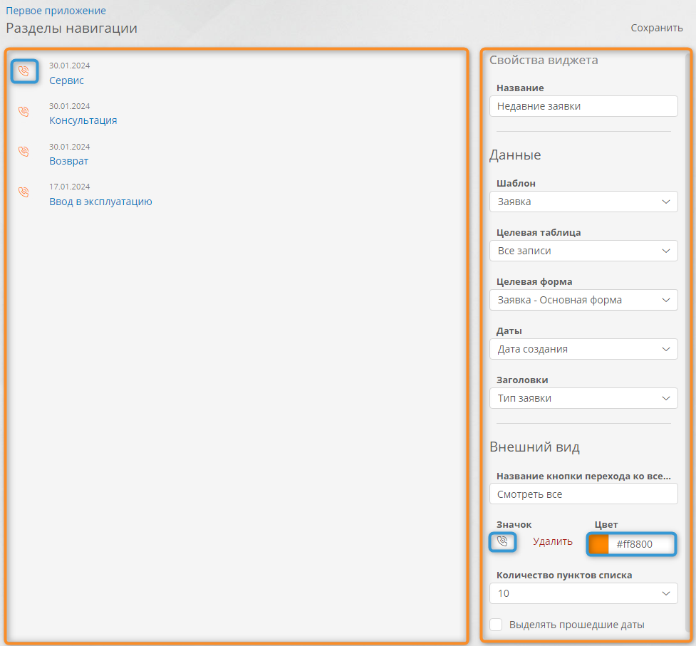
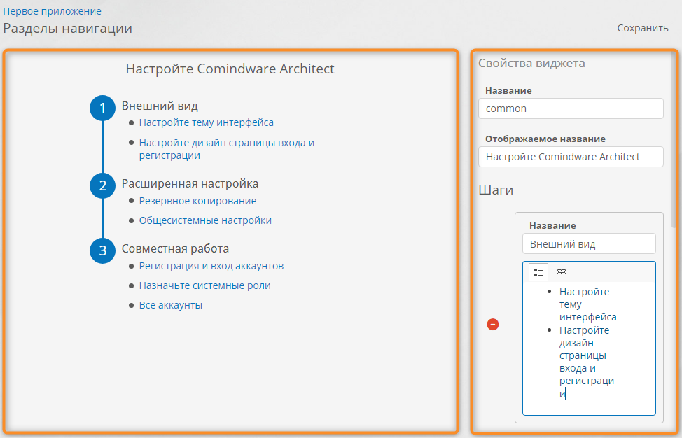

# Информационные страницы. Определения и настройка {: #pages_setup}

## Определения {: .admonition-title #definitions}

- Информационные **страницы** служат для отображения сводных данных из приложений.
- Ссылку на страницу необходимо поместить в раздел навигации, чтобы она отображалась для аккаунтов, которым доступен данный раздел.
- Страницы можно включить в состав [рабочего стола][desktop_setup].

## Настройка свойств и макета страницы

1. Откройте [раздел навигации][navigation_sections_setup].
2. Создайте или откройте страницу для редактирования:

    - Нажмите кнопку «**Создать**» <i class="fa-light fa-plus">‌</i> рядом с пунктом «**Страницы**» на панели элементов.
    - Раскройте пункт «**Страницы**» в списке элементов и нажмите кнопку «**Редактировать**» <i class="fa-light fa-pencil">‌</i> рядом с пунктом с названием страницы.

    __

3. Отобразится [конструктор страницы][pages_setup_designer].
4. Вызовите панель «**Свойства страницы**», нажав пустую область макета страницы. Введите **название** страницы, которое будет отображаться в разделе навигации.
5. Настройте  [элементы][pages_setup_elements] и перетащите их на макет страницы с панели элементов.
6. Чтобы удалить элементы со страницы, перетащите их за пределы макета или нажмите кнопку «Очистить» и подтвердите удаление. Сохраните страницу.

    __

## Использование конструктора страницы {: #pages_setup_designer .pageBreakBefore }

Для настройки свойств и макета страницы используется конструктор страницы, состоящий из следующих областей:

1. **Кнопки**

    - **Сохранить** — сохранение свойств и макета страницы.
    - **Очистить** — удаление всех элементов из макета страницы.

2. **Панель элементов слева** — список виджетов, которые можно перетащить на страницу.

    - **[Область](#область)** — содержит остальные элементы страницы.
    - **Вкладки**, **Колонки**, **Статичный текст** — эти элементы на страницах используются так же, как на формах. См. статью «[Статические элементы формы: области, вкладки, колонки, статичный текст. Настройка представления][form_static_elements]».
    - **[Карусель](#карусель-и-плитки)** — в этом элементе располагаются **плитки**.
    - **[Баннеры](#баннер)**
    - **[Витрины](#витрина)**
    - **[Временные шкалы](#временная-шкала)**
    - **[Диаграммы](#диаграмма)**
    - **[Плитки](#карусель-и-плитки)**
    - **[Показатели](#показатели)**
    - **[Системные виджеты](#системные-виджеты)**

        - **Добро пожаловать**
        - **Мои активные задачи**
        - **Последние события**

    - **[Списки](#список)**
    - **[Шаги](#шаги)**
    - **Поиск** — поле для поиска элемента по названию.

3. **Макет страницы** — предварительное представление страницы. Служит для добавления, упорядочивания и удаления элементов страницы.
4. **Панель свойств** — служит для настройки свойств страницы и её элементов.

__

## Добавление страницы в раздел навигации или на рабочий стол {: .pageBreakBefore }

1. Откройте [раздел навигации][navigation_sections_setup].
2. Раскройте пункт «**Страницы**» в списке элементов.
3. Перетащите пункт с названием требуемой страницы на макет раздела навигации или в группу «**Рабочий стол**».
4. Сохраните раздел навигации.

__

## Настройка элементов страницы {: #pages_setup_elements .pageBreakBefore }

1. Откройте страницу для редактирования.
2. Отобразится конструктор страницы.
3. Создайте или откройте элемент страницы для редактирования:

      - На панели элементов нажмите кнопку «**Создать**» <i class="fa-light fa-plus">‌</i> рядом со списком элементов требуемого типа.
      - Или раскройте список элементов и нажмите кнопку «**Редактировать**» <i class="fa-light fa-pencil"></i> рядом с элементом, подлежащим редактированию.

4. Отобразится конструктор элемента.
5. Настройте элемент с помощью панели «**Свойства виджета**».
6. Сохраните элемент.
7. Нажмите кнопку «**Назад**» **в браузере**, чтобы вернуться к конструктору страницы.
8. Перетащите элемент на макет страницы.
9. Сохраните страницу.

Сведения о настройке доступа к страницам и виджетам см. в статье _[«Информационные страницы. Контроль доступа»][page_access_control]_.

__

### Область {: .pageBreakBefore }

**Область** — это необходимый элемент каждой страницы, остальные элементы следует помещать внутрь областей. Областей на странице может быть несколько.

Конечный пользователь может скрыть некоторые области, и эта персональная настройка будет храниться для его аккаунта в каждом браузере.

1. Перетащите элемент «**Область**» на макет страницы.
2. Отобразится панель «**Свойства области**».
3. Введите **отображаемое название** области.
4. Чтобы конечный пользователь мог скрыть для себя область со страницы, установите флажок «**Кнопка «Не показывать**».
5. Задайте **ширину** области в процентах от ширины страницы.

__

### Баннер {: .pageBreakBefore }

**Баннер** состоит из изображения и набора ссылок на веб-ресурсы под ним.

1. С помощью панели элементов в конструкторе страниц создайте или откройте виджет «**Баннер**».
2. Отобразится конструктор баннера, состоящий из области предварительного просмотра и панели «**Свойства виджета**».
3. Введите **название** баннера, которое будет отображаться в панели элементов конструктора страницы.
4. Введите **отображаемое название** баннера, которое будет поверх изображения баннера.
5. Загрузите файл **изображения** баннера.
6. Добавьте **ссылки** на произвольные веб-ресурсы, которые будут отображаться под изображением баннера:

    - введите **отображаемое название** ссылки;
    - введите **адрес** веб-ресурса вместе с префиксом `https://` или  `http://`;
    - выберите наглядный **значок**, который будет отображаться радом со ссылкой.

7. Сохраните баннер, чтобы просмотреть его предварительное представление.

__

### Витрина {: .pageBreakBefore }

--8<-- "experimental_feature.md"

**Витрина** — это представление записей из шаблона в виде настраиваемых плиток со следующими элементами:

- **Заголовок** и **описание** связаны с атрибутами типа «**Текст**» выбранного шаблона. **Заголовок** отображается в виде гиперссылки на запись в шаблоне.
- **Изображение** показывает картинку, прикреплённую к атрибуту типа «**Изображение**» записи в шаблоне.
- Кнопка **действия** позволяет пользователю выполнить соответствующую операцию в выбранном шаблоне записи.

1. С помощью панели элементов в конструкторе страниц создайте или откройте виджет «**Витрина**».
2. Отобразится конструктор витрины со следующими элементами:

    - Панель «**Атрибуты**» — содержит атрибуты типа «**Текст**» и «**Изображение**» выбранного **шаблона**, которые можно перетащить на макет плитки.
    - **Макет плитки** — показывает предварительное представление плитки.
    - Панель «**Свойства виджета**» — позволяет настроить параметры витрины.

3. Настройте витрину с помощью панели «**Свойства виджета**»:

    - **Название** — введите название витрины, которое будет отображаться в панели элементов конструктора страницы.
    - **Шаблон** — выберите шаблон, записи из которого будут отображаться.
    - **Внешний вид действия** — выберите способ отображения кнопки на плитке:

        - **Ссылка**
        - **Кнопка**

    - **Действие** — выберите [кнопку][buttons] из **шаблона**, которая должна отображаться на плитке.
    - **Название действия** — введите наглядное название для кнопки на плитке.
    - **Фильтр** — задайте список записей из выбранного **шаблона**, которые должны отображаться в виде плиток, с помощью **формулы** или выражения на языке **N3**.

4. С панели «**Атрибуты**» перетащите атрибуты на поля «**Заголовок**», «**Описание**» и «**Изображение**».
5. Чтобы очистить элемент плитки, например поле «**Заголовок**», перетащите его за пределы макета.
6. Сохраните витрину.

__

### Временная шкала {: .pageBreakBefore }

--8<-- "experimental_feature.md"

**Временная шкала** отображает данные из выбранного шаблона в графической форме, аналогичной [диаграмме Ганта][gantt_chart_create]. Конечный пользователь может нажимать элементы на временной шкале, чтобы перейти к соответствующим записям.

Для формирования временной шкалы потребуется создать шаблон записи (шаблон работ) с атрибутами указанных ниже типов.

Если в приложении уже настроена диаграмма Ганта, для построения временной шкалы можно использовать шаблон работ, используемый для построения диаграммы Ганта. См. статьи _«[Диаграмма Ганта. Настройка][gantt_chart_create]»_ и _«[Диаграмма Ганта. Использование][gantt_chart_use]»._

#### Настройка шаблона работ

1. Создайте **[шаблон записи][record_templates]** _«Работы»._
2. В шаблоне _«Работы»_ создайте и поместите на форму атрибуты:

    - _Дата начала фактическая_
    - _Дата начала плановая_
    - _Дата окончания фактическая_
    - _Дата окончания плановая_
        - **Тип данных**: **дата и время**
    - _Дочерние работы_
        - **Тип данных**: **запись**.
        - **Связанный шаблон**: _Работы_
        - **Хранить несколько значений**: флажок установлен
        - **Взаимная связь с новым атрибутом**: _Родительская работа_
            - **Хранить несколько значений**: флажок снят
    - _Исполнитель_
        - **Тип данных**: **аккаунт**
    - _Наименование работы_
        - **Тип данных**: **текст**
        - **Использовать как заголовок записей**: флажок установлен
    - _Номер работы_
        - **Тип данных**: **число**
        - **Количество знаков после запятой**: **не преобразовывать**
    - _Крайний срок_
        - **Тип данных**: **дата**
    - _Предшествующая работа_
        - **Тип данных**: **запись**
        - **Связанный шаблон**: _Работы_
    - _Прогресс_
        - **Тип данных**: **число**
        - **Количество знаков после запятой**: **не преобразовывать**

3. Создайте и заполните несколько записей в шаблоне _«Работы»_.

#### Настройка виджета временной шкалы {: .pageBreakBefore }

1. С помощью панели элементов в конструкторе страниц создайте или откройте виджет «**Временная шкала**».
2. Отобразится конструктор диаграммы, состоящий из области предварительного просмотра и панели «**Свойства виджета**».
3. Настройте **свойства виджета**:

    - **Название** — введите название временной шкалы, которое будет отображаться в панели элементов конструктора страницы.
    - **Шаблон** — выберите ранее созданный шаблон _«Работы»._
    - В следующих полях выберите атрибуты шаблона _«Работы»_:
        - **Название**: _Наименование работы_
        - **Плановая дата начала**: _Дата начала плановая_
        - **Дата начала**: _Дата начала фактическая_
        - **Дата окончания**: _Дата окончания фактическая_
        - **Плановая дата окончания**: _Дата окончания плановая_
        - **Исполнитель**: _Исполнитель_
        - **Исполнение**: _Процент выполнения_
        - **Предыдущая задача**: _Предшествующая работа_
        - **Родительская задача**: _Родительская работа_
        - **Приоритет**: _Номер работы_
        - **Крайний срок**: _Крайний срок_

4. Сохраните временную шкалу.

!!! warning "Логика построения временной шкалы"

    На временной шкале отображаются цветные полосы, соответствующие интервалам между плановыми и фактическими датами начала и окончания работ, а также их прогрессу:

    - плановый ход работы отображается самым тёмным цветом — это интервал между плановыми датами начала и окончания работы;
    - прогресс в процентах отображается в виде затемнённой полосы на полосе планового хода работы;
    - фактический ход работы отображается самым тёмным цветом — это интервал между фактическими датами начала и окончания работы;
    - наименование и гиперссылка на запись работы отображается на полосе фактического хода работ;
    - рядом с работой отображается полное имя и гиперссылка на аккаунт исполнителя работы.

__

### Диаграмма {: .pageBreakBefore }

**Диаграмма** отображает сводные данные из выбранного шаблона в графической форме, а также позволяет просмотреть их детализацию в специальной таблице.

Предусмотрены следующие типы диаграммы:

- **Круговая**
- **Кольцевая**
- **Гистограмма**
- **График**

1. С помощью панели элементов в конструкторе страниц создайте или откройте виджет «**Диаграмма**».
2. Отобразится конструктор диаграммы, состоящий из области предварительного просмотра и панели «**Свойства виджета**».
3. Настройте **свойства виджета**:

    - **Название** — введите название диаграммы, которое будет отображаться в панели элементов конструктора страницы.
    - **Отображаемое название** — введите заголовок, который будет отображаться рядом с диаграммой для конечного пользователя.
    - **Тип** — выберите тип диаграммы:
        - **Круговая**
        - **Кольцевая**
        - **Гистограмма**
            - **Горизонтальная** — поменять местами оси абсцисс (X) и ординат (Y) и строить столбцы горизонтально.
            - **С накоплением** — показывать подкатегории в виде секторов столбцов, а не в виде отдельных столбцов внутри категории.
        - **График**
    - **Шаблон** — выберите шаблон, по записям из которого требуется строить диаграмму.
    - **Фильтр** — задайте список записей из выбранного **шаблона**, по которым требуется строить диаграмму, с помощью **формулы** или выражения на языке **N3**.
    - **Категории** — выберите атрибут для группировки и вычисления показателей на диаграмме. Записи с одинаковым значением данного атрибута будут сгруппированы в сектора на **круговой** и **кольцевой** диаграммах, в столбцы — на **гистограмме**, и точки на оси абсцисс (X) — на **графике**.
    - **Подкатегории** — выберите второй атрибут для группировки и вычисления показателей на гистограмме или графике. На вертикальной **гистограмме** записи с одинаковым значением данного атрибута будут сгруппированы в отдельные столбцы внутри **категорий**, на **гистограмме** **с накоплением** — в сектора столбцов категорий, а на **графике** для них будут построены отдельные линии.
    - **Подпись категорий** — если не выбраны подкатегории, введите наглядное общее наименование **категорий** для **гистограммы** и **графика**. Рядом с подписью категорий будет отображаться итог по всем категориям: количество записей или сумма значений атрибута.
    - **Вычислять** — выберите способ вычисления показателей на диаграмме:
        - **Количество** — вычислять количество записей в каждой категории и подкатегории.
        - **Сумма** — суммировать значения атрибута в записях каждой категории и подкатегории:
            - **Итоги по атрибуту** — выберите атрибут, значения которого требуется суммировать в каждой категории.
    - **Фильтр по дате** — настройте готовые фильтры записей на диаграмме по датам, которые сможет применять конечный пользователь:
        - **Атрибут** — выберите атрибут типа «**Дата и время**», по значениям которого будут фильтроваться данные.
        - **Периоды** — выберите периоды, которые сможет выбрать пользователь:
            - **Ближайшие дни** — вчера, сегодня завтра;
            - **Ближайшие недели** — предыдущая, текущая, следующая недели;
            - **Ближайшие месяцы** — предыдущий, текущий, следующий месяц;
            - **Ближайшие кварталы** — предыдущий, текущий, следующий квартал;
            - **Ближайшие годы** — предыдущий, текущий, следующий год;
            - **Неделя, месяц, год**;
            - **Месяц, квартал, год**.
    - **Быстрые фильтры** — настройте дополнительные фильтры данных на диаграмме, которые сможет применять конечный пользователь:
        - **Фильтр 1**, **Фильтр 2** — выберите атрибут типа «**Запись**», «**Аккаунт**», «**Роль**», «**Оргединица**» или «**Список значений**», по значениям которого будут фильтроваться данные.
        - **Отображаемое название** — введите наглядное название фильтра.
    - **Детализация данных** — настройте таблицу со сводными данными записей, по которым построена диаграмма. Эта таблица будет отображаться при нажатии сектора, столбца или графика на диаграмме.
        - **Включить** — установите этот флажок, чтобы с диаграммы можно было перейти к таблице с детализацией.
        - **Столбцы таблицы** — нажмите кнопку «**Добавить**» <i class="fa-light  fa-plus-circle">‌</i> и настройте столбец:
            1. Выберите **атрибут**, значение которого будет отображаться в столбце.
            2. Введите заголовок столбца в поле «**Отображаемое название**».
            3. Нажмите кнопку «**Добавить**», чтобы сохранить настроенный столбец.

4. Сохраните диаграмму.

__

### Карусель и плитки {: .pageBreakBefore }

**Карусель** содержит несколько **плиток**. Каждая плитка связана с шаблоном записи и содержит следующие элементы:

- **Значок**
- **Заголовок**
- **Описание** — произвольный форматированный текст.
- Кнопка **действия** — позволяет пользователю выполнить соответствующую операцию в выбранном шаблоне записи.

1. С помощью панели элементов в конструкторе страниц создайте или откройте виджет «**Плитки**».
2. Отобразится конструктор плитки со следующими элементами:

    - **Макет плитки** — показывает предварительное представление плитки.
    - Панель «**Свойства виджета**» — позволяет настроить параметры плитки.

3. Настройте плитку с помощью панели «**Свойства виджета**»:

    - **Название** — введите название плитки, которое будет отображаться в панели элементов конструктора страницы.
    - **Значок** — выберите значок для плитки.
    - **Заголовок** — введите и отформатируйте наглядное название.
        - Поддерживаются следующие возможности форматирования:
            - гиперссылка (нажмите клавиши ++ctrl+k++);
            - полужирный шрифт (нажмите кнопку **B** или клавиши ++ctrl+b++);
            - курсивный шрифт (нажмите клавиши ++ctrl+i++);
            - подчёркивание (нажмите клавиши ++ctrl+u++).
    - **Описание** — введите и отформатируйте произвольный текст.
        - Поддерживается такое же форматирование, как для **заголовка**, а также маркированный список (нажмите кнопку <i class="fa-light fa-list-ul">‌</i>).
    - **Шаблон** — выберите шаблон, кнопка из которого будет отображаться на плитке.
    - **Вид плитки** — выберите расположение **значка** на плитке:
        - **Значок сверху**
        - **Значок сбоку**
    - **Внешний вид действия** — выберите способ отображения кнопки на плитке:
        - **Ссылка**
        - **Кнопка**
    - **Действие** — выберите [кнопку][buttons] из **шаблона**, которая должна отображаться на плитке.
    - **Название действия** — введите наглядное название для кнопки на плитке.

4. Сохраните плитку.
5. Вернитесь к конструктору страницы и перетащите на макет страницы элемент «**Карусель**».
6. Перетащите созданные **плитки** на **карусель**.
7. Сохраните страницу.

__

### Показатели {: .pageBreakBefore }

**Показатель** отображает сводное значение по записям из выбранного шаблона и содержит следующие элементы:

- **Значение показателя** — количество записей или сумму значений выбранного атрибута из записей. Значение показателя отображается в виде гиперссылки на настраиваемую сводную таблицу с данными записей, по которым вычислено значение показателя.
- **Подпись** — наглядное наименование показателя.
- **Значок** — визуальное обозначение типа показателя.

1. С помощью панели элементов в конструкторе страниц создайте или откройте виджет «**Показатель**».
2. Отобразится конструктор показателя, состоящий из области предварительного просмотра и панели «**Свойства виджета**».
3. Настройте **свойства виджета**:

    - **Название** — введите название показателя, которое будет отображаться в панели элементов конструктора страницы.
    - **Шаблон** — выберите шаблон, по записям из которого требуется вычислять значение показателя.
    - **Фильтр** — задайте список записей из выбранного **шаблона**, по которым требуется вычислять значение показателя, с помощью **формулы** или выражения на языке **N3**.
    - **Вычислять** — выберите способ вычисления показателя:
        - **Количество** — вычислять количество записей.
        - **Сумма** — суммировать значения атрибута в записях:
            - **Итоги по атрибуту** — выберите атрибут, значения которого требуется суммировать.
    - **Значок** — выберите значок, который будет отображаться рядом со значением показателя.
    - **Цвет** — выберите цвет, которым будут отображаться значение значок показателя.
    - **Подпись** — введите наглядное название показателя, которое будет отображаться под его значением.
    - **Детализация данных** — настройте таблицу со сводными данными записей, по которым вычислено значение показателя. Эта таблица будет отображаться при нажатии значения показателя.
        - **Включить** — установите этот флажок, чтобы значение показателя отображалось как гиперссылка на сводную таблицу.
        - **Столбцы таблицы** — нажмите кнопку «**Добавить**» <i class="fa-light  fa-plus-circle">‌</i> и настройте столбец:

            1. Выберите **атрибут**, значение которого будет отображаться в столбце.
            2. Введите заголовок столбца в поле «**Отображаемое название**».
            3. Нажмите кнопку «**Добавить**», чтобы сохранить настроенный столбец.

4. Сохраните показатель.

__

### Системные виджеты {: .pageBreakBefore }

В эту группу входят готовые виджеты, которые нельзя настроить:

- **Добро пожаловать** — стандартный баннер **{{ productName }}** содержащий ссылки на следующие разделы:
    - **База знаний** — переход сайту [kb.comindware.ru]({{ kbSite }})
    - **Управление лицензиями** — переход к странице «[**Лицензирование**][licensing]».
    - **Блог Comindware** — переход к сайту [comindware.ru/blog/](https://www.comindware.ru/blog/)
    - **Контакты** — переход к форме для связи с компанией **{{ companyName }}**: [comindware.ru/company/contact-us/](https://www.comindware.ru/company/contact-us/)
- **Активные задачи** — переход к странице «**[Мои задачи][my_tasks]**».
- **Последние события** — недавние общие уведомления и уведомления о задачах. Для того чтобы отображались последние события, должны быть включены уведомления в **[Глобальной конфигурации][global_configuration]**.

### Список {: .pageBreakBefore }

**Список** показывает недавние записи из выбранного шаблона и содержит следующие элементы:

- **Строка записи из шаблона**
    - **Дата** — значение выбранного атрибута типа «**Дата и время**» в записи.
    - **Заголовок** — значение выбранного атрибута типа «**Текст**» в записи. Отображается как гиперссылка выбранную форму шаблона.
    - **Значок** — визуальное обозначение типа записей.
- Кнопка «**Смотреть все**» для перехода к выбранной таблице с записями шаблона.

1. С помощью панели элементов в конструкторе страниц создайте или откройте виджет «**Список**».
2. Отобразится конструктор списка, состоящий из области предварительного просмотра и панели «**Свойства виджета**».
3. Настройте **свойства виджета**:

    - **Название** — введите название списка, которое будет отображаться в панели элементов конструктора страницы.
    - **Шаблон** — выберите шаблон, записи из которого будет показывать список.
    - **Целевая таблица** — выберите таблицу **шаблона**, которая должна открываться при нажатии кнопки «**Смотреть все**».
    - **Целевая форма** — выберите форму **шаблона**, которая должна открываться при нажатии заголовка строки в списке.
    - **Даты** — выберите атрибут типа «**Дата и время**», по значению которого требуется отобрать записи для отображения в списке. Записи будут отображаться по порядку убывания дат.
    - **Заголовки** — выберите атрибут типа «**Текст**», который будет отображаться в виде гиперссылки на запись.
    - **Название кнопки перехода ко всем записям** — при необходимости переименуйте кнопку «**Смотреть все**».
    - **Значок** — выберите значок, который будет отображаться рядом с записью в списке.
    - **Цвет** — выберите цвет **значка**.
    - **Количество пунктов списка** — укажите, сколько записей должно отображаться в списке.
    - **Выделять прошедшие даты** — настройте **значок** и **цвет** для обозначения записей, **даты** которых предшествуют текущей.

4. Сохраните список.

__

### Шаги {: .pageBreakBefore }

**Шаги** отображаются в виде последовательных нумерованных плашек, содержащих заголовок и произвольный форматированный текст.

1. С помощью панели элементов в конструкторе страниц создайте или откройте виджет «**Шаги**».
2. Отобразится конструктор шагов, состоящий из области предварительного просмотра и панели «**Свойства виджета**».
3. Настройте **свойства виджета**:

    - **Название** — введите название шагов, которое будет отображаться в панели элементов конструктора страницы.
    - **Отображаемое название** — введите наглядный заголовок, который будет отображаться над шагами.
    - **Шаги** — с помощью кнопки «**Добавить**»  <i class="fa-light  fa-plus-circle"></i> создавайте и настройте шаги:
        - **Название** — введите наглядное название шага.
        - **Текст** — введите и отформатируйте произвольный текст.
            - Поддерживаются следующие возможности форматирования:
                - маркированный список (нажмите кнопку <i class="fa-light fa-list-ul">‌</i>);
                - гиперссылка (нажмите кнопку <i class="fa-light fa-link-simple">‌</i>);
                - полужирный шрифт (нажмите клавиши ++ctrl+b++);
                - курсивный шрифт (нажмите клавиши ++ctrl+i++);
                - подчёркивание (нажмите клавиши ++ctrl+u++).

4. Сохраните виджет «**Шаги**».

__

--8<-- "related_topics_heading.md"

- _[Информационные страницы. Использование][pages]_
- _[Настройка разделов навигации][navigation_sections_setup]_
- _[Настройка рабочего стола][desktop_setup]_
- _[«Контроль доступа к информационным страницам»][page_access_control]_


