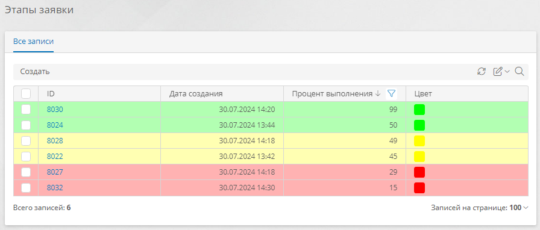
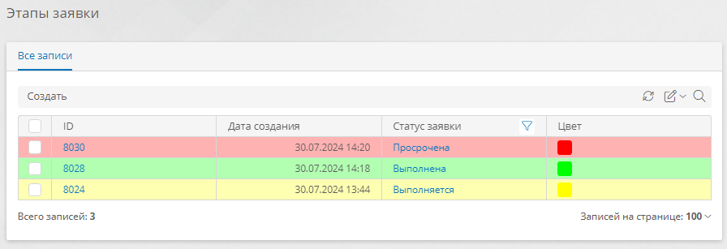

# Атрибут «Цвет» {: #attribute_color}

## Введение

Атрибут «**Цвет**» является системным, он задаёт цвет отображения записи в таблицах, шевронах и диаграммах:

- если для записи задано значение атрибута «**Цвет**», строки этой записи в [таблицах шаблона][table_configure_template], [таблицах на форме][form_dynamic_elements_table], [шевроны][form_dynamic_elements_chevron] и [сектора диаграмм][form_dynamic_elements_color_diagram_example] для неё будут отображаться с заливкой заданным цветом.

Значение атрибута «**Цвет**» можно изменять вручную на форме (**в шестнадцатеричном формате**) или с помощью **[сценариев][scenarios]** и **[C#-скриптов][manual_csharp]** (**в десятичном формате**).

Для поиска кодов цветов и их преобразования из шестнадцатеричной в десятичную форму можно воспользоваться, например, сайтом [convertingcolors.com](https://convertingcolors.com/)

Свойства системного атрибута типа «**Цвет**» не подлежат изменению.

Сведения о настройке поля атрибута «**Цвет**» на формах и в таблицах см. в параграфе «_[Динамические элементы формы. Цвет][form_dynamic_elements_color]_».

## Примеры использования

<div class="admonition example" markdown="block">

### Условное окрашивание строк таблицы {: .admonition-title #table_conditional_color_example}

**Конфигурация приложения**

- Шаблон записи _«Этапы заявки»_
    - Атрибут _«Процент выполнения»_
        - **Тип данных: число**
        - **Количество знаков после запятой**: **не преобразовывать**
    - Поля на форме:
        - _Процент выполнения_
            - **Доступ: разрешить ввод**
        - _Цвет_
            - **Доступ: только чтение**
    - Столбцы в таблице _«Все записи»_:
        - _ID_
        - _Дата создания_
        - _Процент выполнения_
        - _Цвет_
- Сценарий
    - **Событие**
        - **Тип: создание записи**
        - **Целевой шаблон:** _Этапы заявки_
    - **Действие: изменить значения атрибутов**
        - **Атрибут:** _Цвет_
        - **Операция со значениями: заменить**
        - **Значение: формула**
        ``` turtle
        # 16711680 — десятичный код красного цвета,
        # 16776960 — жёлтого, 65280 — зелёного.
        IF($Protsentvypolneniya < 30, 16711680,
            IF($Protsentvypolneniya < 50, 16776960,
                65280))
        ```


</div>
<div class="admonition example" markdown="block">

Условное окрашивание строк таблицы
{: .admonition-title }


**Результирующее поведение**

1. Создайте запись в шаблоне _«Этапы заявки»_.
2. Введите _процент выполнения: 15_.
3. Сохраните запись.
4. Поле _«Цвет»_ должно отобразиться красным цветом.
5. Создайте ещё несколько записей с разными значениями _процента выполнения_.
6. Откройте таблицу _«Все записи»_ шаблона шаблоне _«Этапы заявки»_.
7. Строки таблицы должны отобразиться цветами, соответствующими _проценту выполнения_.

__

</div>

<div class="admonition example" markdown="block">

### Окрашивание строк таблицы по справочнику статусов {: .admonition-title #table_reference_color_example}

**Конфигурация приложения**

- Шаблон записи _«Статусы заявок»_
    - Атрибут _«Статус»_
        - **Тип данных: текст**
        - **Формат отображения: обычный текст**
        - **Использовать как заголовок записей:** флажок установлен
    - Поля на форме:
        - _Цвет_
        - _Статус_
- Шаблон записи _«Этапы заявки»_
    - Атрибут _«Статус заявки»_
        - **Тип данных: запись**
        - **Связанный шаблон:** _Статусы заявок_
        - **Хранить несколько значений:** флажок снят
    - Поля на форме:
        - _Статус заявки_
            - **Представление: раскрывающийся список**
        - _Цвет_
            - **Доступ: только чтение**
    - Столбцы в таблице _«Все записи»_:
        - _ID_
        - _Дата создания_
        - _Статус заявки_
        - _Цвет_


</div>
<div class="admonition example" markdown="block">

Окрашивание строк таблицы по справочнику статусов — продолжение
{: .admonition-title }



- Сценарий
    - **Событие**
        - **Тип: изменение записи**
        - **Целевой шаблон:** _Этапы заявки_
    - **Действие: изменить значения атрибутов**
        - **Атрибут:** _Цвет_
        - **Операция со значениями: заменить**
        - **Значение: атрибут** _Статус заявки → Цвет_

**Результирующее поведение**

1. Создайте записи в шаблоне «Статусы заявок»:

    **Статус**    | **Цвет**
    ----------    |---------
    _Выполнена_   | `#00ff00` (зелёный) {: style="background-color: green; color: white;"}
    _Выполняется_ | `#ffff00` (жёлтый) {: style="background-color: yellow; color: black;"}
    _Просрочена_  | `#ff0000` (красный) {: style="background-color: red; color: white;"}

2. Создайте запись в шаблоне _«Этапы заявки»_.
3. Выберите _статус заявки_ _«Просрочена»_.
4. Сохраните запись.
5. Поле _«Цвет»_ должно отобразиться красным цветом.
6. Создайте ещё несколько записей с разными _статусами заявок_.
7. Откройте таблицу _«Все записи»_ шаблона шаблоне _«Этапы заявки»_.
8. Строки таблицы должны отобразиться цветами, соответствующими _статусам заявок_.

__

</div>

--8<-- "related_topics_heading.md"

**[Таблица. Настройка в шаблоне][table_configure_template]**

**[Таблица. Настройка на форме][form_dynamic_elements_table]**

**[Шевроны. Настройка представления][form_dynamic_elements_chevron]**

**[Сектора диаграмм. Окрашивание по атрибуту «Цвет»][form_dynamic_elements_color_diagram_example]**

**[Системные атрибуты][attributes_system]**

**[Атрибуты. Определения, типы, настройка, архивирование, удаление][attributes]**


