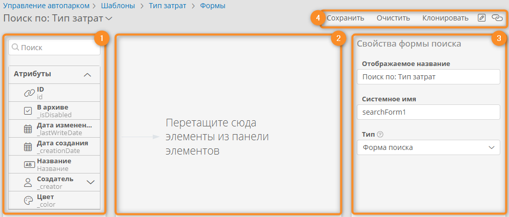

---
kbId:
title: Расширенная фильтрация
---

# Расширенная фильтрация. Настройка форм поиска

## Введение

Расширенная фильтрация улучшает поиск данных в **{{ productName }}**, позволяя фильтровать списки по дополнительным полям.

Здесь представлены сведения о настройке **форм поиска** для расширенной фильтрации. Сведения об использовании расширенной фильтрации см. статью _«[Таблицы. Использование и персональная настройка][table_personal_use]»_.

## Определения {: .admonition-title #definitions}

- **Расширенная фильтрация** обеспечивает фасетный поиск по атрибутам с учётом логических условий.
- В качестве интерфейса используются специальные **формы поиска**.
- Расширенная фильтрация применяется в таблицах и раскрывающихся списках.
- Осуществляется фильтрация по всем имеющимся записям.
- Поддерживается фильтрация по атрибутам дочерних записей.
- При поиске текста поддерживается устранение опечаток.
- Если для шаблона настроена форма поиска, она будет отображаться для всех таблиц и списков, содержащих его записи.
- Доступ к формам поиска определяется с помощью [ролей][roles].

## Настройка формы поиска

1. Откройте шаблон.
2. Выберите вкладку «**Формы**».
3. Отобразится список форм шаблона.
4. Нажмите кнопку «**Создать**».
5. Отобразится конструктор формы.
6. В свойствах формы укажите тип «**Форма поиска**».
7. Укажите **наглядное название** для формы поиска.
8. Поместите **атрибуты**, по которым будет осуществляться фильтрация, на форму.
9. Сохраните форму.
10. Настройте доступ к форме поиска с [помощью ролей][roles].

!!! note "Примечание"

    Не рекомендуется менять у существующей формы тип
     на форму поиска, так как это приведёт к уничтожению её данных.

## Области конструктора формы поиска

**(1) Панель элементов** — палитра атрибутов, которые можно поместить на форму для фильтрации данных. Панель элементов позволяет:

- перетаскивать элементы на макет формы;
- искать элементы;
- создавать и редактировать атрибуты.

**(2) Макет формы** — это её эскиз.

**(3) Панель свойств** — позволяет просмотреть и изменить свойства выбранного элемента.

**(4) Кнопки**

- **Сохранить** — сохранение формы;
- **Очистить** — удаление всех элементов с макета формы;
- **Клонировать** — создание дубликата формы;
- **Настроить шаблон** <i class="fa-light fa-pen-square"></i> — переход к странице «**Свойства**» шаблона;
- **Связи** <i class="fa-light fa-link-horizontal"></i> — просмотр списка объектов приложения, в которых используется форма.

__

--8<-- "related_topics_heading.md"

- _[Таблицы. Использование и персональная настройка][table_personal_use]_
- _[Роли в приложении. Определения, настройка, объединение, удаление][roles]_

