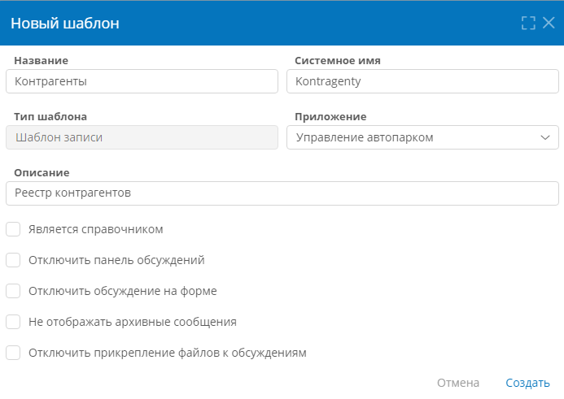
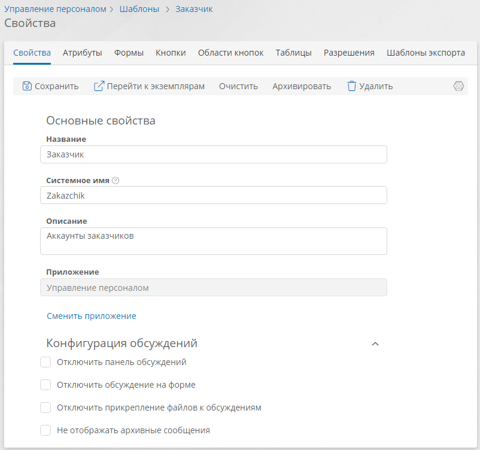

# Шаблоны. Определения, настройка, перенос, архивирование, очистка {: #templates}

## Определения {: .admonition-title #definitions}

**Шаблоны** служат для описания, хранения и обработки данных бизнес-сущностей и процессов.

Для каждого [приложения][apps] предусмотрен отдельный набор шаблонов. См. _«[Просмотр списка шаблонов приложения](#просмотр-списка-шаблонов-приложения)»._

В **{{ productName }}** предусмотрены шаблоны следующих типов:

- **[шаблон записи][record_templates]**
- **[шаблон процесса][process_templates]**
- **[шаблон аккаунта][account_templates]**
- **[шаблон роли][role_templates]**
- **[шаблон организационной единицы][organizational_unit_templates]**

У шаблонов различных типов имеются общие и специфические свойства.

Шаблон любого типа содержит и позволяет настраивать:

- [общие свойства шаблона][template_common_properties];
- [таблицы][table_configure] для отображения данных;
- [карточки][cards_configure_assign_to_table];
- [формы][forms] для просмотра и ввода данных;
- [кнопки][buttons] для выполнения операций в приложении;
- [области кнопок][button_area] для форм и таблиц.

Шаблоны **записи, аккаунта, роли** и **оргединицы** содержат:

- [атрибуты][attributes] бизнес-сущности;
- записи с экземплярами бизнес-сущностей;
- [шаблоны экспорта][export_templates] данных в форматах DOCX, XLSX и PDF.

Шаблон **процесса** содержит:

- [диаграмму бизнес-процесса][process_diagram];
- записи с экземплярами бизнес-процесса.

## Просмотр списка шаблонов приложения

1. На странице [«**Администрирование**»][administration] в разделе «**Архитектура**» выберите пункт «**Приложения**» <i class=" fal  fa-cubes ">‌</i>.
2. Отобразится список приложений.
3. Дважды нажмите строку приложения в списке.
4. На странице **«Администрирование»** приложения выберите пункт «**Шаблоны**» <i class=" fal  fa-briefcase ">‌</i>.
5. Отобразится список шаблонов в составе текущего приложения.

## Просмотр списка шаблонов из всех приложений

1. На странице [«**Администрирование**»][administration] в разделе «**Архитектура**» выберите пункт «**Шаблоны**» <i class=" fal  fa-briefcase ">‌</i>.
2. Отобразится список всех шаблонов в составе всех [приложений][apps].

__

### Операции в списке шаблонов

- **Выбрать** — устанавливайте флажки в первом столбце списка, чтобы выбрать один или несколько шаблонов.
- **Открыть** — дважды нажмите строку шаблона в списке или нажмите гиперссылку в столбце «**ID**», чтобы перейти к [странице «**Свойства**» шаблона](#настройка-свойств-шаблона).
- **Создать** — [создание нового шаблона](#создание-шаблона).
- **Очистить** — [удаление всех записей](#очистка-шаблона), хранящихся в выбранных шаблонах (кнопка отображается, если выбран хотя бы один шаблон).
- **Удалить** — [удаление выбранного шаблона](#удаление-шаблона) (кнопка отображается, только если выбран один шаблон).
- **Обновить список** — загрузка актуальных данных.
- **Мои настройки** — настройка персонального представления списка.
    - **Настроить внешний вид** — выбор и упорядочивание столбцов, настройка режима загрузки данных.
    - **Удалить все фильтры** — сброс всех фильтров, примененных к данным в списке.
    - **Сбросить** — восстановление исходного представления списка.
- **Поиск** — нажмите эту кнопку и введите искомые слова в поле «**Поиск**». Отобразятся строки, содержащие искомые слова.

__

## Создание шаблона

Вручную можно создать:

- [шаблон записи](#создание-шаблона-записи)
- [шаблон процесса](#создание-шаблона-процесса)
- [шаблон аккаунта](#создание-шаблона-аккаунта)

[Шаблон роли][role_templates] и [шаблон организационной единицы][organizational_unit_templates] создаются автоматически при создании приложения.

### Создание шаблона записи

1. Перейдите к [списку шаблонов приложения](#просмотр-списка-шаблонов-приложения).
2. Выберите вкладку «**Шаблоны записей**».
3. Нажмите кнопку «**Создать**».
4. Откроется окно «**Новый шаблон**».
5. Настройте [свойства шаблона записи][record_template_properties].
6. Сохраните шаблон.

__

### Создание шаблона процесса

1. Перейдите к [списку шаблонов приложения](#просмотр-списка-шаблонов-приложения).
2. Выберите вкладку «**Шаблоны процессов**».
3. Нажмите кнопку «**Создать**».
4. Откроется окно «**Новый шаблон**».
5. Настройте [общие свойства шаблона][record_templates].

    __

6. Настройте связь шаблона процесса с шаблоном записи.

    !!! warning "Внимание!"

        Настроить связь шаблона процесса с шаблоном записи можно только при создании шаблона процесса.

        - «Связь с шаблоном записи» — укажите способ привязки создаваемого шаблона к шаблону записи.
        - «Создать новый шаблон» — к новому шаблону процесса будет привязан вновь созданный связанный шаблон записи:
            - «Название нового шаблона записи» — укажите наименование создаваемого шаблона записи.
            - «Системное имя нового шаблона записи» — укажите уникальное имя шаблона.
            --8<-- "system_name_requirements.md"

        __

        - «Связать с существующим шаблоном» — к новому шаблону процесса будет привязан имеющийся шаблон записи.
            - «Связанный шаблон» — выберите из раскрывающегося списка шаблон записи для привязки к создаваемому шаблону процесса.

        __

7. Сохраните шаблон.

### Создание шаблона аккаунта

1. Перейдите к [списку шаблонов приложения](#просмотр-списка-шаблонов-приложения).
2. Выберите вкладку «**Шаблоны аккаунтов**».
3. Нажмите кнопку «**Создать**».
4. Откроется окно «**Новый шаблон**».
5. Настройте [свойства шаблона аккаунта][account_templates].
6. Сохраните шаблон.

__

## Настройка свойств шаблона

1. Откройте [список шаблонов](#просмотр-списка-шаблонов-приложения).
2. Дважды нажмите строку шаблона.
3. Откроется страница «**Свойства**» шаблона.
4. Настройте [свойства шаблона][общие-свойства-шаблонов].
5. Нажмите кнопку «**Сохранить**».

__

### Операции на странице «Свойства» шаблона

На странице «**Свойства**» шаблона предусмотрены кнопки для выполнения перечисленных ниже операций.

- **Сохранить** — сохранение изменений, внесённых на странице «**Свойства**».
- **Перейти к экземплярам** — [переход к списку всех записей](#просмотр-всех-записей-экземпляров-шаблона), хранящихся в шаблоне, или всех экземпляров бизнес-процесса.
- **Очистить** — [удаление всех записей](#очистка-шаблона) из шаблона.
- **Архивировать** / **Разархивировать** — [архивирование или разархивирование](#templates_archive_unarchive) шаблона.
- **Удалить** — [удаление шаблона](#удаление-шаблона) вместе с хранящимися в нём записями.
- **Связи** — просмотр списка объектов, связанных с данным шаблоном. При нажатии этой кнопки отобразится панель «**Связи**».
- **Сменить приложение** — [перенос шаблона в другое приложение](#templates_move).

__

## Просмотр всех записей (экземпляров) шаблона

В каждом шаблоне назначается одна таблица, в которой по умолчанию будет отображаться список записей, хранящихся в шаблоне, или экземпляров бизнес-процесса.

При создании шаблона автоматически создается таблица «**Все записи**», которая назначается таблицей по умолчанию. При настройке шаблона можно выбрать другую таблицу по умолчанию.

1. Откройте [список шаблонов](#просмотр-списка-шаблонов-приложения).
2. Дважды нажмите строку шаблона в списке.
3. Откроется страница «**Свойства**» шаблона
4. Нажмите кнопку «**Перейти к экземплярам**».
5. Отобразится таблица, назначенная для шаблона таблицей по умолчанию.

## Использование шаблона в нескольких приложениях {: #templates_move}

Шаблоны можно переносить между [приложениями][apps] для рефакторинга или формирования связи между несколькими приложениями.

!!! warning "Работа с одним шаблоном в разных приложениях"

    При смене приложения шаблона сохраняются его связи с другими шаблонами в исходном приложении и хранящиеся в шаблоне записи.

    Можно перенести шаблон последовательно в несколько приложений и установить связи с шаблонами в них.

    Это позволяет использовать один и тот же шаблон записи одновременно в разных приложениях и передавать данные между ними.

    Например, в приложениях _CRM_ и _SRM_ требуется использовать единый справочник _«Контрагенты»_ (чтобы не дублировать данные и не создавать два одинаковых шаблона записи _«Контрагенты»_):

    - создайте шаблон _«Контрагенты»_ в приложении _CRM_ и настройте его связи с другими шаблонами;
    - перенесите шаблон _«Контрагенты»_ в приложение _SRM_;
    - связи шаблона _«Контрагенты»_ с шаблонами в приложении _CRM_ сохранятся и продолжат работать ожидаемым образом;
    - в приложении _SRM_ настройте атрибуты типа «**Запись**»_,_ связанные с шаблоном _«Контрагенты»_;
    - чтобы в приложении _CRM_ создать новые связи с шаблоном _«Контрагенты»_, снова смените приложение на _CRM_.

    В текущих шаблонах записи в приложении CRM все связи на шаблон записи «Контрагенты» сохраняются и продолжают работать, и теперь в приложении SRM можно создать атрибуты, ссылающиеся на шаблон записи «Контрагенты». Для того, чтобы в приложении CRM создать новые связи с шаблоном записи «Контрагенты», необходимо повторно сменить приложение.

### Перенос шаблона в другое приложение

1. Нажмите кнопку «**Сменить приложение**» в разделе «**Основные свойства**» на вкладке «**[Свойства][template_common_properties]**» шаблона.
2. Откроется окно «**Смена приложения**».
3. Выберите **новое приложение**.
4. Нажмите кнопку «**Сохранить**».
5. Нажмите кнопку «**Сохранить**» на странице «**Свойства**» шаблона.

__

## Просмотр разрешений на доступ к шаблону

Подробные сведения о разрешениях на доступ к ресурсам приложения и свойствах ролей см. в разделе «**[Роли в приложении][roles]**».

1. Откройте [список шаблонов](#просмотр-списка-шаблонов-приложения).
2. Дважды нажмите строку шаблона в списке.
3. Откроется страница «**Свойства**» шаблона.
4. Выберите вкладку «**Разрешения**».
5. Отобразится список ролей со следующими данными:
    - разрешения ролей на доступ к ресурсам шаблона;
    - статус активности ролей;
    - количество аккаунтов и групп с каждой ролью.

!!! tip "Подсказка"

    - Нажмите гиперссылку в столбце «**Аккаунты**», чтобы просмотреть список аккаунтов и групп, которым назначена роль.
    - Нажмите гиперссылку в столбце «**Роль**», перейти к соответствующим ролям, аккаунтам и группам.

__

## Фильтрация данных в списке разрешений

С помощью кнопок в списке разрешений можно отфильтровать отображающиеся в нем данные.

- «**Фильтр**» — нажмите эту кнопку, выберите отображение всех или только активных ролей и нажмите кнопку «**Сохранить**». В списке отобразятся соответствующие строки.
- «**Поиск**» — нажмите эту кнопку и введите искомые слова в поле «**Поиск**». Отобразятся строки, содержащие искомые слова.

__

## Архивирование и разархивирование шаблона {: #templates_archive_unarchive}

Архивирование позволяет вывести шаблон из использования, не удаляя хранящиеся в нем записи. При необходимости шаблон можно разархивировать.

!!! warning "Логика архивирования шаблонов"

    - Архивный шаблон перестанет отображаться в списках шаблонов.
    - Записи из архивного шаблона будут по-прежнему доступны в связанных с ним шаблонах.
    - Архивный шаблон записи нельзя будет связать с атрибутами типа «**[Запись][attribute_record]**».
    - Архивный шаблон аккаунта нельзя будет связать с атрибутами типа «**[Аккаунт][attribute_account]**».
    - Экземпляры архивного шаблона процесса по-прежнему будут выполняться.

### Архивирование шаблона

1. Откройте [список шаблонов](#просмотр-списка-шаблонов-приложения).
2. Дважды нажмите строку шаблона в списке.
3. Откроется страница «**Свойства**» шаблона.
4. Нажмите кнопку «**Архивировать**».
5. В окне подтверждения нажмите кнопку «**Архивировать**».

__

### Разархивирование шаблона

1. Откройте [список шаблонов](#просмотр-списка-шаблонов-приложения).
2. Дважды нажмите строку шаблона в списке.
3. Откроется страница «**Свойства**» шаблона.
4. Нажмите кнопку «**Разархивировать**».

__

## Удаление шаблона

!!! warning "Внимание!"

    - При удалении шаблона записи или аккаунта:
        - удаляются хранящиеся в нём записи;
        - удаляются записи, связанные с **[атрибутами типа «Запись»][attribute_record]**, в свойствах которых установлен флажок «**Удалять связанные записи**» (см. [пример][attribute_record_example]).
    - При удалении шаблона процесса:
        - удаляются все его экземпляры;
        - **не** удаляются записи из связанного с ним шаблона записи. 

### Удаление шаблона с помощью списка шаблонов

1. Откройте [список шаблонов](#просмотр-списка-шаблонов-приложения).
2. Выберите подлежащий удалению шаблон с помощью флажка выбора в списке.
3. Нажмите кнопку «**Удалить**».
4. Подтвердите удаление шаблона.

__

### Удаление шаблона с помощью его страницы «Свойства»

1. Откройте [список шаблонов](#просмотр-списка-шаблонов-приложения).
2. Дважды нажмите строку шаблона в списке.
3. Откроется страница «**Свойства**» шаблона.
4. Нажмите кнопку «**Удалить**».
5. Подтвердите удаление шаблона.

## Очистка шаблона

Очистка шаблона позволяет удалить все записи из шаблона записи, аккаунта, роли, оргединицы или все экземпляры процесса из шаблона процесса.

!!! warning "Внимание!"

    - При очистке шаблона записи:
        - удаляются все записи из шаблона;
        - удаляются записи, связанные с **[атрибутами типа «Запись»][attribute_record]**, в свойствах которых установлен флажок «Удалять связанные записи» (см. [пример][attribute_record_example]).
        - удаляются все экземпляры процессов, связанные с удалёнными записями.
    - При очистке шаблона процесса:
        - удаляются все экземпляры процесса;
        - не удаляются записи, связанные с удалёнными экземплярами процесса.

### Очистка нескольких шаблонов с помощью списка шаблонов

1. Откройте [список шаблонов](#просмотр-списка-шаблонов-приложения).
2. Выберите один или несколько подлежащих очистке шаблонов с помощью флажков выбора в списке.
3. Нажмите кнопку «**Очистить**».
4. Подтвердите очистку шаблона.

__

### Очистка шаблона с помощью его страницы «Свойства» {: .pageBreakBefore }

1. Откройте [список шаблонов](#просмотр-списка-шаблонов-приложения).
2. Дважды нажмите строку шаблона в списке.
3. Откроется страница «**Свойства**» шаблона.
4. Нажмите кнопку «**Очистить**» на странице «**Свойства**».
5. Подтвердите очистку шаблона.

--8<-- "related_topics_heading.md"

**[Атрибуты. Определения, типы, настройка, архивирование, удаление][attributes]**

**[Формы. Определения и настройка][forms]**

**[Кнопки. Определения и настройка][buttons]**

**[Шаблоны экспорта. Определения и настройка][export_templates]**


