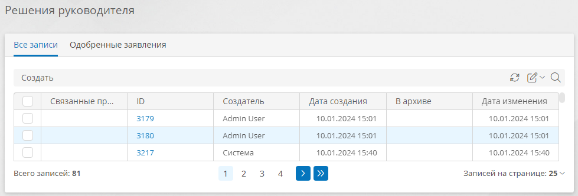
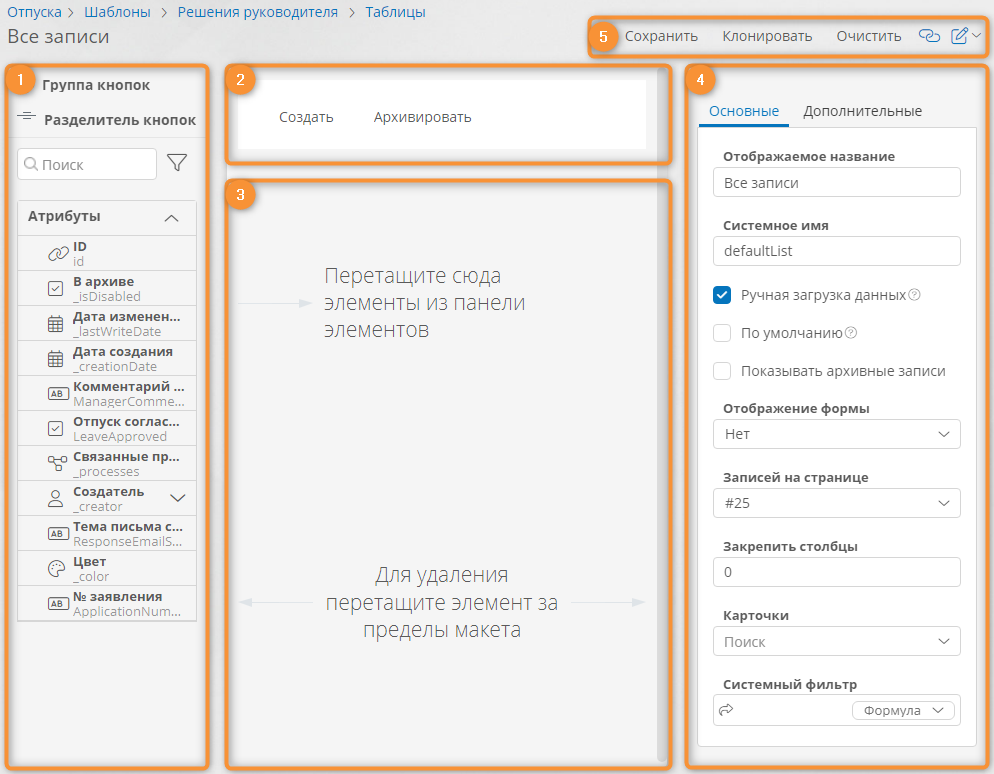
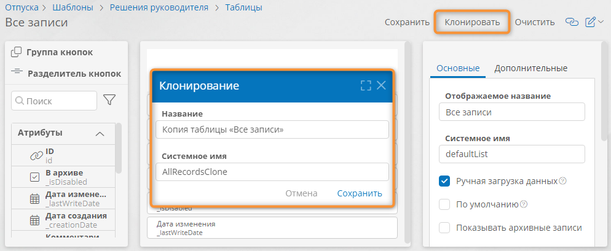

# Таблицы. Определения, настройка, клонирование, удаление {: #table_configure}

## Определения {: .admonition-title #definitions}

**Таблица** — это представление данных в виде столбцов и строк.

- Строка таблицы содержит данные одной записи шаблона.
- Столбец таблицы содержит значения атрибутов записи.
- В каждом шаблоне можно настроить произвольное количество таблиц.
- Таблицы, доступные пользователю приложения, отображаются на отдельных вкладках.
- Для каждой таблицы предусмотрены два представления:
  - [системное][table_configure_template] — настраиваемается на уровне приложения с помощью конструктора таблицы. Это представление будет использоваться по умолчанию для пользователей.
  - [пользовательское][table_personal_use] — настраивается пользователем для своего аккаунта. Например, пользователь может скрыть и переместить столбцы, отфильтровать, отсортировать и сгруппировать строки, подсчитать итоги.

В этом разделе представлены инструкции по настройке таблицы в шаблоне. См. также [_«Настройка таблицы на форме»_][form_dynamic_elements_table].

__

## Просмотр списка и настройка таблиц в шаблоне {: #table_configure_template}

1. Откройте любой шаблон.
2. Выберите вкладку «**Таблицы**».
3. Отобразится список таблиц, настроенных для шаблона, с их свойствами.

    __

4. Создайте таблицу или дважды нажмите таблицу в списке.
5. Отобразится конструктор таблицы со следующими областями:

    **(1) Панель элементов**  — содержит [атрибуты][attributes], которые можно [поместить в качестве столбцов](#настройка-свойств-столбца) в таблицу, а также кнопки для добавления в область кнопок.

    !!! tip "Совет"

        Панель элементов позволяет создавать и редактировать атрибуты в шаблоне, не покидая конструктор таблицы.

         - Чтобы создать атрибут в текущем шаблоне, наведите указатель мыши на заголовок «**Атрибуты**» и нажмите кнопку «**Добавить атрибут**».
         - Чтобы создать атрибут в связанном с этим атрибутом шаблоне, наведите указатель на название **[атрибута типа запись][attribute_record]** и нажмите кнопку «**Добавить атрибут**».
         - Чтобы отредактировать атрибут, наведите указатель мыши на его название и нажмите кнопку «**Редактировать атрибут**».

    **(2) Область кнопок** — позволяет [настроить кнопки](#настройка-кнопок-таблицы) для данной таблицы.

    **(3) Макет таблицы** — служит для [настройки столбцов](#настройка-свойств-столбца) таблицы.

    **(4) Панель свойств** — служит для настройки элемента, выбранного на макете: [таблицы](#настройка-свойств-таблицы), [столбца](#настройка-свойств-столбца) или [кнопок](#настройка-кнопок-таблицы).

    **(5) Кнопки**

    - Сохранить — сохранение текущей конфигурации таблицы.
    - **Клонировать** — [создание дубликата](#table_clone) таблицы.
    - **Очистить** — удаление всех столбцов таблицы.
    - **Связи**  <i class=" fal  fa-link-horizontal " aria-hidden="true">‌</i> — просмотр списка сущностей, с которыми связана таблица.
    - **Перейти к таблице** <i class=" fal  fa-table " aria-hidden="true">‌</i> — просмотр настроенной таблицы с данными в представлении для пользователя.
    - **Настроить шаблон** <i class=" fal  fa-external-link " aria-hidden="true">‌</i> — переход к свойствам шаблона, к которому относится таблица.

    __

6. Настройте [свойства](#настройка-свойств-таблицы), [столбцы](#настройка-свойств-столбца) и [кнопки](#настройка-кнопок-таблицы) таблицы.
7. Сохраните таблицу.

!!! note "Примечание"

    При создании шаблона автоматически создаётся таблица «**Все записи**» с перечисленными ниже столбцами. Эта таблица отображается по умолчанию при нажатии кнопки «**Перейти к экземплярам**» на странице свойств шаблона.

## Создание таблицы со списком задач

!!! question "Определения"

    - **Таблица задач** содержит сведения о задачах по процессу.
    - Помимо стандартной таблицы на странице «**Мои задачи**» можно настроить особую таблицу задач с произвольным набором столбцов.
    - Таблица задач настраивается для шаблона процесса.
    - Таблицу задач можно поместить в виде вкладки на страницу «**Мои задачи**».

1. Откройте [шаблон процесса][process_templates].
2. Откройте список [таблиц шаблона](#table_configure_template).
3. Нажмите кнопку «**Создать**».
4. В раскрывающемся меню выберите пункт «**Таблица задач**»
5. Настройте [свойства](#настройка-свойств-таблицы), [столбцы](#настройка-свойств-столбца) и [кнопки](#настройка-кнопок-таблицы) таблицы.
6. Сохраните таблицу.
7. Добавьте таблицу задач [на страницу «**Мои задачи**»](#добавление-таблицы-на-страницу-мои-задачи).

__

## Настройка свойств таблицы

1. Нажмите пустую область макета.
2. Справа от макета отобразится панель свойств таблицы
3. Настройте свойства таблицы на двух вкладках:

    - [**Основные**](#основные-свойства)
    - [**Дополнительные**](#дополнительные-свойства):
        - [**Сортировка**](#сортировка)
        - [**Группировка**](#группировка)
        - [**Подсчёт итогов**](#подсчёт-итогов)
        - [**Фильтрация**](#фильтрация)

### Основные свойства

- **Отображаемое название** — наглядный заголовок таблицы, который отображается в списке таблиц шаблона и для пользователей при просмотре таблицы.
- **Системное имя** — уникальное имя таблицы, которое используется в вычислениях. Может содержать только буквы латинского алфавита, цифры и знак «_». Заполняется автоматически посредством транслитерации.
- **Ручная загрузка данных** — установите этот флажок , чтобы при открытии таблица отображалась без данных. Пользователь сможет настроить внешний вид таблицы, а затем нажать кнопку «**Загрузить данные**».

    __

- **По умолчанию** — установите этот флажок, чтобы таблица отображалась по умолчанию при просмотре записей в шаблоне. В шаблоне можно назначить только одну таблицу по умолчанию. При этом, если пользователь откроет другую таблицу в шаблоне, она станет отображаться для него по умолчанию.
- **Показывать архивные записи** — установите этот флажок, чтобы в таблице отображались записи помещённые в архив, которые скрыты по умолчанию.
- **Отображение формы** — укажите способ отображения форм записей из таблицы:

     - **Нет** — при двойном нажатии строки таблицы форма с записью отобразится вместо таблицы;
     - **Вертикальное** — при нажатии строки в таблице форма записи отобразится справа от таблицы, границу между таблицей и формой можно будет перемещать с помощью мыши;
     - **Горизонтальное** — при нажатии строки в таблице форма записи отобразится под таблицей, границу между таблицей и формой можно будет перемещать с помощью мыши.

- **Записей на странице** — укажите количество строк отображающихся в таблице при её открытии, по умолчанию: 25.
- **Закрепить столбцы** — укажите количество столбцов начиная слева, которые не будут прокручиваться по горизонтали.
- **Карточки** — выберите представление карточек, которое будет использоваться для отображения данных таблицы в виде плиток. См. _«[Карточки][cards_configure_assign_to_table]»_.
- **Системный фильтр** — задайте список ID записей, которые должны отображаться в таблице. Для этого введите **формулу** или выражение на языке  **N3** или составьте таблицу **DMN**.

### Дополнительные свойства

!!! note "Примечание"

    Перед настройкой дополнительных свойств таблицы её **необходимо сохранить**.

Для настройки сортировки, группировки, подсчёта итогов и фильтрации данных в таблице, перетащите столбцы из макета таблицы в соответствующие блоки на вкладке «**Дополнительные**» справа от макета и настройте параметры блоков, как указано ниже.

Чтобы удалить столбец из блока на вкладке «**Дополнительные**», перетащите его за пределы блока.

#### Сортировка

Перетащите в блок «**Сортировка**» один или несколько столбцов, а затем выберите каждый столбец в блоке и задайте направление сортировки строк таблицы по нему:

- **По возрастанию** — чем меньше значение в данном столбце, тем выше строка будет отображаться в таблице;
- **По убыванию** — чем больше значение в данном столбце, тем выше строка будет отображаться в таблице;
- **Пустые сверху** — установите этот флажок, чтобы строки с пустыми значениями в данном столбце отображались над остальными строками.

!!! note "Примечание"

    Правила сортировки строк таблицы по нескольким столбцам будут применяться по порядку следования столбцов в блоке «**Сортировка**»: от первого к последнему.

    Чтобы задать порядок сортировки по нескольким столбцам, расположите их в требуемом порядке в блоке «**Сортировка**».

__

#### Группировка

Перетащите в блок «**Группировка**» один или несколько столбцов, а затем выберите каждый столбец в блоке и задайте направление группировки строк таблицы по значениям в нём:

- **По возрастанию** — чем меньше значение в данном столбце, тем выше группа строк будет отображаться в таблице;
- **По убыванию** — чем больше значение в данном столбце, тем выше группа строк будет отображаться в таблице;
- **Пустые сверху** — установите этот флажок, чтобы строки с пустыми значениями в данном столбце отображались над остальными строками.

!!! note "Примечание"

    Строки группируются по одинаковым значениям в столбце.

    При группировке строк по нескольким столбцам в таблице будет сформировано древовидное представление записей.

    Правила группировки строк таблицы по нескольким столбцам будут применяться по порядку следования столбцов в блоке «**Группировка**»: от первого к последнему.

    Чтобы задать порядок сортировки по нескольким столбцам, расположите их в требуемом порядке в блоке «**Группировка**».

__

#### Подсчёт итогов

Перетащите в блок «**Подсчет итогов**» один или несколько столбцов, а затем выберите каждый столбец в блоке и задайте способ подсчёта итогов по значениям в столбце:

- **Количество** — будет подсчитано количество строк в каждой группе в таблице;
- **Сумма** — для каждой группы строк в таблице будет подсчитана сумма значений в столбце.

!!! note "Примечание"

    Подсчет итогов работает только при включённой группировке строк в таблице.

__

#### Фильтрация

Перетащите в блок «**Фильтрация**» один или несколько столбцов, а затем настройте правила фильтрации данных в таблице по значениям в столбцах:

- **Равно**
- **Не равно**
- **Больше чем**
- **Больше или равно**
- **Меньше чем**
- **Меньше или равно**

!!! note "Примечание"

    Для фильтров по нескольким столбцам можно выбрать логический оператор `И` либо `ИЛИ`. Для этого нажимайте кнопку «**Поменять оператор**» <i class="  fal  fa-exchange " title="Поменять оператор">‌</i> рядом с правилами фильтрации.

__

## Настройка столбцов таблицы

Панель элементов конструктора таблицы содержит список атрибутов текущего шаблона и связанных с ним шаблонов. Эти атрибуты можно поместить в таблицу в качестве столбцов.

### Добавление столбца

1. Выберите атрибут в панели элементов слева от макета таблицы.
2. Чтобы выбрать атрибут шаблона, связанного с текущим, раскройте в панели элементов атрибут типа «**Запись**».
3. Перетащите выбранный атрибут на макет таблицы.
4. При необходимости перетащите столбец в требуемую позицию на макете таблицы. При перетаскивании целевая позиция столбца подсвечивается на макете.
5. Справа от макета отобразится панель «**Свойства столбца**».
6. [Настройте свойства столбца](#настройка-свойств-столбца).

!!! note "Примечание"

    Для конечного пользователя столбцы таблицы будут отображаться слева направо в порядке их следования в макете таблицы: верхний столбец на макете отобразится первым слева в таблице.

__

### Настройка свойств столбца

1. Добавьте или выберите столбец таблицы на макете.
2. Настройте **свойства столбца** с помощью панели справа от макета таблицы:

    - **Отображаемое название** — заголовок столбца в таблице;
    - **Ширина столбца** — исходная ширина столбца в таблице (пользователь сможет установить персональную ширину столбцов в таблице);
    - **Скрытый** — установите этот флажок, чтобы столбец не отображался для пользователя при просмотре страницы. Этот флажок можно использовать, например, чтобы скрыть столбцы, которые используются для сортировки, группировки или фильтрации таблицы, но не должны быть видны пользователю. При этом пользователь сможет отобразить скрытые столбцы с помощью [персональной настройки таблицы][table_personal_use].
  
3. Нажмите кнопку «**Сохранить**», чтобы сохранить таблицу.

!!! note "Примечание"

    Под свойствами столбца в справочных целях отображаются свойства атрибута, к которому относится столбец:

    - **Путь к атрибуту** — полный путь к атрибуту в контексте текущего шаблона;
    - **Системное имя** — уникальное имя атрибута;
    - **Тип** — тип данных атрибута;
    - **Формат отображения** — отображает формат отображения данных атрибута;
    - **Вычисляемый** — флажок, указывающий, является ли атрибут вычисляемым;
    - **В архиве** — флажок, указывающий, является ли атрибут архивным.

## Настройка кнопок таблицы

В каждой таблице предусмотрена одна [область кнопок][button_area].

- Изначально для таблицы используется область кнопок, в [свойствах][button_area_configure] которой установлен флажок «**По умолчанию для таблиц**». В стандартной области кнопок, например, у шаблона записи находятся кнопки «**Сохранить**» и «**Архивировать**», а у шаблона процесса — «**Создать**», «**Остановить процесс**», «**Мигрировать**» и «**Архивировать**».
- Добавить и удалить кнопки для таблицы можно с помощью конструктора области кнопок, как указано ниже.
- Кроме того, у каждой таблицы предусмотрены перечисленные ниже системные кнопки, которые нельзя добавить и удалить:
     - **Обновить список** — перезагрузка данных таблицы.
     - **Мои настройки** — раскрывающееся меню для настройки таблицы:
         - **Настроить внешний вид** — [персональная настройка][table_personal_use] отображения столбцов таблицы для текущего пользователя.
         - **Удалить все фильтры** — сброс всех настроенных конечным пользователем фильтров данных в таблице.
         - **Сбросить** — удаление всех настроенных конечным пользователем параметров отображения таблицы. То есть будет восстановлено исходное представление таблицы, настроенное в конструкторе.
         - **Настроить таблицу** — перейти к [конструктору таблицы](#table_configure_template) (если у пользователя есть соответствующие права).
         - **Настроить шаблон** — переход к странице настройки шаблона, к которому относится таблица (если у пользователя есть соответствующие права).
     - **Поиск** — нажмите эту кнопку и введите ключевые слова в поле «**Поиск**». В таблице отобразятся строки, содержащие искомые слова.

### Порядок настройки области кнопок таблицы

1. Выберите область кнопок в верхней части макета таблицы.
2. В панели элементов слева отобразится список [кнопок шаблона][buttons].
3. Перетащите необходимые кнопки, группы кнопок и разделители на область кнопок.
4. При необходимости настройте свойства кнопок: переименуйте их, смените их значки или цвет. Эти изменения не отразятся на исходных кнопках, они будут использоваться только для данной таблицы.
5. Чтобы удалить все элементы из области кнопок, нажмите кнопку «**Очистить**» в панели «**Свойства области кнопок**».

    !!! note "Примечание"

        При изменении области кнопок таблицы в [списке областей кнопок][button_area] будет создана новая область кнопок, которая будет использоваться только для этой таблицы. Исходная область кнопок не будет изменена.

6. Чтобы восстановить исходную область кнопок, используемую по умолчанию для таблиц, нажмите кнопку «**Восстановить исходные кнопки**» в панели «**Свойства области кнопок**». После восстановления исходных кнопок и сохранения таблицы созданная для неё особая область кнопок будет удалена из [списка областей кнопок][button_area].
7. Нажмите кнопку «**Сохранить**», чтобы сохранить таблицу.

__

## Добавление таблицы на страницу «Мои задачи»

1. Откройте [раздел навигации][navigation_sections_setup], в который требуется добавить [таблицу][table_configure] из любого шаблона или [таблицу задач](#создание-таблицы-со-списком-задач) из шаблона процесса.
2. Раскройте список шаблонов на панели элементов.
3. Раскройте шаблон, содержащий требуемую таблицу.
4. Раскройте группу «**Таблицы**» внутри шаблона.
5. Перетащите таблицу задач в подраздел «**Мои задачи**» на макете раздела навигации. Если этот подраздел отсутствует, перетащите группу «**Мои задачи**» из панели элементов на макет раздела навигации. См. [_«Добавление страницы «Мои задачи» в раздел навигации»_.][my_tasks_page_configure_add_to_navigation]
6. Настройте свойства вкладки таблицы с помощью панели «**Свойства элемента**»:

    - **Отображаемое название** — введите наглядное название вкладки страницы «**Мои задачи**», на которой будет отображаться таблица.
    - **Описание** — введите краткое описание таблицы.
    - **Значок** — выберите наглядный значок для таблицы.

7. Сохраните раздел навигации.

__

## Клонирование таблицы {: #table_clone}

1. Откройте  [список таблиц шаблона][table_configure_template].
2. Откройте таблицу, дважды нажав её в списке.
3. В конструкторе таблицы нажмите кнопку «**Клонировать**».
4. В окне «**Клонирование**» настройте свойства дубликата таблицы:

     - **Название** — заголовок новой таблицы, который будет отображаться для конечных пользователей;
     - **Системное имя** — уникальное имя таблицы, которое используется в вычислениях.
     --8<-- "system_name_requirements.md"

5. Нажмите кнопку «**Сохранить**».
6. Дубликат таблицы будет добавлен в список таблиц шаблона.

__

## Удаление таблицы

1. Откройте шаблон и выберите вкладку «**Таблицы**».
2. Отобразится список таблиц шаблона.
3. Установите для таблицы флажок в списке.
4. Нажмите кнопку «**Удалить**».
5. Подтвердите удаление.

--8<-- "related_topics_heading.md"

**[Настройка таблицы на форме][form_dynamic_elements_table]**

**[Таблицы. Использование и персональная настройка][table_personal_use]**

**[Настройка страницы «Мои задачи»][my_tasks_page_configure]**

**[Просмотр и настройка свойств шаблона][template_common_properties]**

**[Настройка разделов навигации][navigation_sections_setup]**


