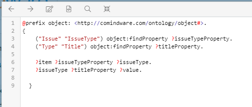
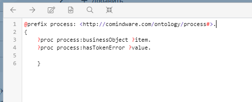
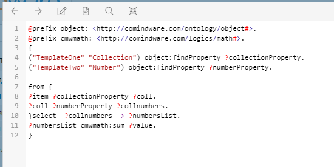
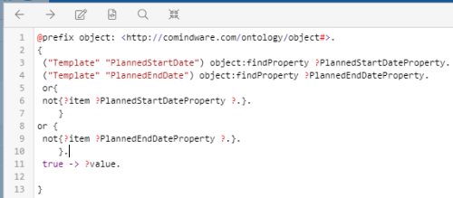
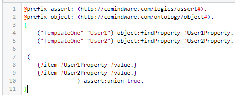

---
title: Учебник по N3
kbId: 
---

# Учебник по N3

## О курсе

Основная цель курса — научить пользователя ориентироваться в написанных выражениях и самостоятельно писать запросы средней сложности на языке N3. В уроках освещены базовые принципы работы триплетов, интерпретатора, приведены реальные примеры использования. В конце каждого урока представлены задания для самостоятельной работы.

!!! warning "Внимание!"

    Так как это вводный курс, некоторые понятия в нём упрощены, чтобы облегчить понимание работы RDF и Notation 3, без ущерба точности представленной информации.

**Предусловие:** хорошее понимание принципов работы и настройки **{{ productName }}**.

## Типы синтаксиса запросов

В **{{ productName }}** предусмотрено два типа синтаксиса запросов:

1. **Язык формул** — фирменный язык выражений **{{ companyName }}**, похожий на Excel. Является простым для восприятия и представляет собой надстройку над **N3**. Для базовой настройки системы его вполне достаточно. Типовые примеры использования языка формул: 

    - хождение по связанным шаблонам записи
    - подсчёт списка объектов
    - простые математические операции типа умножить, разделить, конкатенация строк т. д.
    - полный перечень функций языка формул представлен в [справочнике функций][formula_guide].

2. **Notation 3** (**N3**, **триплеты**) — более сложный в прочтении и написании, но более функциональный и основополагающий язык. Стандарт этого языка определён международным консорциумом W3C.

## Хранение данных

**{{ productName }}** использует графовую базу данных, основанную на модели RDF.

Общая идея графовой модели заключается в том, что любой объект материального и нематериального мира имеет свойства, а эти свойства содержат определённые значения. Следовательно, любую сущность можно описать с помощью простых выражений, которые называют свойства и их значения.

Описание сущности с помощью графовой модели имеет правила. Это происходит в виде так называемого триплета. 

**Триплет** состоит из трёх связанных сущностей: **Субъект — предикат — объект**. 

Эти термины необходимо запомнить, так как они часто используются в курсе.

### Пример триплета

Триплет можно соотнести с простым предложением вида: _Подлежащее — Сказуемое — Дополнение_.

Например, утверждение _"Книга написана Пушкиным"_ в RDF-терминологии можно представить следующим образом:

- **субъект** — Книга
- **предикат** — написана
- **объект** — Пушкин

Теперь построим сам граф. Субъект и объект представлены как узлы. В нашем примере это книга и Пушкин. Свойство, указывающее, кем написана книга, представлено соединительной линией со стрелкой от субъекта к объекту.


### Структура данных в {{ productName }}

По такому же принципу можно описать структуру данных:

- **Субъект** — запись в шаблоне записи.
- **Предикат** — атрибут записи.
- **Объект** — значение атрибута.

Например, имеется шаблон записи «Книги». В шаблоне имеются атрибуты «Наименование» и «Автор». В шаблоне имеются две записи.

Данные этих записей хранятся в триплетах и в упрощённом виде выглядят примерно так:

`id 8037 – Название – “Война и мир”.`
`id 8037 – Автор – “Толстой”.`
`id 8036 – Название – “Медный всадник”.`
`id 8036 – Автор – “Пушкин”.`


Аналогичным образом хранится вся метаинформация (описания шаблонов записи, форм, объектов, типов и т. д.), а также атрибуты окружения (текущий пользователь, текущее время, текущий контекст и т. д.).

Такая структура обеспечивает единообразие и простоту доступа к данным через запросы к базе.

Явные преимущества использования триплетов для описания и хранения данных:

1. **Простота понимания модели данных.** Создание шаблонов записи и связей между ними быстро усваивается даже неподготовленным пользователем.
2. **Мгновенное добавление новых шаблонов записи и атрибутов,** которые сразу доступны к работе.
3. **Неограниченная ширина и глубина связей между сущностями.** В **{{ productName }}** нет ограничений по количеству атрибутов и связей между ними.
4. **Простота и неограниченность навигации по связям.** Переход из одного справочника в другой через ссылочное поле осуществляется единообразно.

Для лучшего понимания принципов описания и хранения данных без использования жёсткой структуры (такой, как таблицы в SQL), ознакомьтесь со статьёй _[«Онтология»](https://kb.comindware.ru/article.php?id=4856)_.

!!! question "Внутренняя логика работы {{ productName }}"

    К примеру, при создании вычисляемого атрибута используется формула. 
    
    Что происходит под «капотом» после написания формулы? Компилятор переводит её в запрос N3, который уже однозначно понятен системе. 
    
    Можно сделать вывод: если есть желание облегчить работу компилятора, пишите формулу сразу на N3.

## Цели использования языка N3

- **Продвинутое использование {{ productName }}.**
- **Доступ ко всем созданным и системным атрибутам.** В интерфейсе **{{ productName }}** представлены не все системные атрибуты, а только те, которые используются чаще всего в типовых сценариях. N3 предоставляет доступ ко большему количеству атрибутов и сущностей, чем формулы.
- **Расширенные возможности работы с данными.** Дополнительные математические функции, функции для работы со списками, приведения данных к одному типу, расчётов времени и т.д. См. _[руководство по написанию выражений на N3][n3_guide]_.

# 1 урок

## Чему научимся

- Триплеты, синтаксис, переменные, параметры `?item` и `?value`.

## Триплеты

Тело запроса состоит из триплетов вида `субъект – предикат – объект`, которые мы рассмотрели во введении.

**Пример запроса:**

``` turtle
{
    ?item ?company ?customer.
    ?customer ?timeResolveProperty ?timeResolve.
    ?timeResolve ?requestTypeProperty ?value.
}
```

С помощью такого запроса мы указываем, какая строка из БД необходима, чтобы получить требуемые данные из графа.  

Например, в контексте записи заявки:

- Первым триплетом находим ссылку на клиента.
- Вторым триплетом определяем время ответа на заявку.
- Третьим триплетом указываем тип времени ответа.

В синтаксисе языка RDF N3 существуют определённые правила, без соблюдения которых запрос не будет сохранён и выполнен корректно.

Вот основные основные правила:

1. Каждый триплет начинается с новой строки.
2. Объявление переменных производится с префиксом `?` (например, `?variable`).
3. Весь запрос помещается в фигурные скобки (`{}`).
4. В конце каждого триплета ставится точка (`.`).
5. Интерпретатор учитывает регистр символов, то есть `?variable` и `?Variable` — это две разных переменных.

## Переменные

При формировании запроса используются переменные.

[Переменная](https://ru.wikipedia.org/wiki/%D0%9F%D0%B5%D1%80%D0%B5%D0%BC%D0%B5%D0%BD%D0%BD%D0%B0%D1%8F_%28программирование%29) — это именованное хранилище данных, обозначаемое в N3 символом `?`.

В приведённом примере используются переменные `?customer` и `?timeResolve`, которые содержат ссылки на шаблоны записи.  

Имена переменных следует задавать так, чтобы отражать суть хранимых данных.

!!! note "Примечание"

    В данном примере переменными являются все объекты из триплета после символа “?”. Это сделано для наглядности.
    
    В следующих уроках мы научимся определять предикат через переменную.

## Входные и выходные параметры `?item` и `?value`

Наш пример начинается и заканчивается использованием двух переменных: `?item` и `?value`. Это особые зарезервированные системные переменные:

- `?item` — входной параметр запроса. Его значение определяется контекстом, в котором выполняется запрос. Например, при вычислении значения атрибута `?item` содержит ID текущей записи. Подробные сведения см. в [Руководстве по написанию выражений на языке N3][n3_guide]/
- `?value` — выходной параметр. В него помещается результат запроса. Обратите внимание: тип данных, помещённых в `?value`, должен совпадать с типом данных атрибута, в который записывается результат, например, логическому или числовому.

**Итого:** мы разобрались с телом запроса, основными правилами синтаксиса,  

## Задачи:

Модель данных: у нас имеется шаблоны записи “Договоры”, “Контрагенты” и “Статусы контрагента”. У договора есть ссылка на контрагента, а у контрагента есть ссылочное поле на статус. 

Мы находимся в контексте договоров. Нам нужно вывести статус контрагента. 

Предикаты:

?agentProperty - предикат контрагента

?statusProperty - предикат ссылки на статус у контрагента

Требуется написать запрос и получить значение статуса контрагента.

Разберем общую модель написания запроса на N3.

В общем виде запрос состоит из:

1. Подключаемые библиотеки пространств имен
1. Использование переменных.
1. Триплеты

## Итого:
В итоге, мы научились использовать библиотеку object и ее функцию по записи URI предикатов в переменную. 

Познакомились со структурой триплетов.

Разобрали входные и выходные параметры запроса (Item и value) 

Познакомились с основными правилами синтаксиса запроса.

## Задачи

Создаем модель данных: 

Три шаблона записи. Первый шаблон имеет числовой атрибут “Calculation” и атрибут ссылку на второй шаблон. Второй ШЗ имеет ссылку на третий. В третьем ШЗ создаем атрибут “Number”. У шаблонов создаем по одной записи и устанавливаем ссылочные поля. В атрибут “Number” пишем число. 

Задача: вычислить в атрибут Calculation значение атрибута Number.

# 2 урок

## Чему научимся: 
Библиотеки пространств имен, присвоение переменных, применение системных атрибутов, built-in предикаты, конструкция from.

Итак, начнем разбор первого полноценного запроса.  Для  ее анализа нужно знать модель данных, в которой мы его пишем.

Пример:

Напишем запрос, который пройдет по ссылке в IssueType, возьмет значение текстового атрибута Title и выведет его.

**Модель данных:**

Два шаблона записи – Issue и Type.

В ШЗ Issue имеется ссылка на ШЗ Type. Имя: “IssueType”.

В ШЗ Issue есть текстовый атрибут TitleCalc. В нем пишем текущий запрос. 

В ШЗ Type создан текстовой атрибут Title.

__


|<p>В обычном Expression Language выглядел бы так:</p><p>$IssueTypeRef->Title</p><p>Пример в Expression language приведен лишь для введения в понимание. В дальнейшем, не следует пытаться представлять выражение N3 в Expression Language, так как это может сбить с верного понимания. </p>|
| - |

Начнем разбор построчно:

Первую строку, которую мы видим - это библиотека «пространства имен».  @prefix object — <[http://comindware.com/ontology/object#](http://comindware.com/ontology/object)>.

|<p><h2>Библиотеки пространств имен </h2></p><p>**Библиотеки** - это подключаемые модули (области), где лежат знания об объектах, функциях и разных правилах. С их помощью мы можем обращаться с системным и прикладным атрибутам и брать их значения. Также, при объявлении библиотек может появляться доступ к различным функциям по работе с датами, списками, числами и т.д. ([ссылка на документ](https://kb.comindware.com/article/%d0%a0%d0%b0%d1%81%d1%88%d0%b8%d1%80%d0%b5%d0%bd%d0%b8%d1%8f-comindware-%d0%a1%d0%bf%d0%b8%d1%81%d0%be%d0%ba-%d0%b2%d1%81%d1%82%d1%80%d0%be%d0%b5%d0%bd%d0%bd%d1%8b%d1%85-%d1%84%d1%83%d0%bd%d0%ba%d1%86%d0%b8%d0%b9-1482.html)).</p>|
| :-: |

С помощью этой библиотеки у нас появляется доступ к функции object:findProperty из строки 3 и 4 нашего примера. Данная функция позволяет брать URI атрибутов, записывать в переменные и использовать их внутри запроса.


|<p>Так как модель описания данных – RDF, для нее определены некоторые стандарты. Так, один из стандартов - это хранение в виде URI. </p><p>URI — последовательность символов, идентифицирующая абстрактный или физический ресурс и выглядит он примерным образом:</p><p>https://www.w3.org/1999/02/22-rdf-syntax-ns#type.</p><p>По сути каждая сущность из триплета является либо URI, либо литералом. При использовании полной нотации RDF выражений, происходит появление в записи длинных строк вида:</p><p></p>|
| :- |

Эта библиотека и функция является одной из базовых и в дальнейшем будет часто использоваться в написании запросов. Она содержит в себе функцию поиска id атрибута по его системному имени.

Перейдем к строке 3 и 4.

В предыдущем уроке мы не касались темы предикатов в триплете. Они были даны изначально. Но по сути каждая часть из триплета лежит в переменных, в том числе и искомые атрибуты. Чтобы их определить и записать в переменную пишем выражение вида:

|<p>("Сист.ИмяШЗ" "Сист.ИмяАтрибута") object:findProperty ?переменная.</p><p>Эта функция подходит только для определения прикладных атрибутов (созданных вручную). Системные атрибуты лежат в других библиотеках.</p><p></p>|
| - |


Теперь, вместо длинных URI предикатов, мы можем использовать переменные.

Берем атрибуты нужных предикатов для запроса и присваиваем их в переменные IssueTypeProperty и titleProperty.

Где, имя переменной определяем сами.
## Триплет
С первыми тремя строчками разобрались. Начинаем писать сам триплет.

__

1\. 	Каждый запрос имеет входной параметр item. Он вычисляется по умолчанию и служит для определения текущей записи, в которой находится атрибут. 

2\. 	Указываем предикат. Мы его уже определили выше.

3\. 	Создаем переменную, в которую поместится значение. Имя этой переменной придумываем сами. Интерпретатор видит, какой части не хватает для триплета и автоматически присваивает в него некое значение.

Данной строкой мы добились того, что смогли определить ссылку, чье значение требуется для дальнейшего нахождения поля title.

Важное правило работы интерпретатора:

Если результат триплета будет false - а именно он не найдет такого предиката, либо вместо объекта мы впишем уже определенное значение и интерпретатор не найдет такую строчку в базе, тогда он останавливается и вниз дальше не идет.


Разбираем 7 строку.

`        	`? IssueType ?TitleProperty ?value.

Берем переменную, которую определили выше. Так как, мы переместились по ссылке и находимся в контексте ШЗ «IssueType», у него имеется предикат TitleProperty. Указываем его. 

И третьим аргументом идет обязательная переменная value. value - является выходным параметром запроса. То что мы поместим в нее, то и будет отображаться в вычисляемом атрибуте. Тип данных, помещенный в value должно быть согласован с типом атрибута. Например: если вычисления в атрибуте логического типа, в value нужно получить логическое значение. И такое же правило существует для остальных типов данных. 

## Присвоение переменных
В предыдущем примере мы использовали ситуацию, где в триплетах субъект и предикат были определены. Неизвестным являлся объект. 

` 	`Интерпретатор понимает какая сущность из триплета неизвестна и тут же присваивает в нее недостающее значение.

Но это не единственный возможный случай присваивания. Всего существует три основных варианта присвоения значений в переменные с помощью работы триплета.

1. Первый способ, используемый в примере 1 урока.  Субъект и предикат определен, значит искомое значение - это объект.

__

1. Триплет позволяет идти и от обратного, если известен объект и предикат, то мы находим субъект

   __


1. Это так называемый ExactMatch. В случае, где известны все три части, происходит проверка на полное совпадение. Здесь получаем уточненное значение субъекта.
   __


Рассмотрим еще один пример с новым типом присвоения значения переменным:

Задача: в некоторых случаях администратор приложения хочет быстро и наглядно увидеть есть ли среди заявок те, у которых в запущенном процессе имеется ошибка.

Суть вычисления - если у текущей записи имеется процесс с ошибкой, вывести true в логический атрибут.


Модель данных: 

У нас имеется процесс и связанный шаблон записи. В связанном шаблоне записи создаем логический вычисляемый атрибут. В вычислениях пишем:

__


Начнем разбор построчно:

1 строка - подключаем библиотеку пространств имен процесса. После данного подключения становятся доступны системные предикаты процесса.
## Системные атрибуты
`	 `В платформе предусмотрено два вида атрибутов: системные и прикладные. К прикладным мы относим, те сущности, которые были вручную созданы для нашей онтологии. 

Но также, у каждого объекта в платформе (Процессы, шаблоны записи, группы, глобальные настройки и т.д.) есть ряд системных атрибутов, которые не всегда видны в интерфейсе программы, но они существуют и как правило логика наполнения данными таких атрибутов уже предопределена и автоматически заполняется системой. 

3 строка - тут мы имеем ситуацию с переменными, когда неизвестен один субъект (2 случай).  Мы знаем что у процесса есть предикат businessObject, который связывает запись с процессом. +Этот атрибут является системным.  Поэтому, первым пишем переменную, затем ее предикат и объект. По итогу в переменной “proc” у нас появился текущий, связанный с записью, процесс.

4 строка - здесь имеем уже первый вид присваивания. Предикат в этой строке тоже системный. Он является логическим типом и его значение становиться true, если запущенный процесс имеет ошибку. Соответственно его значение мы и передаем в выходной параметр value.

Так мы выведем в атрибут екгу, если есть ошибка в процессе.
## Built-In предикаты
Помимо, обычных предикатов, которые описывают свойства сущностей в платформе мы имеем также Built-In предикаты. Это сложные предикаты, которые носят в себе какие-либо функции по работе со строками, датами и т.д. Список таких предикатов описан в документе основы N3.

Рассмотрим пример:

Задача: У нас есть ШЗ TemplateOne. У ШЗ есть коллекция.  У коллекции имеется числовой атрибут. Требуется вывести сумму записей коллекции этого числового поля в вычисляемый числовой атрибут ШЗ.

Пример:

__


2 строка - добавляем библиотеку, содержащую в себе ряд математических функций.
## Конструкция from {}
7 строка - добавляем конструкцию from {}. Так как мы используем математическую функцию суммирования, ей требуется получить на вход такой тип данных, как “list”. Если бы мы просто нашли переменную collnumbers и попытались бы ее применить к функции без преобразования в list, тогда бы ничего не вышло. В collnumbers хранятся uri к значениям записей, а данная функция не работает с uri. Ей нужен понятный для нее тип данных. Какой тип данных требуется на вход разным функциям описано в документе N3.

Структура конструкции: from {триплеты} select ?переменная -> ?лист.


11 строка - пишем наш built-in предикат “cmwmath:sum”. В переменную value запишется получившаяся сумма из списка чисел numbersList.

## Итого:

Теперь мы умеем применять разные типы присвоения значений в переменные, используем системные атрибуты в наших запросах, производим вычисления с помощью bult-in предикатов.

Задачи:
# 3 урок
## 	Чему научимся:

Итератор,  Assert, if, or, контейнеры.


В данном уроке мы будем знакомиться с работой итератора, от которого зависит быстродействие выполнения запроса. Также, познакомимся с отдельными частоиспользуемыми функциями.
## Итератор

Еще одна важная особенность при работе с с запросами —  это итератор. 

Итератор — это перечислитель, который поддерживает простой перебор по группе ссылок. К группе ссылок относятся коллекции и ссылки со множественными значениями в них.

Под перебором мы имеем в виду,  что итератор в порядке случайной очереди берет первый объект из коллекции и проверяет его на верность выполнения условий по всем нижестоящим триплетам.  Пример: 

__

В переменную coll мы получили коллекцию.  Енумератор взял первую запись из коллекции и пошел на 10 строчку. В этой строке мы делаем ExactMatch (3 тип присваивания). Мы проверяем что у этой записи в атрибуте Number значение 15. 

Если у этой записи значение не 15, тогда результат триплета равен false, и эта запись выбрасывается из результата и мы возвращаемся обратно на 9 строку и берем следующую запись коллекции. 

Если результат следующей записи true, тогда запись двинулась дальше на 11 строку и так до конца тела запроса. Таким образом, он повторяет свои действия пока не закончатся уникальные записи. 

Важное примечание: итератор работает всегда. Он пытается вернуться и к верхней строчке и проверить есть ли значения, который он не проверял. Возвращается наверх, сверяет значение с записанным хэшем. Если это значение уже было, он останавливается.

Из этого следует правило, что вверху запроса следует указывать 
` 	`В случае, если мы точно знаем, что итератор должен пройти один раз по телу запроса (нету ссылок со множественным значением или коллекций), тогда внутри тела, триплеты можно обернуть в конструкцию once {}. Она сделает запрос быстрее.


## Логическое И
` 	`Распространены ситуации, где нужно объединить два условия выборки “логическим и”. В N3 нам не нужны специальные функции, так как между строками триплетов по умолчанию используется конъюнкция.  

Предположим, что мы пишем какое то условие применения в правила на форме. Мы должны получить значение truе, если атрибуты PlannedStartDate и PlannedEndDate пустые. 


__

6 строка — проверяем чтобы атрибут PlannedStartDate был пуст. 

Проверка на пустоту происходит подобным синтаксисом:

not {?субъект ?предикат ?.}

Знак-точка вместо объекта означает, что в нем есть данные. Соответственно, мы добавляем not и у нас получается проверка на пустоту.

Предположим, что 6 строка выдала true(атрибут пустой) , тогда интерпретатор перешел 7 строке.

Если в 7 строке интерпертатор выдаст false, то он заканчивает работу и не запишет в value значение true. 

Таким образом, ему требуется, чтобы в 6 и 7 выполнились условия.
## Логическое ИЛИ
Если же мы хотим изменить наше условие, и хотим выводить true, если хоть один атрибутов пуст, тогда условие будет следующее:

__

Такое правило уже является “логическим или”. Синтаксис условия or:

or {триплеты}

or{триплеты}.

Прим — в конце перечислений or обязательно должна стоять точка.

or-ов может быть несколько.


## Условный оператор IF
If -- условный оператор позволяет проверить некоторое условие и в зависимости от результатов проверки выполнить то или иное действие.

Пример: 

__

Синтаксис: if {условие}

then {выполняется, если условие - true}

else {выполняется, если условие - false}

## Assert:union
Еще одна часто используемая функция для работы с запросами — это вызов assert: union true. 

Данная функция требуется, когда в запросе нужно объединить несколько результатов выполнения в одну переменную. 

Пример:

Предположим, в заявке имеется поле с выбором Руководителя (User1) и заместителя руководителя (User2). Нам требуется объединить эти два значения в вычисляемом атрибуте:

__

В строке 8 и 9 мы использовали одноименную переменную для того, чтобы и в нее записалось объединенное значение. 

Синтаксис функции: 

(

{триплет}

{триплет}

) assert:union true.
## 	Итого: 
Мы разобрались в работе Итератора. Умеем применять логические условия для фильтров и так же объединять результаты запросов в одну переменную.

Данные функции являются самыми частоиспользуемыми в запросах.


