# Урок 7. Автоматические вычисления {: #lesson_7 }

## Введение

В ходе этого урока вы научитесь настраивать вычисляемые атрибуты и использовать язык формул, чтобы сделать данные в заявках более наглядными и повысить эффективность бизнес-процесса: показать имя _Заказчика_ и дату заявки, рассчитать итоговую стоимость и статус заявки, сформировать названия задач.

**Предусловие:** пройден _[урок 6 «Усовершенствованный процесс»][lesson_6]_.

**Расчётная продолжительность:** 20 мин.



## Автоматическое вычисление значений атрибутов

!!! warning "Бизнес-логика"

    Пользователям удобно идентифицировать заявки по номеру и дате. 
    
    _Секретарю_ при рассмотрении заявки требуется знать, кто является _Заказчиком_, чтобы решить, следует ли выделять машину.
    
    Для учёта расходов необходимо подсчитать итоговую сумму затрат за рейс.

    Реализуем эти возможности:
    
    - Для номера заявки определим формат, по которому номер будет формироваться автоматически.

    - Дата заявки — это дата запуска процесса. Это значение присваивается автоматически системному атрибуту «**Дата создания**» каждой записи. Имя _Заказчика_ хранится в системном атрибуте «**Создатель**». Вынесем эти атрибуты на форму заявки. 
       
    - Для расчета итоговой суммы затрат зададим формулу.

## Отображение Ф. И. О. _Заказчика_ и даты создания заявки

1. Перейдите на вкладку «**Формы**» шаблона записи _«Заявки на автомобили»_.
2. Откройте конструктор формы _«Заявки на автомобили - Основная форма»_.
3. Разверните элемент «**Создатель**» на панели элементов.
4. Перетащите на макет формы атрибут «**Ф. И. О.**».
5. Сверните элемент «**Создатель**» на панели элементов.
6. Перетащите на макет формы атрибут «**Дата создания**» шаблона _«Заявки на автомобили»_.
7. Сохраните форму.

_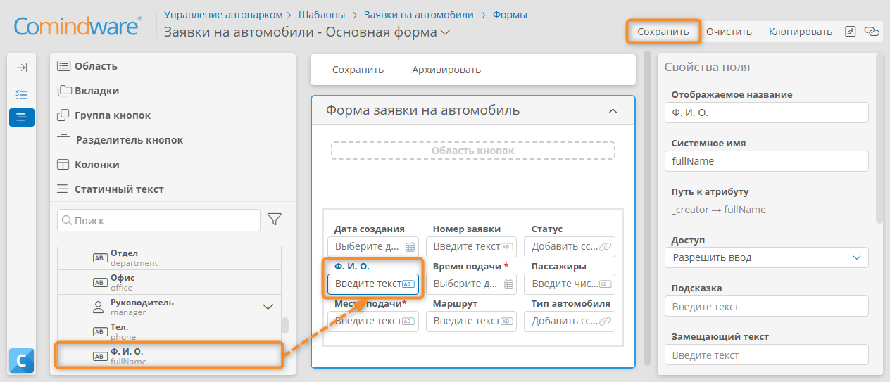_

## Вычисление итоговой суммы затрат

Настроим автоматическое вычисление итоговой суммы затрат.

Для этого в свойствах атрибута _«Итоговая сумма затрат»_ установим флажок «**Вычислять автоматически**», затем зададим формулу для вычисления значения атрибута. Для составления формулы воспользуемся редактором выражений и предиктивным вводом.

!!! warning "Внимание!"

    В формулах необходимо указывать те системные имена, которые вы фактически использовали в своём приложении.

    Например, если вы присвоили шаблону _«Затраты»_ системное имя `Затраты123`, то именно это имя следует использовать в формуле.

    То есть, если системные имена, приведённые в уроках, не совпадают с фактическими системными именами в вашем приложении, используйте фактические системные имена, а не копируйте их из текста уроков.

!!! note "Примечание"

    Подробные сведения о составлении формул см. в разделе _«[Язык формул][formula_guide]»._

1. Перейдите к диаграмме процесса _«Заказ автотранспорта»_.
2. Нажмите кнопку «**Редактировать**».
3. Выберите задачу _«Выполнить рейс»_.
4. В меню элемента нажмите кнопку «**Форма**» <i class="fa-light fa-newspaper">‌</i>.
5. В конструкторе формы задачи разверните элемент _«Заявки на автомобили»_ на панели элементов.
6. Нажмите кнопку «**Редактировать**» <i class="fa-light fa-pencil">‌</i> у атрибута _«Итоговая сумма затрат»_.
7. В окне свойств атрибута установите флажок «**Вычислять автоматически**».
8. В поле «**Вычисляемое выражение**» нажмите кнопку «**Открыть в редакторе**» <i class="fa-light fa-pencil">‌</i>.
9. В редакторе выражений введите функцию: `SUM()`.
10. Установив курсор внутри скобок функции `SUM()`, нажмите клавиши ++ctrl+space++ (Windows и Linux) или ++cmd+space++ (macOS).
11. В отобразившемся раскрывающемся списке дважды нажмите пункт `Затраты` со значком <i class="fa-light fa-list-alt">‌</i>.

    _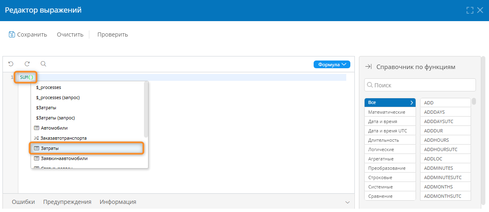_

12. В формулу будет вставлена заготовка запроса записей из шаблона _«Затраты»_: `from a in db->Затраты where Ваше условие select a->id`.

    __

13. Замените строку `Ваше условие` на `a->` и нажмите клавиши ++ctrl+space++ (Windows и Linux) или ++cmd+space++ (macOS).
14. В отобразившемся раскрывающемся списке дважды нажмите пункт `Заявка`.
15. В формулу будет вставлено системное имя атрибута `Заявка` шаблона _«Затраты»._

    _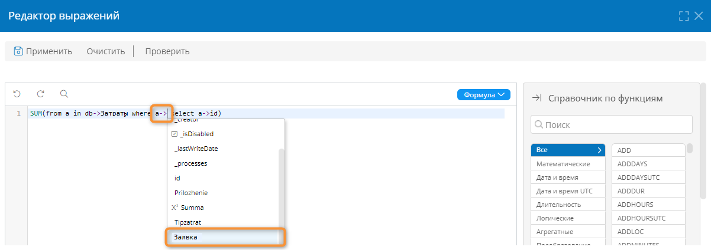_

16. После системного имени `Заявка` введите строку `== $`.
17. В отобразившемся раскрывающемся списке дважды нажмите пункт `id`.
18. В формулу будет вставлено системное имя `id` атрибута **ID** текущего шаблона _«Заявки на автомобили»._

    __

19. Удалите строку `id` после оператора `a->` и нажмите клавиши  ++ctr+space++.
20. В отобразившемся раскрывающемся списке дважды нажмите пункт `Сумма`.
21. В формулу будет вставлено системное имя атрибута `Сумма` шаблона _«Затраты»_.

    __

22. Должна получиться формула:

    ```
    SUM(from a in db->Затраты where a->Заявка == $id select a->Сумма)
    ```

23. Нажмите кнопку «**Применить**» и кнопку ‌«**Закрыть**» <i class="fa-light fa-xmark"></i> в редакторе формул.
24. В окне свойств атрибута _«Итоговая сумма затрат»_ нажмите кнопку «**Сохранить**».
25. Вернитесь к диаграмме процесса.
26. Опубликуйте диаграмму.

    !!! question "Формула итоговой суммы затрат и синтаксис запроса к базе данных"

        - Для вычисления итоговой суммы затрат мы использовали функцию — `SUM()`:
            - `SUM(from a in db->Затраты where a->Заявка == $id select a->Сумма)`
            - Функция `SUM()` принимает в качестве аргумента список значений (массив) и возвращает сумму их значений (число).
        - В функцию `SUM()` мы передаём список значений атрибута _«Сумма»_ шаблона записи _«Затраты»_. Для получения этого списка используем следующий запрос к базе данных:
            - `from a` — объявление локальной переменной `a` для итерации по списку значений.
            - `in db->Затраты` — объявление источника данных: шаблон записи _«Затраты»_.
            - `where a->Заявка == $id` — условие для выборки записей из шаблона _«Затраты»_, где значение атрибута _«Заявка»_ (типа «**Запись**») равно значению атрибута **ID** текущей заявки на автомобиль. То есть выбираем только затраты, которые относятся к данной заявке.
            - `select a->Сумма` — выбор значений атрибута «Сумма».
            - `select a->Сумма` — получение значения атрибута _«Сумма»_ из шаблона _«Затраты»_.
            - `Затраты` — системное имя шаблона записи _«Затраты»_.
            - `Заявка` — системное имя атрибута запроса _«Заявка»_ в шаблоне _«Затраты»_.
            - `$id` — системное имя атрибута **ID** (идентификатор) в шаблоне записи _«Заявки на автомобиль»_.
            - `Сумма` — системное имя атрибута _«Сумма»_ в шаблоне записи _«Затраты»_.
        - Данную формулу можно составить двумя другими способами:
            - `SUM(from a in $Затраты select a->Сумма)` — здесь в качестве источника данных запроса указан атрибут «Затраты» типа «**Запись**», который содержит идентификаторы записей шаблона _«Затраты»_, связанные с текущей заявкой;
            - `SUM($Затраты->Сумма)` — здесь мы напрямую передаем в функцию `SUM()` значения атрибута _«Сумма»_, записей шаблона _«Затраты»_, связанных с текущей заявкой.

## Тестирование вычисления суммы затрат

1. Перейдите к списку экземпляров шаблона процесса _«Заказ автотранспорта»_
2. Нажмите кнопку «**Создать**».
3. Пройдите процесс до задачи _«Выполнить рейс»_.
4. Откройте задачу _«Заказ автотранспорта — Выполнить рейс»_.
5. Заполните таблицу _«Затраты»_ — укажите различные суммы и типы затрат.
6. Поле _«Итоговая сумма затрат»_ должно вычисляться автоматически, как показано на иллюстрации.

_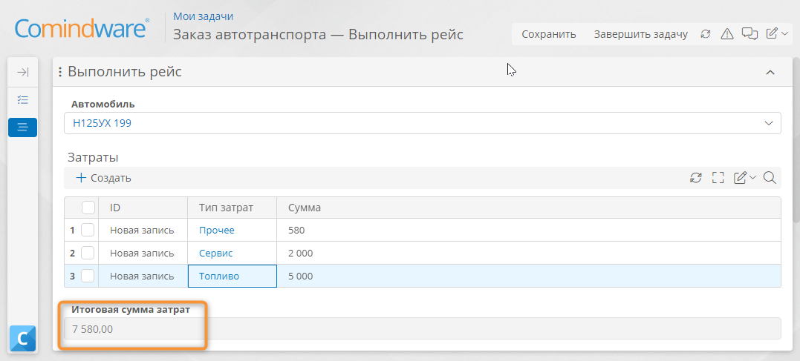_

## Формирование номера заявки

Настроим автоматическую нумерацию заявок в следующем формате: `ЗА-XXXX`, где `XXXX` — порядковый номер заявки.

1. Перейдите на вкладку «**Атрибуты**» шаблона записи _«Заявки на автомобили»._
2. Создайте атрибут:
    - **Название:** _Номер заявки_
    - **Тип данных: текст**
    - **Использовать как заголовок записей:** флажок установлен
3. Перейдите к диаграмме процесса _«Заказ автотранспорта»_
4. Нажмите кнопку «**Редактировать**».
5. Выберите начальное событие и в меню элемента нажмите кнопку «**Сценарий на выходе**» <i class="fa-light fa-arrow-right-from-bracket"></i>.

    __

6. Отобразится конструктор сценария.
7. Внутри действия «**Сменить контекст**» нажмите кнопку «**Добавить действие**» <i class="fa-light fa-circle-plus"></i> и в раскрывающемся меню выберите пункт «**Изменить значения атрибутов**».

    __

8. Внутри действия «**Сменить контекст**» будет создано действие «**Изменить значения атрибутов**».
9. В заголовке действия «**Изменить значения атрибутов**» нажмите кнопку «**Изменить**» <i class="fa-light fa-pen-to-square"></i>.

    __

10. Отобразится окно «**Действие: Изменить значения атрибутов**».
11. Нажмите кнопку «**Создать**».
12. В столбце «**Атрибут**» выберите атрибут «**Номер заявки».**
13. В столбце «**Операция со значениями**» выберите пункт «**Заменить**».
14. В столбце «**Значение**» выберите пункт «**Формула**».

    _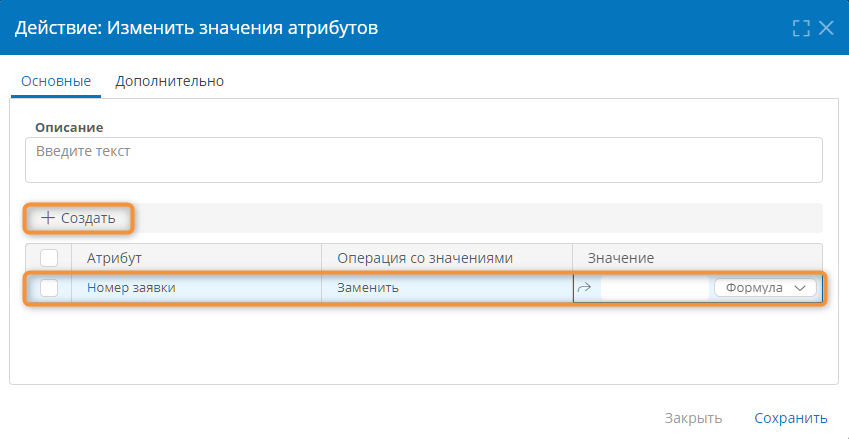_

15. Нажмите поле в столбце «**Значение**». Отобразится компактный редактор формулы.
16. Ведите формулу:

    ```
    FORMAT("ЗA-{0}",LIST(COUNT(from b in db->Заявкинаавтомобили select b->id)))
    ```
    
    !!! question "Синтаксис формулы номера заявки"

        - `FORMAT()` — эта функция принимает в качестве аргументов строку и список значений, заменяет в строке заполнители {0}–{n} значениями из списка и возвращает результирующую строку.
        - `LIST()` — эта функция объединяет аргументы в список.
        - `COUNT()` — эта функция принимает список значений и возвращает количество элементов в нём.
        - `Заявкинаавтомобили` — системное имя шаблона записи _«Заявки на автомобили»_.

17. Нажмите кнопку с зелёным флажком <i class="fa-light fa-check"></i> под формулой, чтобы сохранить её.
18. Нажмите кнопку «**Сохранить**», чтобы сохранить действие «**Изменить значения атрибута**».
19. Вернитесь к диаграмме процесса и опубликуйте её.

    __

## Настройка отображения номера заявки

Настроим отображение наглядного номера заявки на её форме.

1. Перейдите на вкладку «**Формы**» шаблона записи _«Заявки на автомобили»_.
2. Откройте конструктор формы _«Заявки на автомобили — Основная форма»_
3. Поместите на форму атрибут _«Номер заявки»_.
4. Укажите для поля _«Номер заявки»_ режим **доступа** «**Только чтение**».
5. Сохраните форму.

    _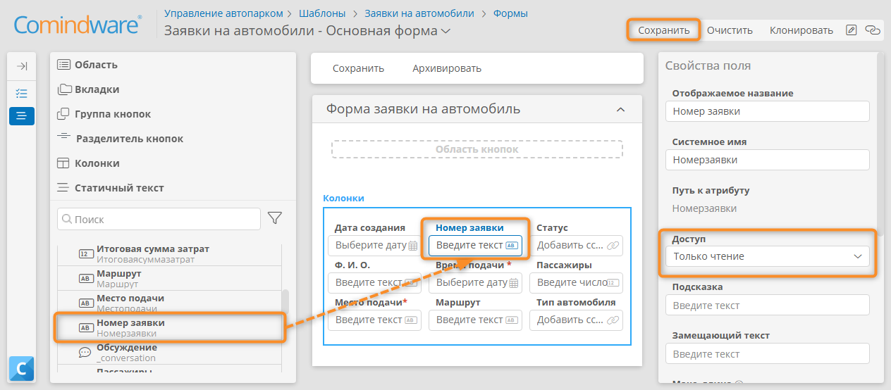_

## Тестирование формирования номера заявки

1. Перейдите к списку экземпляров шаблона процесса _«Заказ автотранспорта»_.
2. Создайте новую заявку на автомобиль.
3. Перейдите на страницу «**Мои задачи**».
4. Откройте задачу _«Заказ автотранспорта — Рассмотреть заявку»_.
5. Поле _«Номер заявки»_ должно быть заполнено автоматически, как показано на иллюстрации.

__

## Настройка отслеживания статуса заявки

Настроим автоматическое изменение статуса заявки согласно текущему этапу бизнес-процесса:

- _Создана_
- _На рассмотрении_
- _Выполняется_
- _Завершена_
- _Отклонена_

### Создание справочника статусов

Статусы заявок будут храниться в справочнике — шаблоне записи.

1. На панели навигации выберите пункты «**Настройки**» — «**Диаграммы**».
2. Откройте диаграмму _«Модель данных — Заказ автотранспорта»_.
3. Перетащите на диаграмму элемент «**Новый шаблон записи**» и создайте шаблон записи _«Статусы заявок»_.
4. Выберите созданный шаблон _«Статусы заявок»_.
5. Создайте атрибут _«Название»_, установив в его свойствах флажок _«**Использовать как заголовок записей**»_.
6. Выберите шаблон _«Статусы заявок»_ и в меню элемента выберите пункт «**Перейти к шаблону**» <i class="fa-light fa-arrow-up-right-from-square"></i> — «**Таблицы**» <i class="fa-light fa-boxes-stacked"></i>.

    __

7. Откройте конструктор таблицы «**Все записи**» и настройте её так, чтобы она содержала только столбец _«Название»._
8. Сохраните таблицу.

    __

9. Откройте конструктор основной формы шаблона _«Статусы заявок»_ и настройте её так, чтобы она содержала только поле _«Название»_.

    _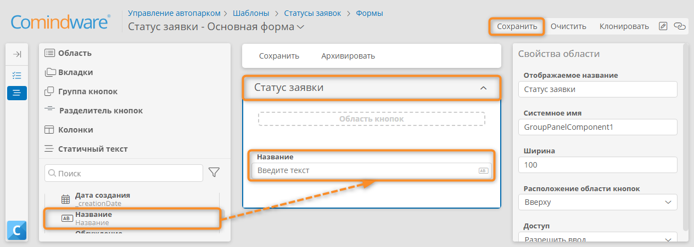_

10. Перейдите к списку экземпляров шаблона _«Статусы заявок»_.
11. Создайте записи со следующими _названиями_:

    - _Создана_
    - _На рассмотрении_
    - _Завершена_
    - _Отклонена_
    - _Выполняется_

    __

12. Вернитесь к диаграмме модели данных и выберите шаблон _«Заявки на автомобили»_.
13. С помощью меню элемента создайте атрибут в шаблоне _«Заявки на автомобили»_:

    - **Название:** _Статус_
    - **Тип данных: запись**
    - **Связанный шаблон**: _Статусы заявок_

    _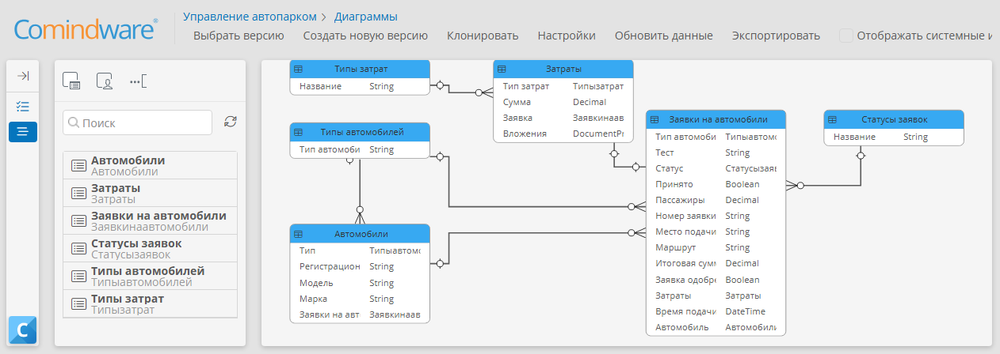_

## Настройка автоматического изменения статуса заявки

### Установка статуса «Создана»

1. Откройте для редактирования диаграмму процесса _«Заказ автотранспорта»_.
2. Выберите начальное событие и в меню элемента нажмите кнопку «**Сценарий на выходе**» <i class="fa-light fa-arrow-right-from-bracket"></i>.
3. В конструкторе сценария внутри действия «**Сменить контекст**» нажмите кнопку «**Изменить**» <i class="fa-light fa-pen-to-square"></i> в заголовке действия «**Изменить значения атрибутов**», [созданного ранее](#формирование-номера-заявки).

    __

4. Добавьте **операцию со значениями** «**Заменить**» для **атрибута** _«Статус»_.
5. В столбце «**Значение**» выберите пункт «**Формула**».
6. Нажмите поле в столбце «**Значение**» и введите формулу:

    ```
    OBJECT("Управлениеавтопарком","Статусызаявок","Название","Создана")
    ```

    !!! question "Синтаксис формулы статуса заявки"

        - `OBJECT()` — эта функция принимает системные имена приложения, шаблона и атрибута, а также искомое значение атрибута, и возвращает ID записи, в которой атрибут имеет указанное значение.
        - `Управлениеавтопарком` — системное имя приложения _«Управление автопарком»_.
        - `Статусызаявок` — системное имя шаблона записи _«Статусы заявок»_.
        - `Название` — системное имя атрибута _«Название»_ в шаблоне записи _«Статусы заявок»_.
        - `Создана` — искомое значение атрибута _«Название»_.

    _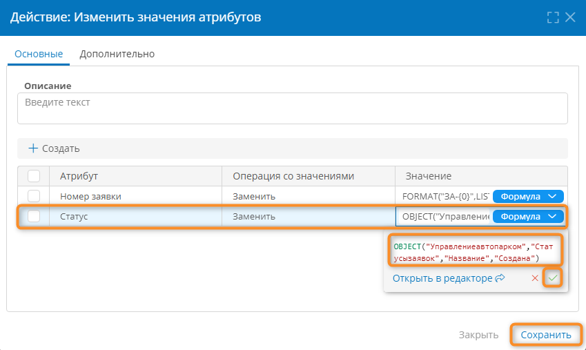_

7. Нажмите кнопку с зелёным флажком <i class="fa-light fa-check"></i> под формулой, чтобы сохранить её.
8. Нажмите кнопку «**Сохранить**», чтобы сохранить действие  «**Изменить значения атрибутов**».

### Установка статуса «На рассмотрении»

1. Вернитесь к диаграмме процесса, но не публикуйте её.
2. Выберите задачу _«Рассмотреть заявку»_ и откройте «**Сценарий на выходе**» <i class="fa-light fa-arrow-right-from-bracket"></i>.
3. В сценарии добавьте действие «**Изменить значения атрибутов**» внутри действия «**Сменить контекст**».
4. В действии «**Изменить значения атрибутов**» создайте операцию «**Заменить**» для атрибута _«Статус»_ c формулой:

    ```
    OBJECT("Управлениеавтопарком","Статусызаявок","Название","На рассмотрении")
    ```

### Установка статуса «Отклонена»

1. На диаграмме процесса выберите задачу _«Отменить поездку»_.
2. Откройте «**Сценарий на входе**» <i class="fa-light fa-arrow-right-from-bracket"></i>.
3. Добавьте действие «**Изменить значения атрибутов**» внутри действия «**Сменить контекст**».
4. В действии «**Изменить значения атрибутов**» добавьте операцию «**Заменить**» для атрибута _«Статус»_ с формулой:

    ```
    OBJECT("Управлениеавтопарком","Статусызаявок","Название","Отклонена")
    ```

### Установка статуса «Выполняется»

1. На диаграмме процесса выберите **развилку «и»** _«Машина выделена»_ перед событиями _«Совершить поездку»_ и _«Выполнить рейс»_.
2. Откройте «**Сценарий на входе**» <i class="fa-light fa-arrow-right-from-bracket"></i>.
3. Добавьте действие «**Изменить значения атрибутов**» внутри действия «**Сменить контекст**».
4. В действии «**Изменить значения атрибутов**» добавьте операцию «**Заменить**» для атрибута _«Статус»_ с формулой:

    ```
    OBJECT("Управлениеавтопарком","Статусызаявок","Название","Выполняется")
    ```

### Установка статуса «Завершена»

1. На диаграмме процесса выберите конечное событие _«Поездка завершена»_.
2. Откройте «**Сценарий на входе**» <i class="fa-light fa-arrow-right-from-bracket"></i>.
3. Добавьте действие «**Изменить значения атрибутов**» внутри действия «**Сменить контекст**».
4. В действии «**Изменить значения атрибутов**» добавьте операцию «**Заменить**» для атрибута _«Статус»_ с формулой:

    ```
    OBJECT("Управлениеавтопарком","Статусызаявок","Название","Завершена")
    ```

7. Опубликуйте диаграмму процесса, чтобы изменения вступили в силу.

## Настройка отображения статуса заявки на форме

Мы добавили новый атрибут _«Статус»_, теперь настроим его отображение на форме заявки.

1. Перейдите на вкладку «**Формы**» шаблона записи _«Заявки на автомобили»._
2. Откройте конструктор формы _«Заявки на автомобили — Основная форма»._
3. При необходимости упорядочьте поля на форме с помощью **колонок**.
4. Перетащите на форму атрибут _«Статус»_.
5. Задайте для поля _«Статус»_ **режим доступа** «**Только чтение**».
6. Сохраните форму.

    _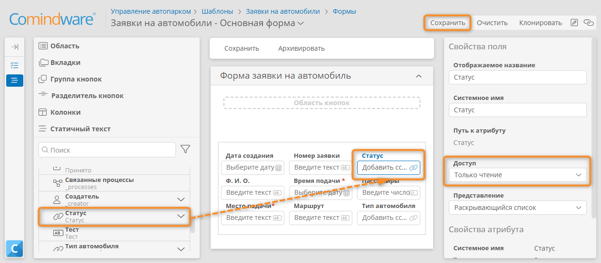_

## Добавления столбцов статуса и номера в список заявок

1. Перейдите на вкладку «**Таблицы**» шаблона _«Заявки на автомобили»_.
2. Откройте конструктор таблицы «**Все записи**».
3. Добавьте в таблицу столбцы _«Номер заявки»_ и _«Статус»_.
4. Сохраните таблицу.

_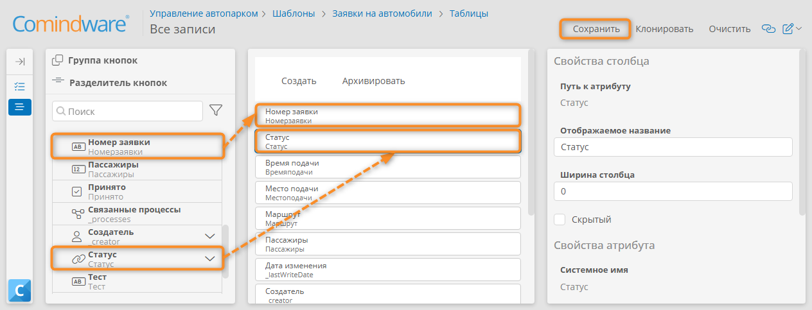_

## Тестирование изменения статуса заявки

1. Перейдите к списку экземпляров шаблона процесса _«Заказ автотранспорта»_
2. Создайте новую заявку на автомобиль.
3. Перейдите к странице «**Мои задачи**».
4. Откройте форму задачи _«Заказ автотранспорта — Рассмотреть заявку»_.
5. Поле _«Статус»_ должно иметь значение _«Создана»_.

__

## Настройка заголовка задачи

!!! warning "Бизнес-логика"

    По умолчанию заголовки задач недостаточно информативны — они содержат только названия процесса и задачи, но никакой конкретной информации по заявке.

    Для удобства пользователя добавим к заголовкам задач наглядные данные о заявке: маршрут и Ф. И. О. _Заказчика_.

_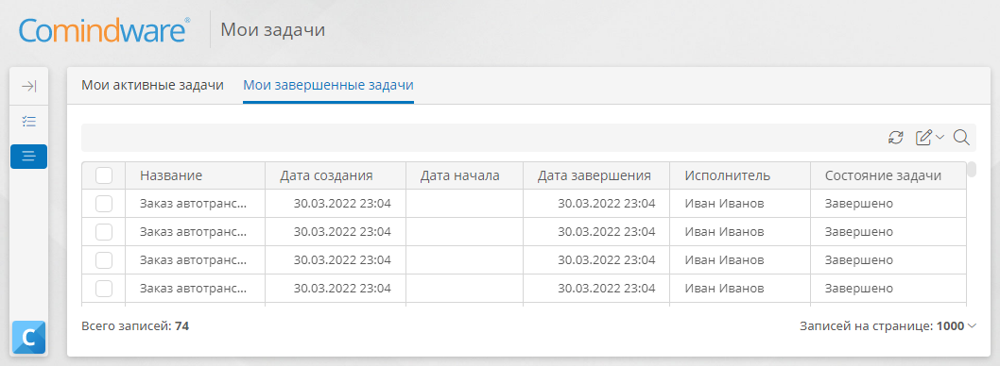_

1. Перейдите к диаграмме процесса и нажмите кнопку «**Редактировать**».
2. Выберите задачу _«Рассмотреть заявку»_.
3. В меню элемента нажмите кнопку «**Свойства**» <i class="fa-light fa-gear">‌</i>.

    _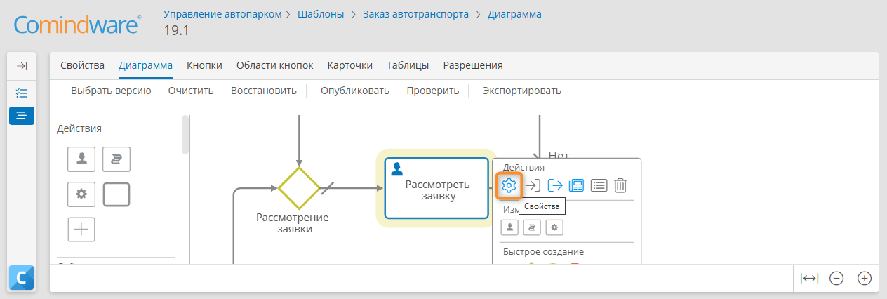_

4. В окне «**Свойства пользовательской задачи**» на вкладке «**Дополнительные**» выберите пункт «**Формула**» в поле «**Заголовок задачи**».
5. Введите формулу:

    ```
    FORMAT("Рассмотреть заявку ({0} — {1})",LIST($Маршрут,$_creator->fullName))
    ```

    !!! question "Синтаксис формулы заголовка задачи"

        - `FORMAT()` — эта функция принимает в качестве аргументов строку и список значений, заменяет в строке заполнители {0}–{n} значениями из списка и возвращает результирующую строку.
        - `LIST()` — эта функция объединяет аргументы в список.
        - `Маршрут` — системное имя атрибута _«Маршрут»_.
        - `_creator->fullName` — Ф. И. О пользователя, создавшего заявку. Это значение получаем из системных атрибутов `_creator` и `fullName` аккаунта пользователя.

6. Нажмите кнопку «**Сохранить**».
7. Аналогичным образом введите формулы для заголовков остальных задач процесса:

    - `FORMAT("Принять заявку ({0} — {1})",LIST($Маршрут,$_creator->fullName))`
    - `FORMAT("Отменить поездку, заявка отклонена ({0} — {1})",LIST($Маршрут,$_creator->fullName))`
    - `FORMAT("Выполнить рейс ({0} — {1})",LIST($Маршрут,$_creator->fullName))`
    - `FORMAT("Совершить поездку, машина выделена ({0} — {1})",LIST($Маршрут,$_creator->fullName))`

8. Опубликуйте диаграмму процесса.

## Тестирование отображения заголовков задач

Посмотрим, как теперь задачи отображаются на странице «**Мои задачи**».

1. Перейдите к экземплярам шаблона процесса _«Заказ автотранспорта»_
2. Запустите процесс, создав новую заявку на автомобиль и заполнив стартовую форму.
3. Перейдите на страницу «**Мои задачи**» и откройте задачу _«Рассмотреть заявку»_.
4. Заголовок задачи в списке и в форме должен содержать название маршрута и Ф. И. О. создателя заявки, как показано на иллюстрации.

__

__

## Результаты

Вы научились настраивать автоматическое вычисление атрибутов и названий задач в ходе процесса.

В [следующем уроке][lesson_8] вы настроите пользователей, роли и права доступа для различных элементов приложения.


