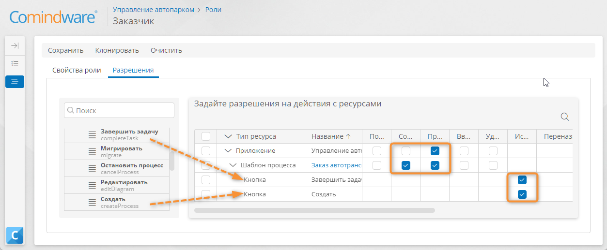
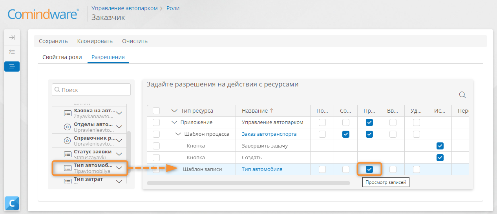
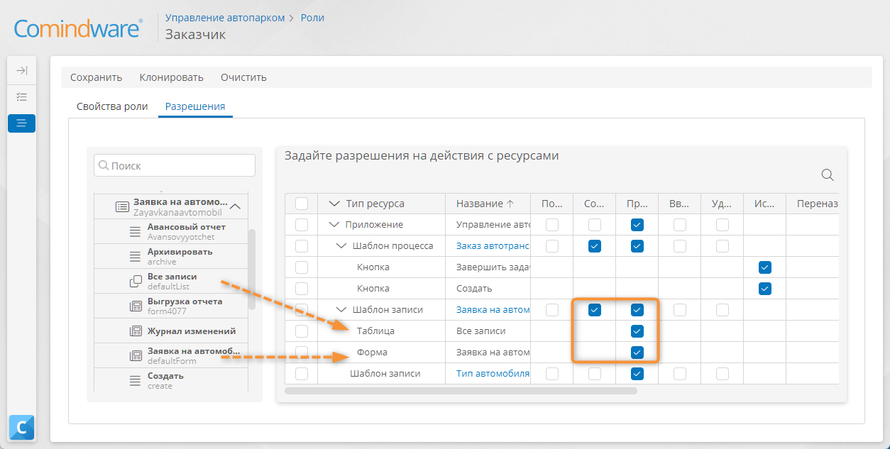

# Урок 8. Аккаунты, группы и роли {: #lesson_8 }

## Введение

В ходе этого урока вы узнаете, как спроектировать оргструктуру, создать аккаунты для пользователей и управлять ими: назначать роли, выдавать и ограничивать права доступа, настраивать разделы навигации и назначать исполнителей задач:

- Создайте роли и определите их права доступа к шаблонам, используемым в процессе заказа автотранспорта.
- Создайте группы аккаунтов и привяжите их к ролям.
- Назначите в качестве исполнителей задач созданные группы.
- Создадите несколько аккаунтов и добавите их в группы.
- Настроите панель навигации для каждой роли.

**Предусловие:** пройдены _[урок 3 «Мой первый бизнес-процесс»][lesson_4]_ и _[урок 4 «Мониторинг и аналитика»][lesson_4]_.

**Расчётная продолжительность:** 15 мин.



## Настройка ролей

!!! question "Роли"

    **Роли** в **{{ productName }}** задают разрешения на доступ к ресурсам приложения: шаблонам (реестрам), таблицам, кнопкам, формам, задачам процессов и др.

    Для настройки **роли** необходимо:
    
    - настроить разрешения на доступ к ресурсам приложения;
    - назначить роль пользователям и (или) группам пользователей;
    - выбрать раздел навигации, который будет отображаться для пользователей, относящихся к данной роли.

!!! warning "Бизнес-логика"

    Для приложения управления автопарком настроим следующие **роли** пользователей:

    - _Заказчик_ — должен иметь возможность создавать и просматривать обработанную заявку.
    - _Секретарь_ — согласует заявку, должен иметь возможность редактирования и просмотра заявок.
    - _Диспетчер гаража_ — принимает заявку и выделяет машину, должен иметь возможность редактировать заявку и формировать отчеты.
    - _Водитель_ — выполняет рейс, должен иметь возможность просмотра заявки, создания нового автомобиля и внесения затрат.
    - Все пользователи должны иметь возможность завершать назначенные им задачи.

### Создание роли «Заказчик»

1. С помощью панели навигации слева прейдите в раздел «**Настройки**» — «**Приложения**».
2. Откройте приложение _«Управление автопарком»_.
3. Перейдите к странице «**Роли**» <i class="fa-light fa-user-shield"></i>.
4. В списке ролей нажмите кнопку «**Создать**».
5. Отобразится страница свойств новой роли.
6. Укажите **название** роли — _«Заказчик»_.

    __

7. Определим разрешения для роли _«Заказчик»_.

    !!! warning "Бизнес-логика"

        Чтобы _Заказчик_ мог возможность инициировать процесс заказа автотранспорта и завершать свои задачи, настроим разрешения на доступ к шаблону процесса _«Заказ автотранспорта»_ и его кнопкам.

8. Перейдите на вкладку «**Разрешения**».
9. В списке слева разверните процесс _«Заказ автотранспорта»_ и перетащите в таблицу разрешений справа кнопки «**Создать**» и «**Завершить задачу**».
10. Установите флажок (разрешение) в столбце «**Просмотр**» для приложения _«Управление автопарком»_.
11. Установите флажки (разрешения) в столбце «**Создание**» и «**Просмотр**» для шаблона процесса _«Заказ автотранспорта»_.
12. Для кнопок «**Создать**» и «**Завершить задачу**» установите разрешения «**Использование кнопки**», как показано на иллюстрации.

    __

    !!! warning "Бизнес-логика"

        Чтобы заказчик мог выбирать тип автомобиля при подаче заявки, настроим доступ для просмотра данных из справочника _«Типы автомобилей»_.

13. Перетащите на таблицу разрешений справочник _«Типы автомобилей»_ и установите для него разрешение «**Просмотр**».

    __

    !!! warning "Бизнес-логика"

        Чтобы _Заказчик_ мог создавать заявки на автомобиль, просматривать их список и форму заявки, настроим доступ к шаблону записи _«Заявки на автомобили»_.

14. Разверните элемент _«Заявки на автомобили»_ на панели элементов слева и перетащите таблицу «**Все записи**» в таблицу разрешений.
15. Перетащите в таблицу разрешений форму _«Заявки на автомобили — Основная форма»_.
16. Установите разрешения «**Создание**» и «**Просмотр**» для шаблона записи _«Заявки на автомобили»_.
17. Установите разрешение «**Просмотр**» для основной формы и таблицы «**Все записи**» шаблона _«Заявки на автомобили»_.
18. Сохраните роль _«Заказчик»_.

    __

### Создание роли «Секретарь»

!!! warning "Бизнес-логика"

    Чтобы _Секретарь_ мог рассматривать, отклонять и принимать заявки на автомобиль, настроим доступ к шаблону процесса _«Заказ автотранспорта»_ и шаблонам записи _«Заявки на автомобили»_, _«Статусы заявок»_ и _«Типы автомобилей»_.

1. Создайте роль _«Секретарь»_.
2. Перейдите на вкладку «**Разрешения**».
3. Перетащите в таблицу разрешений процесс _«Заказ автотранспорта»_ и установите разрешения «**Просмотр**» и «**Ввод данных**».
4. Разверните процесс _«Заказ автотранспорта»_ и перетащите в таблицу разрешений кнопки «**Завершить задачу**» и «**Сохранить**».
5. Установите для кнопок «**Завершить задачу**» и «**Сохранить**» разрешение «**Использование кнопки**».
6. Перетащите в таблицу разрешений шаблон _«Заявки на автомобили»_ и установите для него разрешение «**Полный доступ**».
7. Перетащите в таблицу разрешений шаблоны _«Типы автомобилей»_ и _«Статусы заявок»_ и установите для них разрешение «**Просмотр**».
8. Сохраните роль _«Секретарь»_.

__

### Создание роли «Диспетчер гаража»

!!! warning "Бизнес-логика"

    Чтобы _Диспетчер гаража_ мог рассматривать заявки, выделять автомобили и просматривать затраты на рейсы, настроим доступ к шаблону процесса _«Заказ автотранспорта»_ и шаблонам записи _«Заявки на автомобили»_, _«Статусы заявок»_, _«Затраты»_, _«Типы затрат»_, _«Автомобили»_, _«Типы автомобилей»_.

1. Создайте роль _«Диспетчер гаража»_.
2. Перейдите на вкладку «**Разрешения**».
3. Перетащите в таблицу разрешений шаблоны _«Заказ автотранспорта», «Заявки на автомобили», «Затраты», «Типы затрат», «Автомобили», «Типы автомобилей», «Статусы заявок»_ и установите для них разрешение «**Полный доступ**».
4. Сохраните роль _«Диспетчер гаража»_.

__

### Создание роли «Водитель»

!!! warning "Бизнес-логика"

    Чтобы _Водитель_ мог просматривать заявки, выполнять рейс, добавлять автомобили и вносить затраты на рейсы, настроим доступ к шаблону процесса _«Заказ автотранспорта»_ и шаблонам записи _«Заявки на автомобили»_, _«Статусы заявок»_, _«Затраты»_, _«Типы затрат»_, _«Автомобили»_ и _«Типы автомобилей»_.

1. Создайте роль _«Водитель»_.
2. Перейдите на вкладку «**Разрешения**».
3. Перетащите в таблицу разрешений шаблоны _«Типы затрат», «Типы автомобилей» и «Статусы заявок»_ и установите для них разрешение «**Просмотр**».
4. Для шаблона _«Автомобили»_ установите разрешение «**Просмотр**».
5. Для шаблона _«Заявки на автомобили»_ установите разрешения «**Просмотр**» и «**Ввод данных**».
6. Разверните процесс _«Заказ автотранспорта»_ и перетащите в таблицу разрешений кнопки «**Сохранить**» и «**Завершить задачу**». Установите для них разрешение «**Использование кнопки**».
7. Для процесса _«Заказ автотранспорта»_ установите разрешения «**Просмотр**» и «**Ввод данных**».
8. Для шаблона _«Затраты»_ и установите разрешения «**Создание**», «**Просмотр**» и «**Ввод данных**».
9. Разверните шаблон _«Затраты»_, перетащите из него в таблицу разрешений таблицу «**Все записи**» и установите для неё разрешение «**Просмотр**»
10. Из шаблона _«Затраты»_ перетащите в таблицу разрешений кнопку «**Создать**» и установите для нее разрешение «**Использование кнопки**».
11. Сохраните роль _«Водитель»_.

__

## Настройка групп аккаунтов

!!! warning "Бизнес-логика"

    Мы создали роли _«Заказчик», «Секретарь», «Водитель»_ и _«Диспетчер гаража»_ и определили для них разрешения на доступ к ресурсам приложения.

    Чтобы применить заданные в ролях разрешения к аккаунтам, создадим группы аккаунтов и назначим им роли.

1. На панели навигации выберите пункты «**Настройки**» — «**Группы**».
2. В списке групп нажмите кнопку «**Создать**».
3. Укажите название группы _«Секретари»_ и нажмите кнопку «**Создать**», чтобы сохранить группу.

    __

4. Аналогичным образом создайте группы _«Диспетчеры»_ и _«Водители»_.
5. Создайте группу _«Сотрудники»_, которая будет включать в себя всех сотрудников:

    - На вкладке «**Участники**» нажмите в левом столбце группы _«Диспетчеры», «Водители»_ и _«Секретари»_.
    - Эти группы отобразятся в правом столбце будут добавлены в группу _«Сотрудники»_.

    __

6. Нажмите кнопку «**Создать**», чтобы сохранить группу _«Сотрудники»_.

    __

## Назначение группам ролей

!!! warning "Бизнес-логика"

    Создать заявку на автомобиль может любой сотрудник. Поэтому мы назначим роль _«Заказчик»_ группе _«Сотрудники»_. 

    Соответственно, роли _«Секретарь»_, _«Диспетчер гаража»_ и _«Водитель»_ назначим группам _«Секретари»_, _«Диспетчеры гаража»_ и  _«Водители»_.

1. На боковой панели выберите пункт «**Настройки**» — «**Роли**».
2. В отобразившемся списке ролей откройте роль _«Заказчик»_, дважды нажав её.

    __

3. На вкладке «**Свойства роли**» в области «**Выберите участников роли**» нажмите группу _«Сотрудники»_, чтобы перенести ее в список «**Выбранные аккаунты и группы**».
4. Сохраните роль _«Заказчик»_.

    __

5. Вернитесь к списку ролей и откройте роль _«Секретарь»_.
6. Укажите для роли _«Секретарь»_ группу _«Секретари»_ и сохраните роль.
7. В списке ролей откройте роль _«Диспетчер гаража»_ и укажите для неё группу _«Диспетчеры»_.
8. Для роли _«Водитель»_ укажите группу _«Водители»_.

## Назначение исполнителей задач

!!! warning "Бизнес-логика"

    До этого момента все пользовательские задачи процесса _«Заказ автотранспорта»_ назначались текущему пользователю (то есть вашему аккаунту).
    
    Мы создали роли, настроили их разрешения и назначили роли группам аккаунтов. 
    
    Теперь назначим роли _«Секретарь»_, _«Диспетчер гаража»_ и _«Водитель»_ в качестве исполнителей соответствующих задач.

    Как и прежде, задачи _«Отменить поездку»_ и _«Совершить поездку»_ будут автоматически назначаться создателю заявки на автомобиль.

1. На панели навигации выберите пункт «**Настройки**» — «**Приложения**».
2. Перейдите к приложению _«Управление автопарком»_.
3. Откройте раздел «**Шаблоны**» <i class="fa-light fa-briefcase"></i>.
4. Перейдите к шаблону процесса _«Заказ автотранспорта»_.
5. Перейдите на вкладку «**Диаграмма**» и нажмите кнопку «**Редактировать**».
6. Выберите пользовательскую задачу _«Рассмотреть заявку»_.
7. В меню элемента нажмите кнопку «**Свойства**» <i class="fa-light fa-gear">‌</i>.

    __

8. Перейдите на вкладку «**Дополнительные**».
9. В поле «**Исполнители**» снимите флажок со своего аккаунта и установите флажок _«Секретарь»_.
10. Нажмите кнопку «**Сохранить**».

    __

11. Для задачи _«Принять заявку»_ назначьте исполнителем роль _«Диспетчер гаража»_.
12. Для задачи _«Выполнить рейс»_ назначьте исполнителем  роль _«Водитель»_.
13. Опубликуйте диаграмму процесса.

## Создание аккаунтов

!!! warning "Бизнес-логика"

    Чтобы протестировать использование приложения в разных ролях, создадим аккаунты сотрудников с соответствующими должностями (_Секретарь_, _Диспетчер_, _Водитель_).

1. На панели навигации выберите пункт «**Настройки**» — «**Аккаунты**» <i class="fa-light fa-address-card"></i>.
2. В списке аккаунтов нажмите кнопку «**Создать**».

    __

3. В поле «**Язык**» укажите «**Русский**».
4. В поле «**Ф. И. О.**» укажите полное имя сотрудника.
5. В поле «**Имя пользователя**» укажите логин, под которым сотрудник будет входить в свой аккаунт.
6. Укажите **пароль** и адрес **эл. почты**.
7. Укажите **должность** _«Диспетчер»_ и **отдел** _«Гараж»_.
8. Нажмите кнопку «**Создать**», чтобы сохранить аккаунт.

    __

9. Вернитесь к списку аккаунтов и создайте ещё один аккаунт, укажите для него **должность** _«Водитель»_ и **отдел** _«Гараж»_.
10. Создайте **два** аккаунта с **должностью** _«Секретарь»_.
11. Создайте аккаунт _Заказчика_ с любой должностью. Пользователь этого аккаунта будет создавать заявки.

    __

## Назначение аккаунтам групп

!!! warning "Бизнес-логика"

    Чтобы применить настроенные в ролях разрешения к аккаунтам, назначим им группы в соответствии с должностями сотрудников.

1. На панели навигации выберите пункт «**Настройки**» — «**Группы**».
2. Откройте группу _«Водители»_
3. Перейдите на вкладку «**Участники**».
4. Укажите участника группы — аккаунт водителя.
5. Сохраните группу.

    __

6. Аналогичным образом добавьте аккаунт диспетчера в группу _«Диспетчеры»_, а аккаунты секретарей — в группу _«Секретари»_.
7. Выберите группу _«Сотрудники»_ и добавьте в неё аккаунт, пользователь которого будет создавать заявки, например _«Евгений З.»_.

    __

## Настройка панели навигации

!!! question "Определения"

    Панель навигации слева состоит из разделов навигации, которые позволяют быстро переходить к различным страницам **{{ productName }}**.
    
!!! warning "Бизнес-логика"

    До этого момента мы использовали системный раздел навигации, теперь настроим раздел навигации для каждой роли согласно должностным обязанностям сотрудников.

### Настройка раздела навигации для Заказчика

1. На боковой панели навигации выберите пункт «**Настройки**» — «**Приложения**».
2. В списке приложений выберите _«Управление автопарком»_.
3. Перейдите к странице «**Разделы навигации**» <i class="fa-light fa-list-dropdown"></i>.
4. В списке разделов навигации нажмите кнопку «**Создать**».
5. Откроется конструктор раздела навигации.
6. С помощью панели свойств справа укажите **отображаемое название** раздела навигации _«Заказчик»_.
7. Удостоверьтесь, что в панели свойств выбрано **приложение** _«Управление автопарком»_.
8. Назначьте разделу навигации выбрать роль, для пользователей которой он будет отображаться:

    - На панели свойств раздела навигации нажмите пункт «**0 ролей**».
    - В окне _«Роли»_ укажите роль _«Заказчик»_.
    - Нажмите кнопку «**Применить**».

    __

9. Настройте пункты, которые будут отображаться в разделе навигации для _Заказчика_:

    - Перетащите элемент «**Мои задачи**» с левой панели на макет раздела навигации.
    - Разверните пункты «**Шаблоны процессов**» — _«Заказ автотранспорта»_ — «**Кнопки**».
    - Перетащите кнопку «**Создать**» на макет раздела навигации.

10. Сохраните раздел навигации.

    __

### Настройка раздела навигации для Секретаря

1. Откройте список разделов навигации приложения _«Управление автопарком»_.
2. Нажмите кнопку «**Создать**».
3. Укажите **отображаемое название** раздела навигации _«Секретарь»_.
4. Назначьте разделу навигации роль _«Секретарь»_.
5. Перетащите пункт «**Мои задачи**» на макет раздела навигации.
6. Разверните пункты «**Шаблоны записей**» — _«Заявки на автомобили»_ — «**Таблицы**».
7. Перетащите таблицу «**Все записи**» на макет раздела навигации.
8. С помощью панели свойств переименуйте пункт «**Все записи**» в _«Заявки на автомобили»_.
9. Сохраните раздел навигации.

__

### Настройка раздела навигации для для водителей и диспетчеров гаража

!!! warning "Бизнес-логика"

    Настроим навигацию для сотрудников гаража, чтобы они могли обрабатывать заявки и просматривать сводку заявок по месяцам.

1. Откройте список разделов навигации приложения _«Управление автопарком»_.
2. Откройте раздел навигации _«Сводки»_, созданный в ходе [Урока 4][lesson_4].
3. Измените **отображаемое название** раздела навигации на _«Сотрудник гаража»_.
4. Назначьте разделу навигации две роли: _«Диспетчер гаража»_ и _«Водитель»_.
5. Перетащите на макет раздела навигации элемент «**Мои задачи**».
6. Разверните шаблон _«Заявки на автомобили»_.
7. Перетащите на макет раздела навигации таблицу «**Все записи**» и переименуйте её в _«Заявки на автомобили»_.
8. Перетащите на макет раздела навигации таблицу «**Все записи**» шаблона _«Затраты»_ и переименуйте её в _«Затраты»_.
9. Сохраните раздел навигации.

__

__

## Тестирование

!!! note "Примечание"

    Для тестирования настроенных ролей и исполнителей вам понадобится несколько раз войти в созданные аккаунты с различными ролями — _«Заказчик», «Секретарь», «Диспетчер гаража»_ и _«Водитель»_. 
    
    Посмотреть имена пользователей аккаунта можно на странице «**Настройки**» — «**Аккаунты**».
    
    Для удобства проводите тестирование новом окне браузера в режиме _«Инкогнито»_ или разных браузерах.

### Оформление заявки — Заказчик

1. Войдите в аккаунт _Заказчика_.
2. Выберите пункт «**Создать**» на панели навигации.
3. Заполните поля стартовой формы, чтобы создать заявку на автомобиль и запустить бизнес-процесс.

    __

4. Выйдите из системы: для этого нажмите значок пользователя в правом верхнем углу страницы и выберите пункт «**Выход**».

    __

### Рассмотрение заявки — Секретарь

1. Войдите в аккаунт _Секретаря_.
2. Перейдите к странице «**Мои задачи**» с помощью панели навигации.
3. Откройте задачу _«Рассмотреть заявку»_, дважды нажав её.

    __

4. Установите флажок _«Заявка одобрена»_
5. Завершите задачу.
6. Выйдите из системы.

### Выделение машины заявки — Диспетчер гаража

1. Войдите в аккаунт _Диспетчера гаража_.
2. На странице «**Мои задачи**» о ткройте задачу _«Принять заявку»_.
3. Выберите автомобиль и установите флажок _«Принято»_.
4. Завершите задачу.
5. Выйдите из системы.

    __

### Выполнение рейса — Водитель

1. Войдите в аккаунт _Водителя_.
2. Откройте задачу _«Выполнить рейс»_
3. Заполните данные по затратам.
4. Завершите задачу.

    __

5. Выйдите из системы.

### Совершение поездки — Заказчик

1. Снова войдите в аккаунт _Заказчика_.
2. Завершите задачу _«Совершить поездку»_.

## Результаты

Вы научились настраивать роли и определять права доступа, создавать аккаунты и группы, а также настраивать разделы навигации.

Вы улучшили процесс: теперь выполнением задач процесса занимаются пользователи с ролями, соответствующими их должностям. В целях безопасности и удобства работы пользователи имеют доступ только к тем ресурсам приложения, которые им предназначены.

В ходе [следующего урока][lesson_9] вы научитесь формировать документы с данными из приложения.


